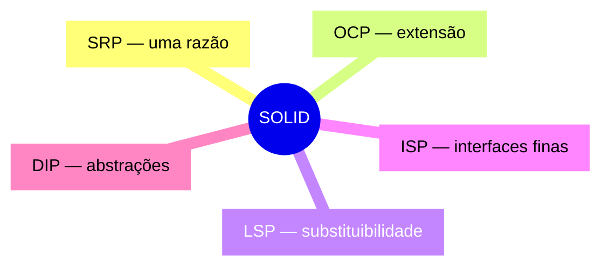
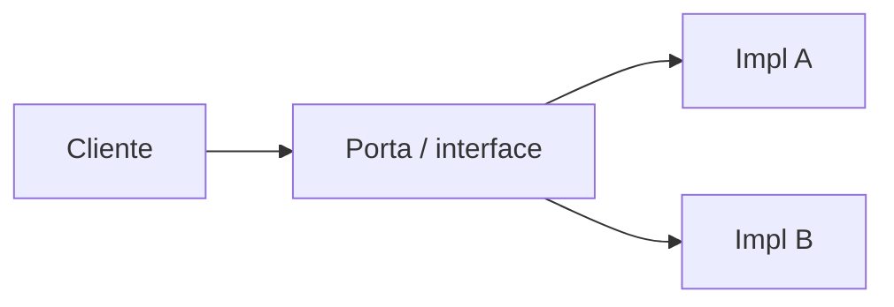
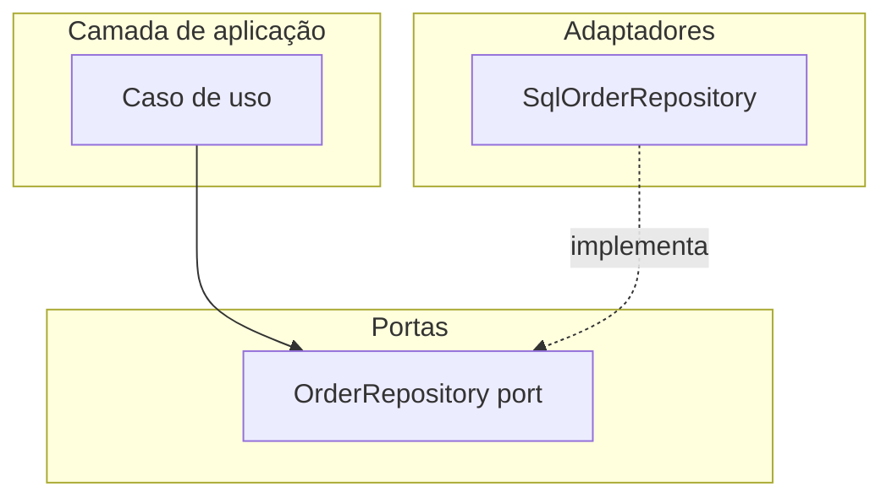

# SOLID — princípios para código orientado a objetos sustentável

## Introdução

**SOLID** agrupa cinco princípios articulados por Robert C. Martin para projetar módulos OO **coesos**, **acoplados de forma controlada** e **abertos à extensão**. Não são dogmas: em linguagens multiparadigma (JavaScript, Python com dataclasses, Clojure com protocolos) a tradução é **conceitual** — separar razões de mudança, inverter dependências de infraestrutura e substituir implementações em testes.



---

## S — Single Responsibility Principle

**Uma unidade (classe/função/módulo) deve ter um único motivo para mudar** — isto é, uma responsabilidade coesa no vocabulário do negócio ou da arquitetura.

| Sinal de violação | Efeito |
|-------------------|--------|
| Classe que altera relatório PDF **e** envia e-mail **e** fala com SQL | Mudanças de canal ou persistência se entrelaçam |
| “God class” com centenas de métodos | Testes frágeis, merges dolorosos |

**Direção útil:** extrair *application service*, *repository*, *notifier* — cada um muda quando seu *stakeholder* muda.

---

## O — Open/Closed Principle

**Aberto para extensão, fechado para modificação** no *comportamento estável*: novos casos entram por **novas implementações** de uma abstração, não editando `switch` gigante a cada requisito.



---

## L — Liskov Substitution Principle

**Subtipos devem poder substituir seus tipos base** sem quebrar invariantes ou expectativas do contrato. Clássico: `Square extends Rectangle` quebra se `setWidth` não mantém altura — o substituto viola o modelo mental do cliente.

Em APIs: DTOs e validações de subclasses não devem **restringir** mais que o tipo base promete (pré-condições não podem ser mais fortes de forma surpresa).

---

## I — Interface Segregation Principle

**Clientes não devem depender de métodos que não usam.** Preferir várias interfaces pequenas a uma “fat interface” que força `NotImplementedException` ou no-ops.

---

## D — Dependency Inversion Principle

**Módulos de alto nível não devem depender de baixo nível; ambos dependem de abstrações.** Em frameworks (Spring, ASP.NET), isso aparece como injeção de `IOrderRepository` em vez de `new SqlOrderRepository()` no domínio.



---

## Exemplos — violação vs DIP leve

### Java (Spring — interface + bean)

```java
public interface Clock {
  Instant now();
}

@Component
public class SystemClock implements Clock {
  @Override public Instant now() { return Instant.now(); }
}
```

### C#

```csharp
public interface IPaymentGateway { Task ChargeAsync(decimal amount, string id); }

public sealed class CheckoutService(IPaymentGateway gateway)
{
  public Task ConfirmAsync(decimal total, string orderId) =>
      gateway.ChargeAsync(total, orderId);
}
```

### JavaScript (inversão manual)

```javascript
export function createOrderService(deps) {
  const { repo, clock } = deps;
  return {
    async place(cmd) {
      const id = crypto.randomUUID();
      await repo.save({ ...cmd, id, at: clock.now() });
      return id;
    },
  };
}
```

### Python

```python
from typing import Protocol
from datetime import datetime, timezone


class Clock(Protocol):
    def now(self) -> datetime: ...


class OrderService:
    def __init__(self, repo: "OrderRepo", clock: Clock) -> None:
        self._repo = repo
        self._clock = clock

    def place(self, cmd: dict) -> str:
        entity = {**cmd, "at": self._clock.now().isoformat()}
        return self._repo.save(entity)
```

---

## Quando não exagerar

- **Scripts e CLIs** de uma tela: SOLID completo pode ser ruído.
- **CRUD simples** sem regras: camadas demais geram *boilerplate*.
- **Performance crítica** em hot path: medição antes de fragmentar em 15 interfaces.

---

## Referências

- Martin, R. C. *Agile Software Development: Principles, Patterns, and Practices*.
- Martin, R. C. *Clean Architecture* — SOLID no contexto de limites arquiteturais.

---

*Use SOLID para **localizar mudança** e **testar comportamento**; não como checklist que impede entregar valor.*
