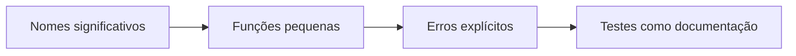

# Clean Code — legibilidade, nomes e funções

## Introdução

**Clean Code** (termo popularizado por Robert C. Martin) descreve hábitos para código **legível**, **simples de alterar** e **difícil de interpretar errado**. Complementa SOLID: princípios OO estruturam dependências; *clean code* cuida de **nomes**, **tamanho de funções**, **comentários úteis** e **formatação** consistente — aplicável a qualquer linguagem.



---

## Nomes

- **Revelem intenção** — `calculateDiscountedTotal` melhor que `calc`.
- **Evitem desinformação** — `list` para array, `tmp` genérico.
- **Distância lexical** — constantes com significado próximo ao uso.
- **Padrões do ecossistema** — `camelCase` em JS/Java, `PascalCase` para tipos em C#, `snake_case` em Python.

---

## Funções

- **Pequenas** — idealmente uma ideia por função; se precisa de comentário de seção dentro da função, considere extrair.
- **Um nível de abstração** por função — não misturar `parseHttpHeaders` com `saveToDatabase` na mesma rotina.
- **Argumentos** — poucos; objetos de comando reduzem parâmetros longos.
- **Sem efeitos colaterais escondidos** — função chamada `checkPassword` não deve disparar sessão global.

---

## Comentários

**Bons:** explicam o **porquê** (decisão de negócio, workaround de bug de biblioteca, aviso de segurança).  
**Ruins:** repetem o óbvio (`// incrementa i`) ou descrevem código legado que deveria ter sido refatorado.

---

## Tratamento de erros

Preferir **tipos explícitos** (`Result`, `Either`, exceções de domínio) a códigos mágicos. Em APIs HTTP, mapear falhas de domínio para status e corpos **consistentes** (ver artigo de normalização de request/response).

---

## Formatação e estrutura de arquivos

- **Arquivos curtos** facilitam navegação; agrupar por *feature* ou camada conforme o projeto.
- **Imports** ordenados; evitar dependências circulares (ferramentas: dep-cruiser, ArchUnit).

---

## Exemplos — refatoração mínima

### Antes (JavaScript)

```javascript
function x(u, p) {
  // u user p pass
  if (u && p) {
    return db.q("SELECT * FROM users WHERE login='" + u + "'");
  }
}
```

### Depois

```javascript
async function findUserByCredentials(login, passwordHash) {
  if (!login || !passwordHash) return null;
  return userRepository.findByLoginAndPasswordHash(login, passwordHash);
}
```

### C# — early return

```csharp
public decimal ApplyCoupon(decimal total, string? code)
{
    if (total <= 0) throw new ArgumentOutOfRangeException(nameof(total));
    if (string.IsNullOrWhiteSpace(code)) return total;
    return couponEngine.Apply(total, code.Trim());
}
```

### Java (Spring) — serviço enxuto

```java
@Service
public class QuoteService {
  private final RateTable rates;

  public QuoteService(RateTable rates) { this.rates = rates; }

  public Money quote(String sku, int qty) {
    if (qty < 1) throw new IllegalArgumentException("qty");
    return rates.forSku(sku).multiply(qty);
  }
}
```

### Python — nomes e tipos

```python
def monthly_invoice_total(line_items: list[tuple[str, int, float]]) -> float:
    """line_items: (sku, quantity, unit_price)"""
    return sum(q * p for _, q, p in line_items)
```

---

## Code review como alavanca

Checklist leve em PRs:

1. Nomes novos são claros para quem não escreveu o patch?
2. Há teste ou contrato atualizado junto com comportamento?
3. Erros e logs permitem diagnosticar produção sem PII indevida?

---

## Relação com SOLID e arquitetura

Clean code atua **no nível do arquivo e função**; **SOLID** e **arquitetura limpa** atuam em **fronteiras** maiores. Código “limpo” dentro de um monólito mal particionado ainda sofre; fronteiras claras com código ilegível também.

---

## Referências

- Martin, R. C. *Clean Code*.
- Fowler, M. *Refactoring* — catálogo de transformações seguras.

---

*Código limpo é **empatia com o próximo leitor** — que muitas vezes é você daqui a seis meses.*
