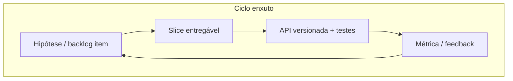
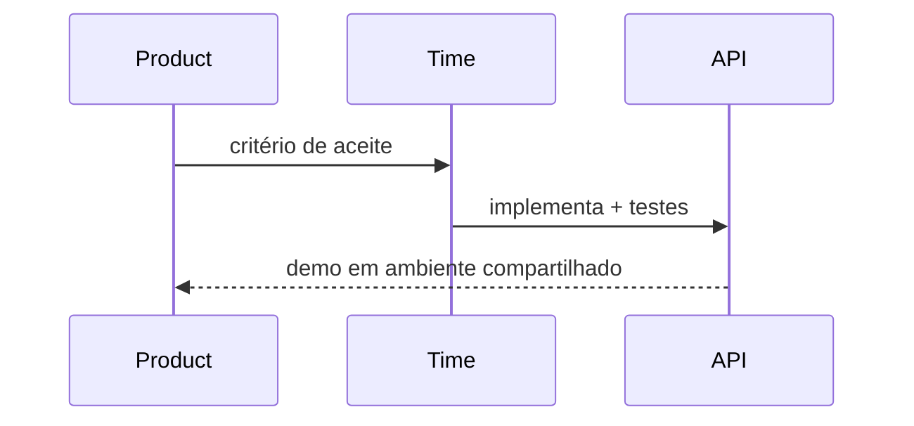

# Metodologia ágil no desenvolvimento de APIs e produtos

## Introdução

**Metodologia ágil**, neste contexto, é o conjunto de práticas e mindset para **entregar valor cedo**, **adaptar escopo** com feedback e **manter qualidade técnica** em APIs e backends. Complementa o estudo [Gestão e metodologias](../gestao-metodologias/README.md) (Scrum, Kanban): aqui o foco é **como ágil se materializa em contratos HTTP**, integração contínua, *definition of done* técnica e colaboração com produto.



---

## Princípios do Manifesto aplicados a APIs

| Manifesto | Em APIs |
|-----------|---------|
| Indivíduos e interação | Alinhar semântica de recursos com PO e consumidores |
| Software funcionando | Endpoint em homologação com contrato testado > especificação eterna |
| Colaboração com cliente | Reviews de *breaking changes* antes do merge |
| Responder a mudanças | Versionamento, *feature flags*, deprecação documentada |

---

## Incrementos verticais

Preferir **fatias verticais** (“usuário consegue X”) a camadas horizontais só de infraestrutura. Um incremento útil pode ser: `POST /orders` persistindo em DB de teste, com validação e teste de contrato — mesmo que relatórios ainda não existam.



---

## Definition of Done técnica (exemplo)

- Testes automatizados (unitários e/ou integração) passando.
- Contrato OpenAPI/JSON Schema atualizado se o payload mudou.
- Logs com `correlation-id` em fluxos síncronos críticos.
- Sem *secrets* no repositório; config por ambiente.
- Documentação de migração se houver *breaking change*.

---

## Cadência e fluxo

Times **Scrum** planejam incremento no Sprint; times **Kanban** puxam itens com WIP limitado. Em ambos: **refinement** de itens de API (campos obrigatórios, códigos de erro, idempotência) evita retrabalho no meio do ciclo.

---

## Exemplos — “ready for dev” em código (campos de história)

### JSON (contrato de história / OpenAPI snippet)

```json
{
  "story": "POST /v1/payments idempotency",
  "acceptance": [
    "Header Idempotency-Key obrigatório",
    "Replay com mesma chave retorna 200 + mesmo body",
    "422 para valor negativo"
  ]
}
```

### Java (Spring — teste de contrato mínimo)

```java
@Test
void postPayment_requiresIdempotencyKey() throws Exception {
  mockMvc.perform(post("/v1/payments")
      .contentType(MediaType.APPLICATION_JSON)
      .content("{\"amount\":10}"))
      .andExpect(status().isBadRequest());
}
```

### C# — xUnit + WebApplicationFactory (esboço)

```csharp
[Fact]
public async Task Post_WithoutIdempotency_Returns400()
{
    var res = await _client.PostAsJsonAsync("/v1/payments", new { amount = 10m });
    Assert.Equal(HttpStatusCode.BadRequest, res.StatusCode);
}
```

### JavaScript (supertest)

```javascript
it("rejects without Idempotency-Key", async () => {
  await request(app).post("/v1/payments").send({ amount: 10 }).expect(400);
});
```

### Python (pytest + httpx)

```python
import pytest
import httpx

@pytest.mark.asyncio
async def test_payment_requires_idempotency(async_client: httpx.AsyncClient):
    r = await async_client.post("/v1/payments", json={"amount": 10})
    assert r.status_code == 400
```

---

## Anti-padrões

- **Big bang integration** no último dia do Sprint sem ambiente compartilhado.
- **API como “detalhe de implementação”** sem dono de contrato — gera drift entre times.
- **Velocity como meta** — incentiva cortar testes e documentação.

---

## Referências

- Beck, K. et al. *Manifesto for Agile Software Development*.
- Estudo interno: [Scrum](../gestao-metodologias/01-scrum.md), [Kanban](../gestao-metodologias/02-kanban.md).

---

*Ágil em API é **contrato + feedback em ciclo curto**; ferramentas mudam, o loop permanece.*
