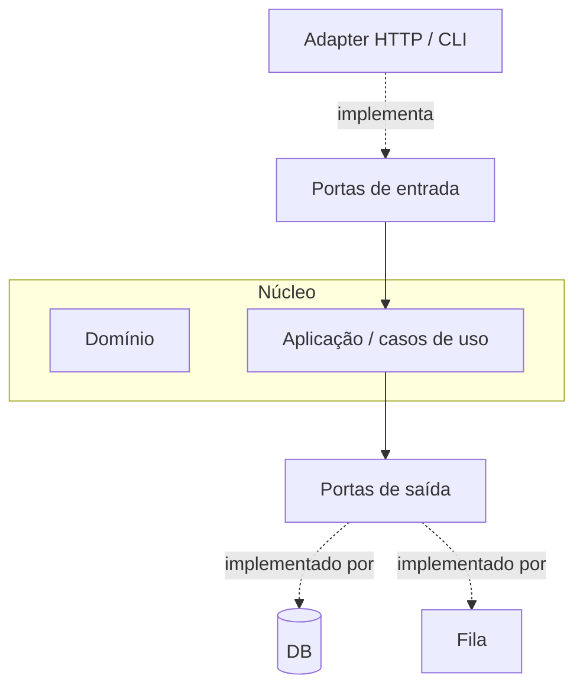
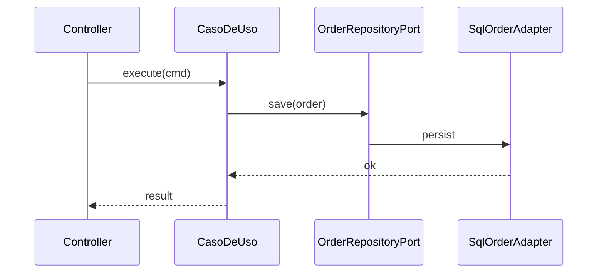

# Arquitetura hexagonal (Ports and Adapters)

## Introdução

A **arquitetura hexagonal** (Alistair Cockburn) organiza a aplicação em torno do **núcleo de domínio**, conectado ao mundo externo por **portas** (interfaces) e **adaptadores** (HTTP, SQL, fila, CLI). O desenho “hexagonal” é metáfora visual: muitos lados, todos equivalentes — nenhum adaptador é “o centro”.



---

## Portas de entrada e saída

| Tipo | Exemplos | Quem implementa |
|------|----------|-----------------|
| **Entrada** | `PlaceOrder`, `RegisterUser` | Controllers, handlers de mensagem |
| **Saída** | `OrderRepository`, `EmailSender` | JDBC, SMTP, SDK S3 |

O **domínio** não importa Spring ou Express — apenas tipos puros ou interfaces do próprio núcleo.

---

## Fluxo típico

1. **Adapter** HTTP recebe DTO e valida formato transporte.
2. Traduz para **comando** de aplicação.
3. **Caso de uso** orquestra entidades e chama **portas de saída**.
4. Adaptadores persistem ou publicam eventos.



---

## Exemplos — porta + adaptador

### Java (Spring)

```java
public interface OrderRepository {
  void save(Order order);
  Optional<Order> findById(OrderId id);
}

@Repository
public class JpaOrderRepository implements OrderRepository {
  // JPA details...
}
```

### C#

```csharp
public interface IOrderRepository
{
    Task SaveAsync(Order order, CancellationToken ct = default);
}

public sealed class EfOrderRepository : IOrderRepository
{
    // EF Core...
}
```

### JavaScript (Node — sem framework no núcleo)

```javascript
export function createPlaceOrderUseCase({ orderRepo, clock }) {
  return {
    async execute({ customerId, lines }) {
      const order = Order.create({ customerId, lines, at: clock.now() });
      await orderRepo.save(order);
      return order.id;
    },
  };
}
```

### Python

```python
from typing import Protocol


class OrderRepository(Protocol):
    def save(self, order: dict) -> None: ...


class PlaceOrder:
    def __init__(self, repo: OrderRepository) -> None:
        self._repo = repo

    def execute(self, cmd: dict) -> str:
        order = {"id": new_id(), **cmd}
        self._repo.save(order)
        return order["id"]
```

---

## Testes

Substituir adaptadores por **fakes** ou **in-memory** nas portas de saída permite testar casos de uso **sem** subir servidor web ou banco — o que caracteriza o benefício principal.

---

## Hexagonal vs “Clean Architecture”

Conceitos **sobrepostos** (entidades, casos de uso, interfaces). Diferenças são principalmente **desenho de diagramas** e tradição de nomenclatura; na prática muitos projetos combinam os dois vocabulários.

---

## Armadilhas

- **DTO duplicado em demasia** sem critério — alinhar camadas de *mapping*.
- **Porta por linha de código** — excesso de interfaces sem múltiplas implementações reais.
- **Domínio anêmico** — apenas getters/setters; regras vazam para serviços gigantes.

---

## Referências

- Cockburn, A. *Hexagonal Architecture* (artigo original).
- Freeman, E. & Pryce, N. *Growing Object-Oriented Software, Guided by Tests*.

---

*Hexagonal é **inversão de dependência visível**: o app define o contrato; infra obedece.*
