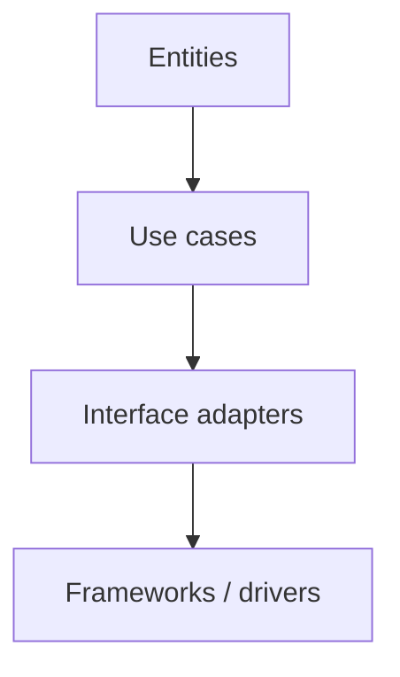
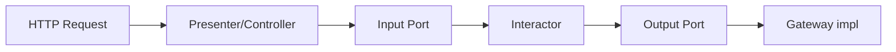

# Arquitetura limpa (Clean Architecture)

## Introdução

A **Clean Architecture** (Robert C. Martin) propõe **círculos concêntricos** de dependência: regras de negócio no centro; frameworks e drivers na periferia. A regra de ouro: **dependências apontam para dentro** — o domínio não conhece Spring, ASP.NET ou React.



---

## Camadas (visão resumida)

| Camada | Conteúdo típico |
|--------|-----------------|
| **Entities** | Regras críticas de negócio, independentes de aplicação |
| **Use cases** | Orquestração, fluxos de aplicação |
| **Interface adapters** | Presenters, gateways, conversores DTO ↔ domínio |
| **Frameworks** | Web, DB, UI, devices |

Nomes exatos variam; o importante é a **direção** das dependências e **testabilidade** do núcleo.

---

## Boundaries e DTOs

- **Entrada:** controllers chamam *input boundaries* (`PlaceOrderInputPort`).
- **Saída:** *output boundaries* (`OrderOutputPort`) implementados por gateways.
- **DTOs** de transporte não vazam para entidades sem tradução consciente.



---

## Exemplos — interactor + porta

### Java

```java
public interface PlaceOrderInputPort {
  OrderResult place(PlaceOrderCommand cmd);
}

public class PlaceOrderInteractor implements PlaceOrderInputPort {
  private final OrderRepository orders;
  private final PaymentGateway pay;

  public PlaceOrderInteractor(OrderRepository orders, PaymentGateway pay) {
    this.orders = orders;
    this.pay = pay;
  }

  @Override
  public OrderResult place(PlaceOrderCommand cmd) {
    // domínio + orquestração
    return new OrderResult(/* ... */);
  }
}
```

### C#

```csharp
public interface IPlaceOrderUseCase
{
    Task<OrderResult> ExecuteAsync(PlaceOrderCommand cmd, CancellationToken ct = default);
}
```

### TypeScript (núcleo sem Nest no import)

```typescript
export type PlaceOrderCommand = { customerId: string; sku: string; qty: number };

export interface OrderGateway {
  save(order: unknown): Promise<string>;
}

export function makePlaceOrder(gw: OrderGateway) {
  return async (cmd: PlaceOrderCommand) => {
    const id = crypto.randomUUID();
    await gw.save({ id, ...cmd });
    return id;
  };
}
```

### Python

```python
class PlaceOrderUseCase:
    def __init__(self, orders: "OrderGateway", payments: "PaymentGateway"):
        self._orders = orders
        self._payments = payments

    def execute(self, cmd: dict) -> dict:
        # regras + persistência via portas
        return {"orderId": self._orders.next_id()}
```

---

## Plugins e frameworks

Spring Boot, FastAPI ou Minimal APIs ficam na **borda**: registram beans/handlers que **adaptam** HTTP aos *use cases*. Trocar framework exige reescrever adaptadores, não o interactor.

---

## Testes

- **Unitários** do use case com *doubles* nas portas.
- **Integração** nos adaptadores (DB real em container, por exemplo).
- **E2E** no contorno HTTP — menos, mas cobrindo fluxos críticos.

---

## Referências

- Martin, R. C. *Clean Architecture*.
- artigo e vídeos do autor sobre *screaming architecture*.

---

*Clean Architecture vende **independência de framework**; o preço é **mais arquivos e mapeamentos** — use quando o produto vive anos.*
