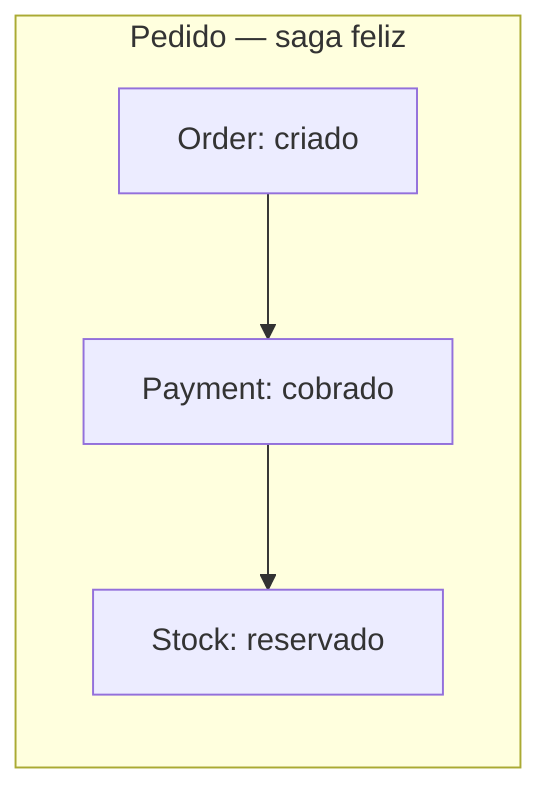
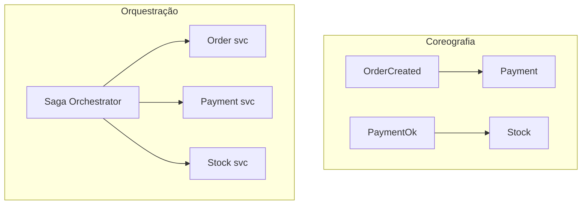

# Saga — transações distribuídas por orquestração ou coreografia

## Introdução

Em **microsserviços**, não há transação ACID única entre bases diferentes. O padrão **Saga** modela uma operação de negócio como **sequência de transações locais**, cada uma em um serviço, com **ações compensatórias** em caso de falha. Duas formas predominantes: **coreografia** (eventos entre pares) e **orquestração** (coordenador explícito).



---

## Coreografia vs orquestração

| Aspecto | Coreografia | Orquestração |
|---------|-------------|--------------|
| Controle | Cada serviço reage a eventos | *Saga orchestrator* decide próximo passo |
| Acoplamento | Conhecer eventos uns dos outros | Dependência do orchestrator |
| Depuração | Rastrear cadeia pode ser difícil | Fluxo centralizado em um lugar |
| Falha parcial | Compensações disparadas por eventos | Orchestrator invoca compensações |



---

## Compensações

**Compensação** não é “desfazer” como ROLLBACK SQL — é **ação de negócio** que anula efeito (estorno, cancelamento de pedido, liberação de estoque). Deve ser **idempotente** onde possível e **documentada** (ordem importa em disputas).

---

## Exemplos — estados e mensagens

### Java (Spring — mensagem ilustrativa)

```java
public record SagaStep(
    String sagaId,
    int stepIndex,
    String action,
    String payloadJson
) {}
```

### C#

```csharp
public sealed record CompensationCommand(
    string SagaId,
    string StepName,
    string Reason);
```

### JavaScript — máquina mínima em memória

```javascript
const saga = {
  sagaId: "s-1",
  steps: [
    { name: "order", forward: () => {}, compensate: () => {} },
    { name: "pay", forward: () => {}, compensate: () => {} },
  ],
  current: 0,
};
```

### Python

```python
from dataclasses import dataclass
from typing import Callable


@dataclass
class Step:
    name: str
    forward: Callable[[], None]
    compensate: Callable[[], None]
```

---

## Entrega e consistência

- **At-least-once** em filas exige **idempotência** nos handlers.
- **Outbox pattern** ajuda a publicar eventos de forma consistente com commit local.
- **Timeouts** e **sagas presas** precisam de monitoração e intervenção humana ou *retry* com limite.

---

## Persistência do estado da saga

Orquestradores costumam gravar **passo atual**, **payload** e **timeouts** em tabela própria ou banco dedicado para **recuperação** após crash. Coreografias dependem de **event sourcing** ou **logs** correlacionados por `sagaId` — sem isso, diagnosticar “onde parou” é caro. Ferramentas como **Temporal**, **Camunda** ou **AWS Step Functions** embutem parte desse modelo operacional.

## Quando evitar saga longa

Sagas com dezenas de passos e compensações frágeis viram **sistemas distribuídos difíceis de raciocinar**. Às vezes **monólito modular** ou **transação local + integração assíncrona** simples resolve melhor.

---

## Referências

- Richardson, C. *Microservices Patterns* — capítulo sobre sagas.
- Garcia-Molina, H. & Salem, K. *Sagas* (trabalho original).

---

*Saga troca **simplicidade transacional** por **modelagem explícita de falha** — desenhe compensações antes do happy path.*
