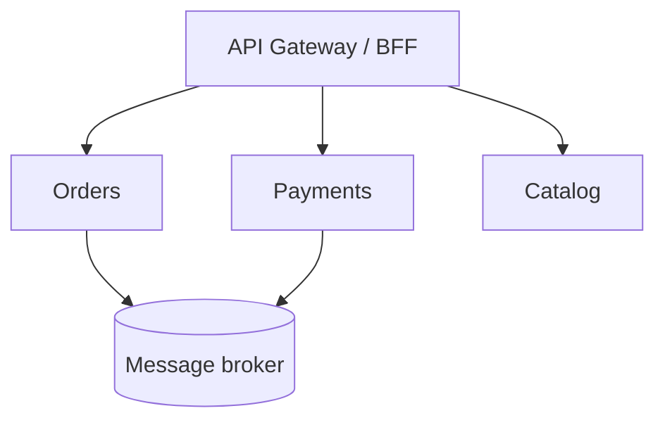
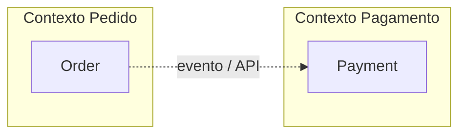

# Arquitetura de microsserviços

## Introdução

**Microsserviços** são serviços **autônomos** implantáveis de forma independente, alinhados a **limites de negócio** (bounded contexts), comunicando-se por rede (HTTP, filas, gRPC). O oposto pragmático é o **monólito modular** — um deploy, módulos claros internamente.



---

## Benefícios e custos

| Benefício | Custo |
|-----------|-------|
| Escala independente | Latência de rede e falhas parciais |
| Times autônomos | Contratos, versionamento, testes de integração |
| Tecnologia heterogênea | Operação, observabilidade, segurança multiplicadas |

---

## Decomposição

Critérios úteis:

- **Bounded context** (DDD) — vocabulário coeso.
- **Taxa de mudança** — o que muda junto pode ficar junto.
- **Dados** — cada serviço possui seus dados; compartilhar DB é anti-padrão clássico.



---

## Comunicação

- **Síncrona:** REST, gRPC — simples, acopla disponibilidade.
- **Assíncrona:** filas, *event streaming* — desacopla tempo, exige idempotência.

**API Gateway** ou **BFF** centraliza autenticação, roteamento e agregação para front-ends específicos.

---

## Observabilidade e deploy

- **Logs correlacionados** (`trace-id`) entre serviços.
- **Métricas** por instância e *SLOs* por endpoint crítico.
- **CI/CD** por serviço; *container* ou *serverless* conforme carga.

---

## Exemplos — health e descoberta (ilustrativo)

### Java (Spring Boot Actuator)

```yaml
# conceito: expor /actuator/health para orquestrador
management:
  endpoints:
    web:
      exposure:
        include: health,info
```

### C# (Minimal API)

```csharp
app.MapGet("/health", () => Results.Ok(new { status = "up" }));
```

### JavaScript (Express)

```javascript
app.get("/health", (_req, res) => res.json({ status: "up" }));
```

### Python (FastAPI)

```python
from fastapi import FastAPI

app = FastAPI()

@app.get("/health")
def health():
    return {"status": "up"}
```

---

## Contratos entre serviços

Defina **SLAs** de latência e disponibilidade por chamada síncrona; documente **timeouts** e **circuit breakers** (Resilience4j, Polly). Para evolução de contrato, prefira **versionamento explícito** (URL, header ou pacote gRPC) e testes de **consumer-driven contracts** (Pact). Em organizações maduras, um **catalog** de APIs (Backstage, Swagger UI agregado) reduz descoberta ad hoc.

## Anti-padrões

- **Microsserviço por classe** — overhead sem ganho organizacional.
- **Shared database** entre serviços — acoplamento oculto.
- **Chamadas em cadeia síncrona longa** — falha em cascata.

---

## Referências

- Newman, S. *Building Microservices*.
- Richardson, C. *Microservices Patterns*.
- Estudo interno: [Saga](./06-saga.md), [gRPC](./19-grpc.md).

---

*Microsserviços são **ferramenta organizacional e operacional**; comece com monólito bem modular e extraia quando os limites estiverem claros.*
