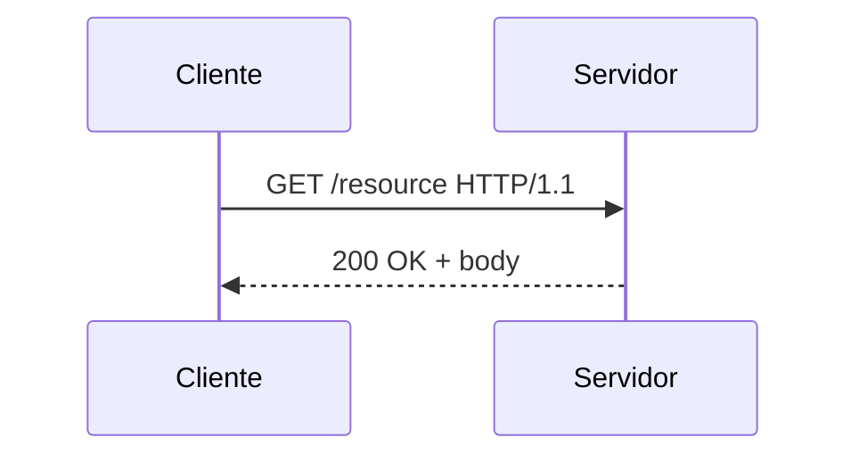

# HTTP — protocolo, métodos e semântica

## Introdução

**HTTP** (Hypertext Transfer Protocol) é o protocolo de camada de aplicação mais usado na web. Versões **HTTP/1.1**, **HTTP/2** e **HTTP/3** (sobre QUIC) melhoram multiplexação e latência, mas a **semântica** de métodos, status e cabeçalhos permanece central para APIs.



---

## Métodos (verbos)

| Método | Uso típico | Idempotente* | Corpo em request |
|--------|------------|--------------|------------------|
| **GET** | Ler recurso | Sim | Raro |
| **POST** | Criar ação / sub-recurso | Não | Comum |
| **PUT** | Substituir recurso | Sim | Comum |
| **PATCH** | Atualização parcial | Não garantido | Comum |
| **DELETE** | Remover | Sim | Opcional |

\*Idempotência: repetir a mesma requisição **não altera** o estado além do primeiro efeito (em condições normais).

---

## Códigos de status (grupos)

- **1xx** — informativo (raro em APIs REST comuns).
- **2xx** — sucesso (`200 OK`, `201 Created`, `204 No Content`).
- **3xx** — redirecionamento (`301`, `302`, `304 Not Modified`).
- **4xx** — erro do cliente (`400`, `401`, `403`, `404`, `409`, `422`).
- **5xx** — erro do servidor (`500`, `502`, `503`).

Consistência no **uso** por recurso reduz surpresas para consumidores.

---

## Cabeçalhos importantes

- **Content-Type** / **Accept** — negociação de representação (`application/json`).
- **Authorization** — esquemas `Bearer`, etc.
- **Cache-Control**, **ETag** — cache HTTP.
- **Location** — após `201 Created`, URI do novo recurso.

---

## HTTP/2 e HTTP/3 (resumo)

- **HTTP/2:** multiplexação em uma conexão TCP, *server push* (menos usado em APIs puras).
- **HTTP/3:** QUIC (UDP) reduz *head-of-line blocking* em perdas de pacote — melhor em redes instáveis.

---

## Exemplos — cliente HTTP mínimo

### Java (Java 11+ HttpClient)

```java
var client = HttpClient.newHttpClient();
var req = HttpRequest.newBuilder(URI.create("https://api.example.com/v1/items"))
    .header("Accept", "application/json")
    .GET()
    .build();
HttpResponse<String> res = client.send(req, HttpResponse.BodyHandlers.ofString());
System.out.println(res.statusCode());
```

### C#

```csharp
using var client = new HttpClient();
client.DefaultRequestHeaders.Accept.ParseAdd("application/json");
var res = await client.GetAsync("https://api.example.com/v1/items");
res.EnsureSuccessStatusCode();
```

### JavaScript (fetch)

```javascript
const res = await fetch("https://api.example.com/v1/items", {
  headers: { Accept: "application/json" },
});
console.log(res.status);
```

### Python

```python
import urllib.request

req = urllib.request.Request(
    "https://api.example.com/v1/items",
    headers={"Accept": "application/json"},
)
with urllib.request.urlopen(req) as r:
    print(r.status)
```

---

## Segurança

- **HTTPS** obrigatório em produção.
- Evitar **verbos GET com efeitos colaterais** (cache intermediário, pré-fetch).
- **CORS** é política de browser — não substitui autenticação no servidor.

---

## Referências

- IETF RFC 9110 (HTTP Semantics) e RFCs relacionadas a HTTP/2 e HTTP/3.
- MDN — documentação prática de métodos e status.

---

*APIs RESTful e GraphQL rodam **sobre** HTTP — dominar status e cabeçalhos evita integrações frágeis.*
