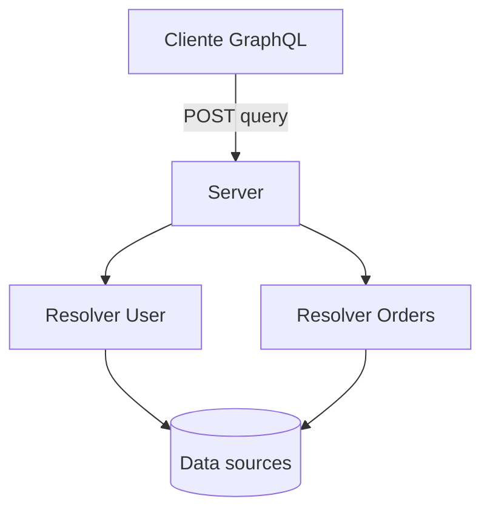

# GraphQL — consulta única, schema e trade-offs

## Introdução

**GraphQL** é uma **linguagem de consulta** e runtime tipado: o cliente envia uma **query** descrevendo os campos desejados; o servidor resolve com **resolvers** sobre um **schema** (tipos, campos, arguments). Diferente de REST com muitos endpoints, costuma haver **um endpoint HTTP** (`/graphql`) para leitura e mutações.



---

## Schema SDL (exemplo)

```graphql
type Query {
  user(id: ID!): User
}

type User {
  id: ID!
  name: String!
  orders(first: Int): [Order!]!
}

type Order {
  id: ID!
  total: Float!
}
```

**Tipos fortes** permitem documentação e validação automática da query.

---

## Queries, mutations e subscriptions

| Operação | Uso |
|----------|-----|
| **Query** | Leitura |
| **Mutation** | Alteração de estado |
| **Subscription** | Fluxo contínuo (WebSocket em muitos servidores) |

---

## N+1 e DataLoader

Resolvers por campo podem causar **N+1** consultas ao banco. O padrão **DataLoader** (batch + cache por request) agrupa leituras.

---

## Vantagens e cuidados

| Pró | Contra |
|-----|--------|
| Cliente pede só o que precisa | Queries profundas podem sobrecarregar CPU/DB |
| Evita *over-fetching* em mobile | Cache HTTP de CDN é menos trivial que GET REST |
| Introspection em dev | Expor introspection em produção exige cautela |

---

## Exemplos — servidor mínimo (conceito)

### JavaScript (apollo-server style pseudocódigo)

```javascript
const resolvers = {
  Query: {
    user: (_p, { id }) => db.userById(id),
  },
  User: {
    orders: (user, { first = 10 }) => db.ordersByUser(user.id, first),
  },
};
```

### C# (Hot Chocolate — ideia)

```csharp
// Schema-first ou code-first: tipo User com campo Orders resolvido
```

### Python (Strawberry — esboço)

```python
import strawberry

@strawberry.type
class User:
    id: str
    name: str

@strawberry.type
class Query:
    @strawberry.field
    def user(self, id: str) -> User | None:
        return load_user(id)
```

### Java (DGS / GraphQL Java)

```java
// @DgsQuery / @DgsData para resolvers modulares
```

---

## Federation e subgraphs

Em organizações grandes, **Apollo Federation** ou **GraphQL Mesh** agregam **subgraphs** mantidos por times diferentes. O **gateway** compõe o schema supergraph; exige **governança** de tipos compartilhados (`@key`, `@external`) e **versionamento** coordenado para não quebrar resolvers entre equipes.

## Segurança

- **Limitar profundidade** e complexidade da query (*cost analysis*).
- **Autorização** campo a campo (não confiar só na query “não pedir” campos sensíveis).
- **Rate limiting** por consumidor.

---

## Referências

- GraphQL.org — especificação e tutoriais.
- Facebook/DataLoader — padrão de batching.

---

*GraphQL brilha com **muitos clientes e UIs heterogêneas**; REST e gRPC seguem ótimos para contratos estáveis B2B.*
