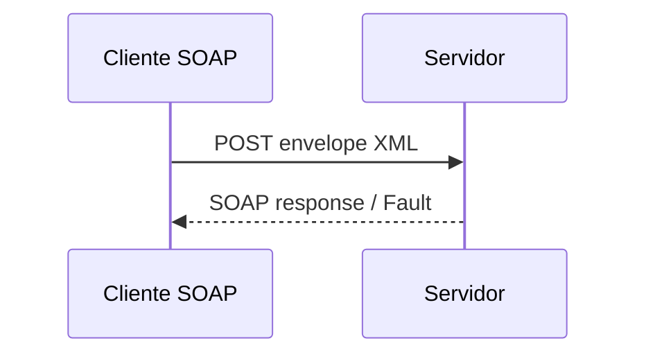

# SOAP — XML, WSDL e serviços enterprise

## Introdução

**SOAP** (Simple Object Access Protocol) é um protocolo baseado em **XML** para mensagens estruturadas, frequentemente sobre **HTTP** mas independente de transporte. Em ambientes **enterprise** e legados, **WSDL** descreve operações, tipos e endpoints; ferramentas geram **stubs** cliente e servidor.



---

## Envelope SOAP

Mensagem típica contém:

- **Envelope** — raiz.
- **Header** — metadados (segurança WS-Security, correlação).
- **Body** — payload da operação ou **Fault** em erro.

```xml
<soap:Envelope xmlns:soap="http://schemas.xmlsoap.org/soap/envelope/">
  <soap:Body>
    <GetPrice xmlns="http://example.com/">
      <sku>ABC</sku>
    </GetPrice>
  </soap:Body>
</soap:Envelope>
```

---

## WSDL e XSD

**WSDL** referencia **XSD** para tipos; contrato é **explícito** e versionável, porém verboso. **Document/Literal** é o estilo mais comum hoje.

---

## SOAP vs REST (visão prática)

| SOAP | REST JSON |
|------|-----------|
| Contrato rígido, tooling maduro | Leve para browsers e mobile |
| WS-* (segurança, transações) em grandes vendors | Simplicidade, cache HTTP |
| Overhead XML | Menos cerimônia |

Muitas organizações mantêm SOAP para **integrações B2B** e expõem REST/JSON para **canais digitais**.

---

## Exemplos — cliente (ilustrativo)

### Java (JAX-WS style)

```java
// Gerado a partir do WSDL: PriceService port = service.getPriceServicePort();
// GetPriceResponse r = port.getPrice("ABC");
```

### C# (WCF / generated client)

```csharp
// var client = new PriceServiceClient();
// var r = await client.GetPriceAsync("ABC");
```

### Python (zeep)

```python
from zeep import Client

client = Client("https://example.com/service?wsdl")
result = client.service.GetPrice("ABC")
```

### JavaScript (soap / strong-soap)

```javascript
const soap = require("soap");
soap.createClient(url, (err, client) => {
  client.GetPrice({ sku: "ABC" }, (_e, r) => console.log(r));
});
```

---

## Faults

**SOAP Fault** transporta `faultcode`, `faultstring`, `detail` — padronize mapeamento para erros de domínio e **não** exponha stack traces em produção.

## WS-Security e políticas (visão enterprise)

Em integrações B2B, **WS-Security** pode transportar tokens, assinatura XML e criptografia de partes da mensagem. O custo é **complexidade** e **performance** — use quando políticas de segurança exigirem, não por padrão em APIs internas novas. Ferramentas de **governança** (API Gateway corporativo) frequentemente mediam entre consumidores REST e provedores SOAP legados.

---

## Referências

- W3C / OASIS — especificações SOAP e WS-*.
- Zeep, JAX-WS, WCF — documentação das stacks.

---

*SOAP permanece relevante onde **contrato XML e políticas corporativas** são mandatórios; para APIs públicas novas, JSON/REST ou gRPC são mais comuns.*
