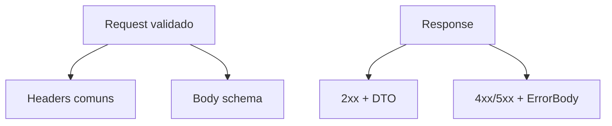

# Normalização e padronização de request/response

## Introdução

APIs escaláveis precisam de **contratos previsíveis**: formatos de **erro** uniformes, **paginação** consistente, **datas** em ISO 8601 UTC, **IDs** como string ou UUID conforme padrão do produto. Este artigo propõe um **“envelope” mínimo** e regras que funcionam em REST JSON (e inspiram BFFs GraphQL).



---

## Request — cabeçalhos comuns

| Header | Uso |
|--------|-----|
| `Content-Type: application/json` | Corpo JSON |
| `Accept: application/json` | Negociação |
| `Authorization: Bearer …` | Autenticação |
| `Idempotency-Key` | POST seguros para retry |
| `X-Request-Id` / `traceparent` | Correlação |

---

## Response — sucesso

Manter **recurso** ou **lista** no corpo, com paginação explícita:

```json
{
  "items": [{ "id": "a" }, { "id": "b" }],
  "page": { "nextCursor": "eyJ…", "hasMore": true }
}
```

Evite misturar metadados de negócio e metadados de **paginação** no mesmo nível sem convenção.

---

## Response — erro padronizado

```json
{
  "type": "https://api.example.com/problems/validation-error",
  "title": "Validation failed",
  "status": 422,
  "detail": "quantity must be >= 1",
  "instance": "/v1/orders",
  "errors": [{ "field": "quantity", "code": "min", "message": "…" }]
}
```

Alinhado ao RFC **7807 Problem Details** (HTTP API Problems).

---

## Nomenclatura e tipos

- **camelCase** ou **snake_case** — escolha **uma** por API e documente.
- **Boolean** como `true`/`false`, não `1`/`0`.
- **Decimal monetário** — string ou inteiro em centavos (evitar `float` para dinheiro).
- **Data/hora** — `2025-03-24T14:00:00Z`.

---

## Exemplos — validação + resposta de erro

### Java (Spring)

```java
@RestControllerAdvice
public class ProblemDetailsHandler {
  @ExceptionHandler(MethodArgumentNotValidException.class)
  public ResponseEntity<ProblemDetail> handle(MethodArgumentNotValidException ex) {
    var body = new ProblemDetail(422, "Validation failed", /* map fields */);
    return ResponseEntity.unprocessableEntity().body(body);
  }
}
```

### C#

```csharp
app.UseExceptionHandler(); // + ProblemDetails middleware (.NET 7+)
```

### JavaScript (Express + Zod)

```javascript
app.use((err, req, res, next) => {
  if (err.name === "ZodError") {
    return res.status(422).json({
      type: "validation-error",
      title: "Validation failed",
      status: 422,
      errors: err.flatten(),
    });
  }
  next(err);
});
```

### Python (FastAPI)

```python
from fastapi import FastAPI, Request
from fastapi.responses import JSONResponse
from fastapi.exceptions import RequestValidationError

app = FastAPI()

@app.exception_handler(RequestValidationError)
async def validation(_: Request, exc: RequestValidationError):
    return JSONResponse(
        status_code=422,
        content={
            "type": "validation-error",
            "title": "Validation failed",
            "status": 422,
            "errors": exc.errors(),
        },
    )
```

---

## Versionamento de contrato

- **Breaking:** novo path major ou header de versão.
- **Non-breaking:** novos campos opcionais, novos endpoints.
- Documentar em **OpenAPI** com `deprecated: true` antes de remover.

---

## Referências

- IETF RFC 7807 — Problem Details for HTTP APIs.
- OpenAPI Specification — schemas compartilhados.

---

*Padronizar erro e paginação economiza **horas de integração** em cada novo cliente.*
