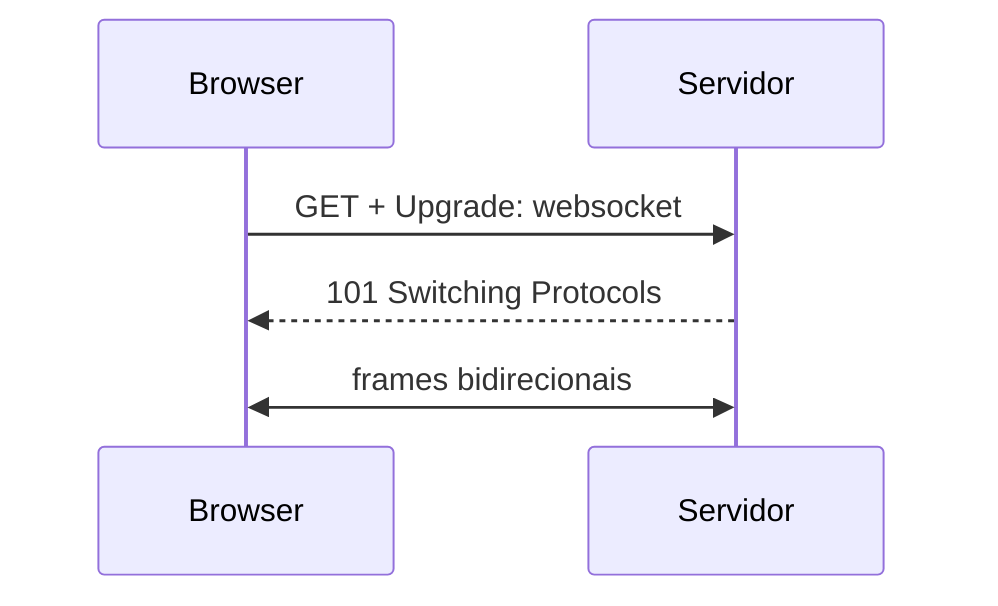
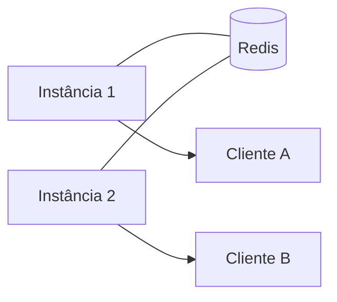

# WebSockets — conexão bidirecional full-duplex

## Introdução

**WebSocket** é um protocolo sobre TCP que começa com **handshake HTTP** (`Upgrade: websocket`) e passa a um **canal full-duplex** com *frames* de texto ou binário. Ideal para **chat**, **notificações em tempo quase real**, **jogos** e **painéis ao vivo** com menos overhead que *long polling*.



---

## Modelo de mensagens

Defina **formato** (JSON com campo `type`, protobuf em binário, etc.) e **heartbeats** (ping/pong) para detectar conexões mortas atrás de proxies.

---

## Escalabilidade

Servidores com **múltiplas instâncias** precisam de **backplane** (Redis Pub/Sub, NATS, etc.) para enviar mensagens ao socket certo.



---

## Segurança

- **WSS** (TLS) em produção.
- **Autenticação** via token na query (limitações) ou cookie + same-site; preferir **ticket de curta duração** trocado após conexão segura.
- **Validar origem** e limitar tamanho de *frames*.

---

## Exemplos — eco servidor mínimo

### JavaScript (ws — Node)

```javascript
import { WebSocketServer } from "ws";
const wss = new WebSocketServer({ port: 8080 });
wss.on("connection", (socket) => {
  socket.on("message", (data) => socket.send(data));
});
```

### Browser

```javascript
const ws = new WebSocket("wss://api.example.com/ws");
ws.onmessage = (ev) => console.log(ev.data);
ws.send(JSON.stringify({ type: "ping" }));
```

### Java (Spring WebSocket / STOMP — ideia)

```java
// @MessageMapping / SimpMessagingTemplate para broker STOMP sobre WebSocket
```

### C# (ASP.NET)

```csharp
app.Map("/ws", async context =>
{
    if (!context.WebSockets.IsWebSocketRequest) { context.Response.StatusCode = 400; return; }
    using var ws = await context.WebSockets.AcceptWebSocketAsync();
    // receive / send loop
});
```

### Python (websockets)

```python
import asyncio
import websockets

async def echo(websocket):
    async for message in websocket:
        await websocket.send(message)

async def main():
    async with websockets.serve(echo, "localhost", 8765):
        await asyncio.Future()

asyncio.run(main())
```

---

## WebSocket vs SSE vs MQTT

- **SSE** — servidor → cliente só, sobre HTTP (ver artigo SSE).
- **MQTT** — broker pub/sub para IoT e baixa largura (ver artigo MQTT).
- **WebSocket** — bidirecional, browser-friendly.

---

## Referências

- RFC 6455 — The WebSocket Protocol.
- MDN — WebSocket API.

---

*WebSocket remove overhead HTTP repetido; o custo é **estado de conexão** e **operação** mais complexa.*
