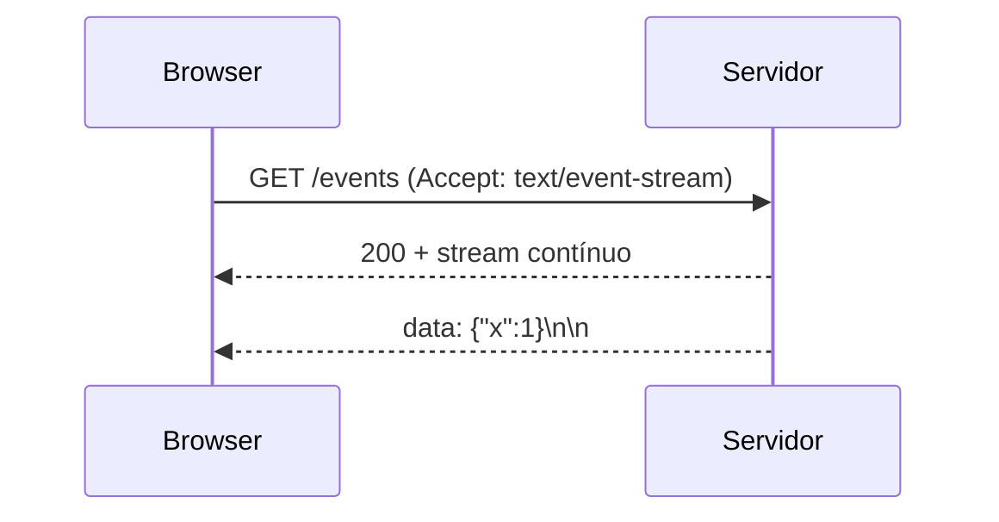

# Server-Sent Events (SSE)

## Introdução

**Server-Sent Events** permitem que o servidor **empurre** texto ao cliente sobre uma **conexão HTTP** unidirecional (servidor → cliente). O browser expõe `EventSource` com **reconexão automática** e formato de linhas `data: …`. É mais simples que WebSocket quando **só precisa de notificações** ou *streams* de texto/JSON.



---

## Formato

- Linhas `data:` — corpo do evento (múltiplas linhas concatenadas).
- `id:` — último ID para `Last-Event-ID` em *reconnect*.
- `event:` — tipo customizado.
- Linha em branco **termina** o evento.

---

## Limitações

- **UTF-8 texto** — binário precisa de Base64 ou outro canal.
- **Unidirecional** — cliente não envia pelo mesmo stream (use POST paralelo).
- **Conexões por domínio** — limite de browsers a HTTP/1.1; HTTP/2 multiplexa melhor.
- **Proxies** — buffers podem atrasar; configurar *flush* e desabilitar cache agressivo.

---

## Exemplos — servidor

### Node (Express)

```javascript
app.get("/events", (req, res) => {
  res.setHeader("Content-Type", "text/event-stream");
  res.setHeader("Cache-Control", "no-cache");
  res.flushHeaders();
  let n = 0;
  const t = setInterval(() => {
    res.write(`data: ${JSON.stringify({ n: ++n })}\n\n`);
  }, 1000);
  req.on("close", () => clearInterval(t));
});
```

### Spring Boot (Java)

```java
@GetMapping(path = "/events", produces = MediaType.TEXT_EVENT_STREAM_VALUE)
public Flux<ServerSentEvent<String>> stream() {
  return Flux.interval(Duration.ofSeconds(1))
      .map(i -> ServerSentEvent.builder("tick-" + i).build());
}
```

### C# (Minimal)

```csharp
app.MapGet("/events", async (HttpResponse res, CancellationToken ct) =>
{
    res.Headers.ContentType = "text/event-stream";
    await res.WriteAsync("data: hello\n\n", ct);
    await res.Body.FlushAsync(ct);
});
```

### Python (FastAPI + StreamingResponse)

```python
import asyncio
import json
from fastapi import FastAPI
from fastapi.responses import StreamingResponse

app = FastAPI()

async def gen():
    n = 0
    while True:
        n += 1
        yield f"data: {json.dumps({'n': n})}\n\n"
        await asyncio.sleep(1)

@app.get("/events")
async def events():
    return StreamingResponse(gen(), media_type="text/event-stream")
```

---

## Cliente

```javascript
const es = new EventSource("/events");
es.onmessage = (e) => console.log(JSON.parse(e.data));
es.addEventListener("price", (e) => console.log(e.data));
```

---

## SSE vs WebSocket

| SSE | WebSocket |
|-----|-----------|
| HTTP simples, *firewall-friendly* | Upgrade de protocolo |
| Só servidor → cliente | Bidirecional |
| Reconnect nativo | Você implementa *heartbeat* |

---

## Referências

- HTML Living Standard — *Server-sent events*.
- MDN — `EventSource`.

---

*SSE é a escolha **mais barata** para *live feed* unidirecional em dashboards e notificações leves.*
