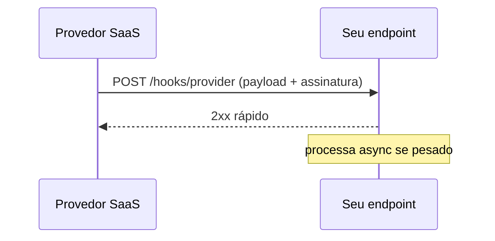

# Webhooks — callbacks HTTP assíncronos

## Introdução

**Webhook** é um **callback HTTP** disparado por um servidor quando algo acontece (pagamento confirmado, commit em repo, mensagem em canal). O produtor envia **POST** (tipicamente JSON) para uma URL registrada pelo consumidor — padrão central em **SaaS**, **automação** e **integrações low-code**.



---

## Boas práticas

| Tema | Recomendação |
|------|--------------|
| **Resposta** | Retornar **2xx rápido**; trabalho pesado em fila interna |
| **Idempotência** | Mesmo evento pode chegar **duas vezes** — chave única por `event_id` |
| **Assinatura** | HMAC no corpo (ex.: `X-Hub-Signature-256`, Stripe-Signature) |
| **Retry** | Provedor repete em backoff se 5xx/timeout — seu handler deve ser idempotente |
| **HTTPS** | Obrigatório; validar TLS no cliente outbound |

---

## Segurança

- **Verificar assinatura** com *secret* por endpoint.
- **Rotacionar secrets** sem downtime (dois secrets válidos temporariamente).
- **Allowlist de IPs** apenas como camada extra (IPs mudam).

---

## Exemplos — verificação HMAC (conceito)

### JavaScript (Node crypto)

```javascript
import crypto from "crypto";

function verify(rawBody, signature, secret) {
  const h = crypto.createHmac("sha256", secret).update(rawBody).digest("hex");
  return crypto.timingSafeEqual(Buffer.from(signature), Buffer.from(h));
}
```

### Python

```python
import hmac
import hashlib

def verify(raw: bytes, sig: str, secret: bytes) -> bool:
    mac = hmac.new(secret, raw, hashlib.sha256).hexdigest()
    return hmac.compare_digest(mac, sig)
```

### C#

```csharp
public static bool Verify(byte[] body, string sigHex, byte[] secret)
{
    using var hmac = new HMACSHA256(secret);
    var hash = Convert.ToHexString(hmac.ComputeHash(body)).ToLowerInvariant();
    return CryptographicOperations.FixedTimeEquals(
        Encoding.UTF8.GetBytes(hash),
        Encoding.UTF8.GetBytes(sigHex.ToLowerInvariant()));
}
```

### Java

```java
public boolean verify(byte[] body, String sigHex, byte[] secret) throws Exception {
  var mac = Mac.getInstance("HmacSHA256");
  mac.init(new SecretKeySpec(secret, "HmacSHA256"));
  var expected = HexFormat.of().formatHex(mac.doFinal(body));
  return MessageDigest.isEqual(expected.getBytes(), sigHex.toLowerCase().getBytes());
}
```

---

## Contrato de payload

Documente **versionamento** (`api_version`, `event_type`), **timestamp** e **id**. Consumidor ignora tipos desconhecidos **sem falhar** (forward compatibility).

---

## Referências

- OWASP — *Webhook Security*.
- Documentação de Stripe, GitHub, Slack — padrões de assinatura.

---

*Webhook é **mensageria sobre HTTP**; trate como **at-least-once** e **nunca** confie no payload sem autenticidade.*
