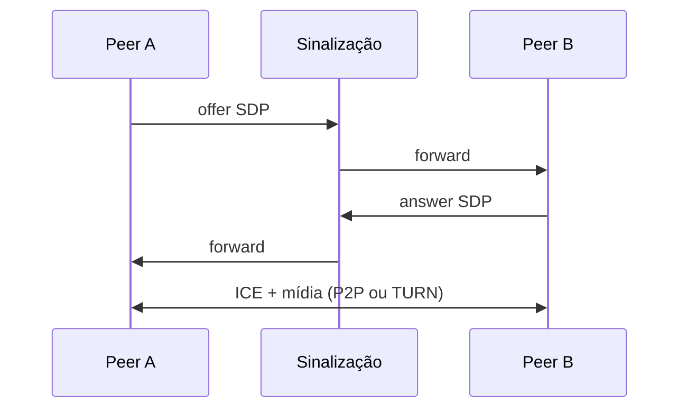

# WebRTC — mídia em tempo real no browser

## Introdução

**WebRTC** (Web Real-Time Communication) permite **áudio, vídeo e dados P2P** entre browsers (ou nativos) com **baixa latência**, usando **UDP**, **SRTP** e **DTLS**. O sinalização (troca de SDP e ICE candidates) costuma passar por um **servidor de sinalização** (WebSocket/WebSocket Secure); a mídia pode ir **direta** entre pares quando NAT permite (**STUN**); caso contrário **TURN** relay.



---

## Componentes

| Peça | Papel |
|------|--------|
| **getUserMedia** | Captura câmera/mic |
| **RTCPeerConnection** | Transporte, codecs, ICE |
| **DataChannel** | Dados binários P2P |
| **STUN** | Descobrir IP público |
| **TURN** | Relay quando P2P falha |

---

## Sinalização

O padrão **não** define o protocolo de sinalização — você implementa (Socket.io, WebSocket custom, Firebase, etc.). Trocar **SDP** e **candidates** até `connectionstate === "connected"`.

---

## Exemplo — esqueleto browser (JavaScript)

```javascript
const pc = new RTCPeerConnection({
  iceServers: [{ urls: "stun:stun.l.google.com:19302" }],
});

const stream = await navigator.mediaDevices.getUserMedia({ video: true, audio: true });
for (const track of stream.getTracks()) pc.addTrack(track, stream);

pc.onicecandidate = (e) => {
  if (e.candidate) signalSend({ type: "ice", candidate: e.candidate });
};

const offer = await pc.createOffer();
await pc.setLocalDescription(offer);
signalSend({ type: "offer", sdp: offer.sdp });
```

### Servidor (C#/Java/Python)

Não processam RTP diretamente no código de negócio típico — hospedam **sinalização** e **TURN**. Exemplo ilustrativo **ASP.NET** como hub de sinalização:

```csharp
// SignalR hub: Clients.Others.SendAsync("signal", payload);
```

Spring WebSocket ou FastAPI WebSocket podem repassar JSON de SDP da mesma forma.

---

## NAT, ICE e TURN em produção

**ICE** (Interactive Connectivity Establishment) testa caminhos candidatos até achar par P2P viável. Em redes corporativas restritas, **TURN** quase sempre entra — **planeje cotas** e **autenticação** no servidor TURN. Monitore taxa de **failed connections** e latência por região para dimensionar clusters de sinalização e TURN.

## Gravação e SFU

Videoconferências multi-parte usam **SFU** (Selective Forwarding Unit) ou **MCU** — não full mesh N×N. Produtos: Janus, mediasoup, LiveKit, Twilio, etc.

---

## Segurança e privacidade

- **HTTPS** obrigatório para `getUserMedia` na maioria dos browsers.
- **Permissões** explícitas do usuário.
- **Criptografia** end-to-end é possível com camadas adicionais (E2EE), não é o padrão WebRTC “de fábrica”.

---

## Referências

- W3C — WebRTC API.
- IETF — RTP, STUN, TURN, ICE.

---

*WebRTC entrega **latência**; o custo é **complexidade de NAT, TURN e sinalização**.*
