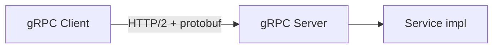

# gRPC — RPC sobre HTTP/2 com Protobuf

## Introdução

**gRPC** usa **HTTP/2** e **Protocol Buffers** (tipagem forte, payload binário compacto) para **RPC** cliente-servidor e **streaming** (unário, servidor, cliente, bidirecional). É comum em **microsserviços internos** e **mobile → backend** quando performance e contrato evolutivo importam.



---

## `.proto` (exemplo)

```protobuf
syntax = "proto3";
package demo;

service Greeter {
  rpc SayHello (HelloRequest) returns (HelloReply);
}

message HelloRequest { string name = 1; }
message HelloReply { string message = 1; }
```

`protoc` + plugins geram stubs em Java, C#, Go, Python, etc.

---

## Streaming

- **Server streaming** — uma chamada, muitas respostas (logs, preços).
- **Client streaming** — upload em partes.
- **Bidi** — canais interativos.

---

## Status e erros

**gRPC status codes** (`NOT_FOUND`, `INVALID_ARGUMENT`, `DEADLINE_EXCEEDED`) mapeiam conceitualmente a HTTP; **deadlines** e **cancellation** propagam pela call chain.

---

## gRPC vs REST

| gRPC | REST JSON |
|------|-----------|
| Binário, contrato `.proto` | Legível, curl-friendly |
| HTTP/2 multiplex | Cache CDN mais simples em GET |
| Forte em interna | Forte em pública |

**gRPC-Gateway** expõe REST/JSON para o mesmo serviço.

---

## Exemplos — servidor mínimo (conceito)

### Java (grpc-java)

```java
public class GreeterImpl extends GreeterGrpc.GreeterImplBase {
  @Override
  public void sayHello(HelloRequest req, StreamObserver<HelloReply> resp) {
    resp.onNext(HelloReply.newBuilder().setMessage("Hi " + req.getName()).build());
    resp.onCompleted();
  }
}
```

### C# (Grpc.AspNetCore.Server)

```csharp
public class GreeterService : Greeter.GreeterBase
{
    public override Task<HelloReply> SayHello(HelloRequest request, ServerCallContext ctx)
        => Task.FromResult(new HelloReply { Message = "Hi " + request.Name });
}
```

### Python (grpcio)

```python
class Greeter(demo_pb2_grpc.GreeterServicer):
    def SayHello(self, request, context):
        return demo_pb2.HelloReply(message="Hi " + request.name)

server = grpc.server(futures.ThreadPoolExecutor(max_workers=10))
demo_pb2_grpc.add_GreeterServicer_to_server(Greeter(), server)
```

### JavaScript (@grpc/grpc-js)

```javascript
const grpc = require("@grpc/grpc-js");
const server = new grpc.Server();
server.addService(loader, {
  SayHello: (call, cb) => cb(null, { message: "Hi " + call.request.name }),
});
```

---

## Spring Boot

**grpc-spring-boot-starter** integra com DI; expõe porta gRPC separada da HTTP MVC.

---

## Referências

- gRPC.io — guias e tutoriais.
- Protobuf Language Guide.

---

*gRPC é **contrato + binário + streaming**; para APIs públicas amplas, combine com gateway REST ou documentação forte.*
