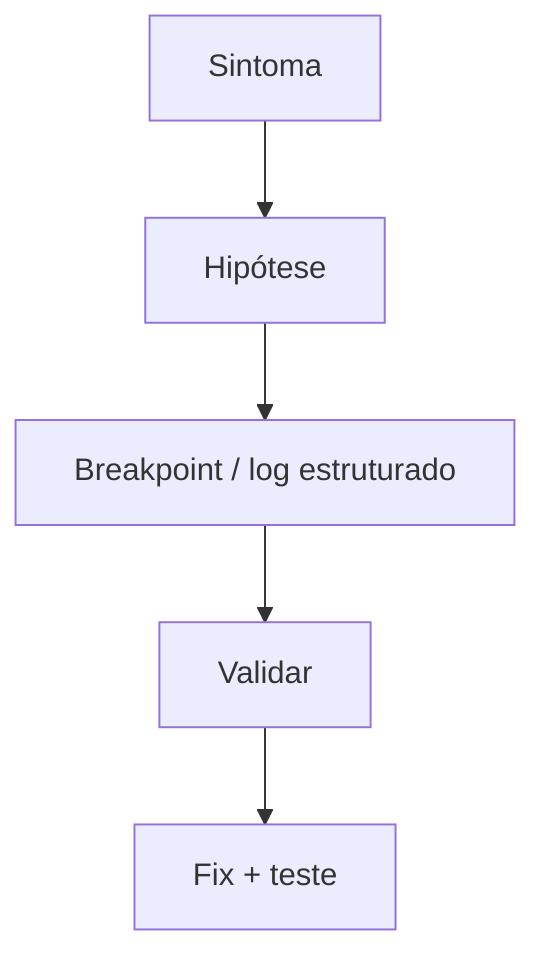

# Debug de aplicações — Clojure, VS Code/Cursor, C#, Spring Boot e Python

## Introdução

Este artigo consolida **fluxos de depuração** nas stacks mais citadas no repositório: **Clojure** (REPL-driven), **C#** / **.NET**, **Spring Boot** (Java) e **Python**, usando **VS Code** e **Cursor** (compatível com extensões VS Code). O objetivo é reduzir tempo entre **sintoma** (log, 500, timeout) e **causa** (estado inválido, I/O, concorrência).



---

## Princípios comuns

1. **Reproduzir** — script, teste de integração ou *curl* mínimo.
2. **Isolar** — remover proxies, *feature flags*, dados específicos.
3. **Observar estado** — variáveis, pilha, *async* continuations.
4. **Não depurar em produção** com debugger attach salvo processo controlado — preferir **logs**, **traces**, **profiles**.

---

## Clojure — VS Code / Cursor

**Extensão:** [Calva](https://marketplace.visualstudio.com/items?itemName=betterthantomorrow.calva) (REPL integrado).

- Inicie o **REPL** (`Calva: Start a Project REPL`).
- **Evaluate** formas com `Alt+Enter`; insira **`#dbg`** ou breakpoints no *debugger* Calva onde suportado.
- Use **`tap>`** (`(tap> x)`) com `add-tap` para inspecionar fluxo sem poluir stdout.
- **Stack traces** em Clojure são verbosas — leia **causa raiz** no fim; ative `*print-level*` / `*print-length*` para não travar o REPL.

```clojure
(comment
  (defn suspect [n]
    (tap> {:stage :in :n n})
    (/ 1 n)) ;; ArithmeticException se n = 0
  (suspect 0))
```

---

## C# — Visual Studio Code

**Extensão:** C# (ms-dotnettools.csharp) ou C# Dev Kit.

- `launch.json` com `"type": "coreclr"`, `program` apontando para o `.dll` ou projeto.
- **Conditional breakpoints** e **Hit Count** para loops ruidosos.
- **`DebuggerDisplay`** em tipos para ver estado resumido.
- Async: janela **Tasks** / pilha quando `await` suspende.

```json
{
  "version": "0.2.0",
  "configurations": [
    {
      "name": ".NET Launch",
      "type": "coreclr",
      "request": "launch",
      "program": "${workspaceFolder}/bin/Debug/net8.0/MyApp.dll"
    }
  ]
}
```

---

## Spring Boot (Java) — VS Code / Cursor

**Extensão:** Extension Pack for Java (Microsoft).

- **Run and Debug** com `main` da aplicação ou `Spring Boot Dashboard`.
- Breakpoints em **código próprio**; para código de biblioteca, habilitar *source lookup* de dependências Maven/Gradle.
- **`logging.level.org.springframework.web=DEBUG`** temporário para mapear *handlers* (cuidado com volume).
- **Remote debug** (`-agentlib:jdwp=transport=dt_socket,server=y,suspend=n,address=*:5005`) em container — só em ambientes seguros.

```yaml
# application-dev.yml (temporário)
logging:
  level:
    com.example: DEBUG
```

---

## Python — VS Code / Cursor

**Extensão:** Python (ms-python.python) + debugpy.

- `launch.json` com `"module": "uvicorn"` para FastAPI, ou `"program": "${file}"` para scripts.
- **Conditional breakpoints**; **Logpoint** para não recompilar.
- Ambientes virtuais: selecionar **interpreter** correto antes de debugar.

```json
{
  "name": "FastAPI",
  "type": "debugpy",
  "request": "launch",
  "module": "uvicorn",
  "args": ["main:app", "--reload", "--port", "8000"]
}
```

---

## Cursor — notas

Cursor reutiliza o **mesmo** `launch.json` e extensões VS Code. **Composer/Agent** não substitui debugger: use-o para **localizar arquivos** e **gerar hipóteses**, mas valide com execução passo a passo.

---

## Quando o breakpoint não basta

- **Flaky tests** — `-Xdiag` (JVM), `DOTNET_CLI_UI_LANGUAGE`, `faulthandler` (Python).
- **Produção** — OpenTelemetry traces, *structured logging* com `trace_id`, *profiling* contínuo (Pyroscope, dotTrace, async-profiler).

---

## Referências

- Calva docs — debugging Clojure.
- Microsoft — debug .NET e Java no VS Code.
- debugpy — wiki no GitHub.

---

*Debug eficiente combina **ferramenta certa** com **reprodução mínima** — sem isso, só acumula breakpoints fantasmas.*
