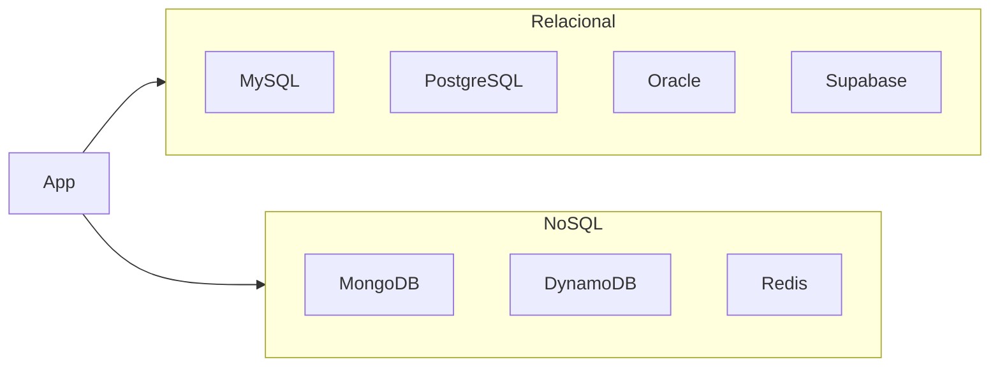

# Visão geral: relacional vs não relacional

## Por que escolher um tipo de banco?

Bancos de dados armazenam e permitem consultar dados de forma estruturada. A escolha entre **relacional** e **não relacional** (NoSQL) impacta modelagem, consistência, escala e ferramentas. Nenhum tipo é “melhor” em absoluto; cada um atende melhor a certos cenários.

Este estudo cobre os principais bancos **relacionais** (MySQL, PostgreSQL, Oracle, Supabase) e **não relacionais** (MongoDB, DynamoDB, Redis), além de **ORMs** e conceitos de **transações e consistência**.

---

## Relacional (SQL)

Bancos **relacionais** organizam dados em **tabelas** (linhas e colunas), com **chaves primárias** e **estrangeiras** ligando entidades. A linguagem padrão é o **SQL** (Structured Query Language). O modelo segue a **álgebra relacional** e garante **integridade** via esquema, restrições e transações ACID.

**Características principais:**

- **Esquema fixo** (ou evoluído com migrações): colunas tipadas, obrigatórias ou opcionais.
- **Normalização:** redução de redundância e anomalias (1NF, 2NF, 3NF, etc.).
- **Transações ACID:** atomicidade, consistência, isolamento e durabilidade.
- **Consultas declarativas:** SELECT, JOIN, agregações, subconsultas.

**Quando usar:** domínio com entidades bem definidas, relações estáveis, necessidade de integridade forte e consultas ad hoc (relatórios, dashboards). Ex.: sistemas de negócio, ERP, CRM, catálogos, faturamento.

---

## Não relacional (NoSQL)

**NoSQL** agrupa modelos diferentes: **documento**, **chave-valor**, **colunar**, **grafo**. Em comum: flexibilidade de esquema (ou sem esquema rígido), escala horizontal frequente e trade-offs em consistência (eventual consistency em muitos casos).

| Tipo        | Modelo principal     | Exemplos típicos     | Uso principal                    |
|------------|----------------------|----------------------|----------------------------------|
| Documento  | Documentos (JSON/BSON)| MongoDB, Couchbase   | Catálogos, conteúdo, perfis      |
| Chave-valor| Chave → valor        | Redis, DynamoDB      | Cache, sessão, filas, alta vazão |
| Colunar    | Colunas por família  | Cassandra, HBase     | Analytics, séries temporais      |
| Grafo      | Nós e arestas        | Neo4j                | Redes, recomendações, fraudes    |

**Quando usar:** alto volume de escrita, esquema variável, baixa necessidade de JOINs complexos, distribuição geográfica ou latência muito baixa (cache). Ex.: logs, eventos, carrinho, sessões, feeds.

---

## Diagrama: posicionamento

Na prática, muitos sistemas usam **ambos**: relacional para núcleo transacional e NoSQL (ou cache) para sessão, filas ou analytics.

---

## Critérios de escolha (resumo)

| Critério           | Tendência relacional      | Tendência NoSQL              |
|--------------------|---------------------------|-------------------------------|
| Esquema            | Fixo ou evolução controlada| Flexível ou sem esquema       |
| Consistência       | Forte (ACID)              | Eventual ou tunável           |
| Escala             | Vertical ou réplicas       | Horizontal (sharding)         |
| Consultas          | JOINs, agregações ricas    | Por chave, índice, agregação   |
| Transações         | Multitabela nativa        | Limitadas ou específicas      |

Os capítulos seguintes detalham cada banco e trazem scripts e exemplos em várias linguagens e ORMs.

---

*Próximo: [Bancos relacionais: conceitos e SQL](./02-relacionais-conceitos-sql.md).*
