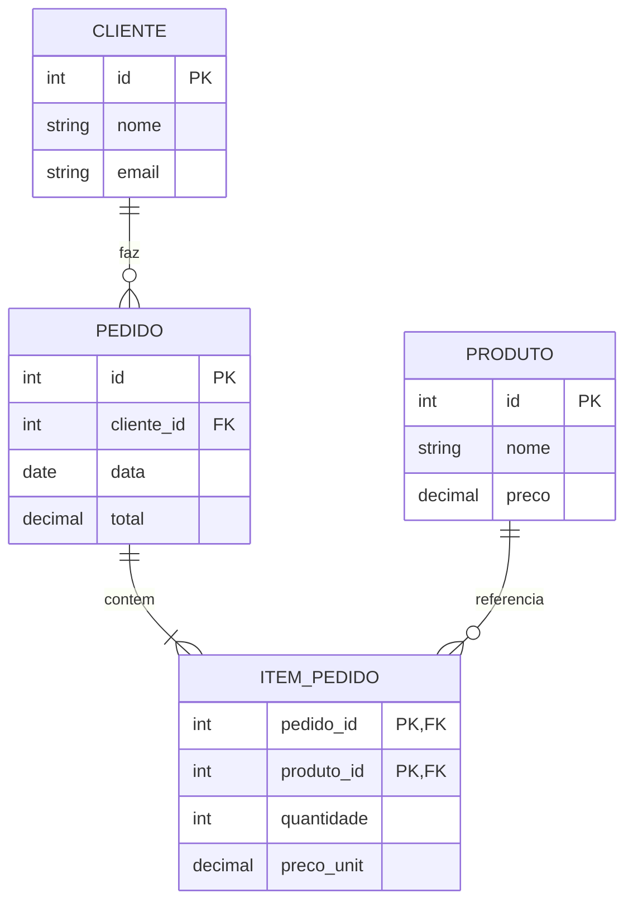

# Bancos relacionais: conceitos e SQL

## Modelo relacional em poucas linhas

O **modelo relacional** representa dados em **relações** (tabelas): cada linha é uma **tupla** e cada coluna um **atributo** com tipo. **Chave primária** identifica a linha; **chave estrangeira** referencia outra tabela, garantindo integridade referencial. Operações são definidas pela **álgebra relacional** (seleção, projeção, junção, etc.), expressas na prática em **SQL**.

---

## Normalização (resumo)

A **normalização** reduz redundância e anomalias de atualização:

- **1NF:** atributos atômicos (um valor por célula), sem grupos repetitivos.
- **2NF:** está em 1NF e todo atributo não chave depende da chave inteira (evita dependências parciais).
- **3NF:** está em 2NF e não há dependência de atributo não chave em outro não chave (evita dependências transitivas).

Em muitos sistemas 3NF é o alvo; em casos de leitura pesada pode-se desnormalizar com critério (ex.: relatórios, caches).

---

## Diagrama ER simplificado



---

## SQL básico (portável)

Abaixo, exemplos em SQL padrão (compatíveis com MySQL, PostgreSQL, Oracle com pequenos ajustes).

### Criar tabelas

```sql
CREATE TABLE cliente (
  id    INT PRIMARY KEY AUTO_INCREMENT,
  nome  VARCHAR(200) NOT NULL,
  email VARCHAR(255) NOT NULL UNIQUE
);

CREATE TABLE pedido (
  id          INT PRIMARY KEY AUTO_INCREMENT,
  cliente_id  INT NOT NULL,
  data_pedido DATE NOT NULL,
  total       DECIMAL(12,2) DEFAULT 0,
  FOREIGN KEY (cliente_id) REFERENCES cliente(id)
);

CREATE TABLE produto (
  id    INT PRIMARY KEY AUTO_INCREMENT,
  nome  VARCHAR(200) NOT NULL,
  preco DECIMAL(12,2) NOT NULL
);

CREATE TABLE item_pedido (
  pedido_id   INT NOT NULL,
  produto_id  INT NOT NULL,
  quantidade  INT NOT NULL CHECK (quantidade > 0),
  preco_unit  DECIMAL(12,2) NOT NULL,
  PRIMARY KEY (pedido_id, produto_id),
  FOREIGN KEY (pedido_id)  REFERENCES pedido(id),
  FOREIGN KEY (produto_id) REFERENCES produto(id)
);
```

*(Em PostgreSQL use `SERIAL` ou `GENERATED ALWAYS AS IDENTITY`; em Oracle use `NUMBER` e sequences.)*

### Inserir e consultar

```sql
INSERT INTO cliente (nome, email) VALUES ('Maria', 'maria@example.com');
INSERT INTO pedido (cliente_id, data_pedido) VALUES (1, CURRENT_DATE);
INSERT INTO item_pedido (pedido_id, produto_id, quantidade, preco_unit)
VALUES (1, 1, 2, 29.90);

-- Listar pedidos com nome do cliente
SELECT p.id, p.data_pedido, c.nome, p.total
FROM pedido p
JOIN cliente c ON c.id = p.cliente_id
ORDER BY p.data_pedido DESC;

-- Total por cliente
SELECT c.nome, SUM(ip.quantidade * ip.preco_unit) AS total
FROM cliente c
JOIN pedido p ON p.cliente_id = c.id
JOIN item_pedido ip ON ip.pedido_id = p.id
GROUP BY c.id, c.nome;
```

### Atualizar e transação

```sql
BEGIN;
UPDATE produto SET preco = 19.90 WHERE id = 1;
UPDATE pedido SET total = (SELECT SUM(quantidade * preco_unit) FROM item_pedido WHERE pedido_id = 1) WHERE id = 1;
COMMIT;
```

---

## Diferenças rápidas entre MySQL, PostgreSQL e Oracle

| Aspecto      | MySQL        | PostgreSQL   | Oracle           |
|-------------|--------------|--------------|------------------|
| Licença     | GPL / comercial | PostgreSQL  | Comercial        |
| Tipos JSON  | Sim          | Sim (rico)   | Sim (12c+)       |
| Full-text   | Nativo       | Nativo       | Oracle Text      |
| Concorrência| MVCC (InnoDB)| MVCC         | MVCC             |
| Extensões   | Limitadas    | Muitas       | Muitas           |

Os próximos capítulos trazem scripts específicos e boas práticas para cada um.

---

*Próximo: [MySQL](./03-mysql.md).*
