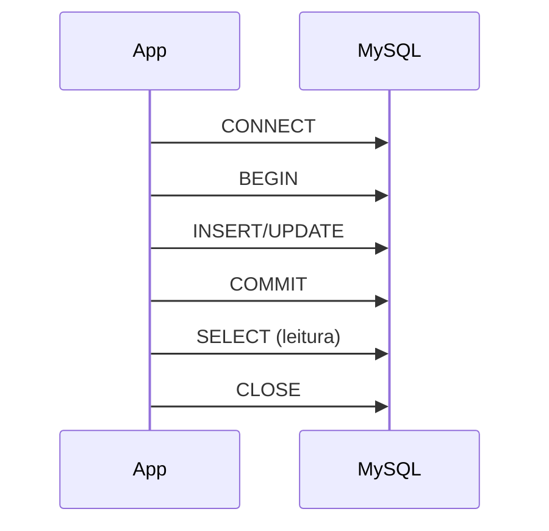

# MySQL

MySQL é um SGBD relacional open source, muito usado em aplicações web (LAMP, LEMP) e como banco padrão em muitos provedores. Este capítulo cobre instalação resumida, tipos de armazenamento, scripts SQL e boas práticas.

---

## Visão geral

- **Motor padrão:** InnoDB (transações ACID, chaves estrangeiras, row-level locking).
- **Outros motores:** MyISAM (legado, sem transações), MEMORY (tabelas em RAM).
- **Porta padrão:** 3306.
- **Cliente CLI:** `mysql -u usuario -p -h host nome_banco`.

---

## Instalação rápida (Linux)

```bash
# Debian/Ubuntu
sudo apt update && sudo apt install mysql-server
sudo systemctl start mysql
sudo mysql -e "ALTER USER 'root'@'localhost' IDENTIFIED WITH mysql_native_password BY 'sua_senha';"

# Criar banco e usuário
mysql -u root -p -e "CREATE DATABASE app_db; CREATE USER 'app'@'localhost' IDENTIFIED BY 'senha'; GRANT ALL ON app_db.* TO 'app'@'localhost'; FLUSH PRIVILEGES;"
```

---

## Esquema de exemplo

```sql
-- Garantir uso do InnoDB (padrão no MySQL 8)
CREATE TABLE usuarios (
  id         INT UNSIGNED AUTO_INCREMENT PRIMARY KEY,
  email      VARCHAR(255) NOT NULL,
  nome       VARCHAR(200),
  ativo      TINYINT(1) DEFAULT 1,
  criado_em  DATETIME DEFAULT CURRENT_TIMESTAMP,
  UNIQUE KEY uk_email (email),
  KEY idx_ativo (ativo)
) ENGINE=InnoDB DEFAULT CHARSET=utf8mb4 COLLATE=utf8mb4_unicode_ci;

CREATE TABLE categorias (
  id   INT UNSIGNED AUTO_INCREMENT PRIMARY KEY,
  nome VARCHAR(100) NOT NULL
) ENGINE=InnoDB;

CREATE TABLE artigos (
  id           INT UNSIGNED AUTO_INCREMENT PRIMARY KEY,
  categoria_id INT UNSIGNED NOT NULL,
  autor_id     INT UNSIGNED NOT NULL,
  titulo       VARCHAR(300) NOT NULL,
  corpo        TEXT,
  publicado    TINYINT(1) DEFAULT 0,
  criado_em    DATETIME DEFAULT CURRENT_TIMESTAMP,
  atualizado_em DATETIME DEFAULT CURRENT_TIMESTAMP ON UPDATE CURRENT_TIMESTAMP,
  FOREIGN KEY (categoria_id) REFERENCES categorias(id) ON DELETE RESTRICT,
  FOREIGN KEY (autor_id) REFERENCES usuarios(id) ON DELETE RESTRICT,
  FULLTEXT KEY ft_titulo_corpo (titulo, corpo)
) ENGINE=InnoDB DEFAULT CHARSET=utf8mb4;
```

---

## Consultas e recursos MySQL

### Full-text search

```sql
-- Busca em titulo e corpo (modo natural)
SELECT id, titulo, MATCH(titulo, corpo) AGAINST ('banco de dados' IN NATURAL LANGUAGE MODE) AS score
FROM artigos
WHERE MATCH(titulo, corpo) AGAINST ('banco de dados' IN NATURAL LANGUAGE MODE)
ORDER BY score DESC;

-- Boolean mode
SELECT id, titulo FROM artigos
WHERE MATCH(titulo, corpo) AGAINST ('+mysql -oracle' IN BOOLEAN MODE);
```

### Agregações e agrupamento

```sql
-- Artigos por categoria com contagem
SELECT c.nome, COUNT(a.id) AS total
FROM categorias c
LEFT JOIN artigos a ON a.categoria_id = c.id AND a.publicado = 1
GROUP BY c.id, c.nome;

-- Últimos 10 artigos com nome do autor
SELECT a.id, a.titulo, a.criado_em, u.nome AS autor
FROM artigos a
JOIN usuarios u ON u.id = a.autor_id
WHERE a.publicado = 1
ORDER BY a.criado_em DESC
LIMIT 10;
```

### Subconsultas e EXISTS

```sql
-- Categorias que têm pelo menos um artigo publicado
SELECT id, nome FROM categorias c
WHERE EXISTS (SELECT 1 FROM artigos a WHERE a.categoria_id = c.id AND a.publicado = 1);

-- Usuários que nunca publicaram
SELECT id, nome, email FROM usuarios u
WHERE NOT EXISTS (SELECT 1 FROM artigos a WHERE a.autor_id = u.id);
```

---

## Transações e isolamento

```sql
START TRANSACTION;
INSERT INTO artigos (categoria_id, autor_id, titulo, corpo, publicado)
VALUES (1, 1, 'Novo artigo', 'Conteúdo...', 0);
UPDATE categorias SET nome = nome WHERE id = 1; -- apenas exemplo
COMMIT;
-- Em caso de erro: ROLLBACK;
```

Para ver nível de isolamento: `SELECT @@transaction_isolation;` (MySQL 8). InnoDB usa **REPEATABLE READ** por padrão.

---

## Diagrama: fluxo típico de uso



---

## Boas práticas

- Usar **utf8mb4** para suporte completo a Unicode (emojis).
- Preferir **chaves numéricas** (INT/BIGINT) para PK e FKs; índices em colunas usadas em WHERE/JOIN/ORDER.
- Evitar `SELECT *` em produção; listar colunas necessárias.
- Configurar **backups** (mysqldump, snapshots) e **logs binários** para point-in-time recovery.
- Monitorar queries lentas com `slow_query_log` e ferramentas como PMM ou CloudWatch (RDS).

---

*Próximo: [PostgreSQL](./04-postgresql.md).*
