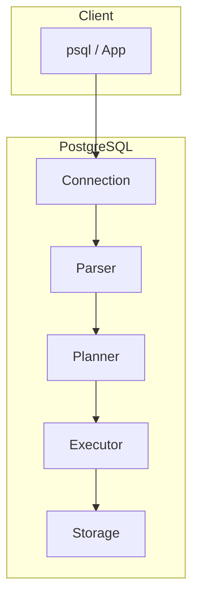

# PostgreSQL

PostgreSQL é um SGBD relacional open source avançado, com forte aderência ao padrão SQL, tipos ricos (JSON, arrays, UUID, geométricos), extensões e excelente concorrência via MVCC. Muito usado em aplicações modernas e como base do Supabase.

---

## Visão geral

- **Licença:** PostgreSQL (BSD-style).
- **Porta padrão:** 5432.
- **Cliente CLI:** `psql -U usuario -h host -d nome_banco`.
- **Concorrência:** MVCC (Multi-Version Concurrency Control); sem locks de leitura bloqueando escritas.

---

## Instalação rápida (Linux)

```bash
# Debian/Ubuntu
sudo apt update && sudo apt install postgresql postgresql-contrib
sudo systemctl start postgresql
sudo -u postgres psql -c "CREATE USER app WITH PASSWORD 'senha';"
sudo -u postgres psql -c "CREATE DATABASE app_db OWNER app;"
```

---

## Tipos e esquema de exemplo

```sql
-- Extensão UUID (opcional)
CREATE EXTENSION IF NOT EXISTS "uuid-ossp";

CREATE TABLE usuarios (
  id         UUID PRIMARY KEY DEFAULT uuid_generate_v4(),
  email      VARCHAR(255) NOT NULL UNIQUE,
  nome       VARCHAR(200),
  ativo      BOOLEAN DEFAULT true,
  tags       TEXT[],
  metadados  JSONB,
  criado_em  TIMESTAMPTZ DEFAULT CURRENT_TIMESTAMP
);

CREATE INDEX idx_usuarios_metadados ON usuarios USING GIN (metadados);
CREATE INDEX idx_usuarios_tags ON usuarios USING GIN (tags);

CREATE TABLE eventos (
  id         BIGSERIAL PRIMARY KEY,
  usuario_id UUID NOT NULL REFERENCES usuarios(id) ON DELETE CASCADE,
  tipo       VARCHAR(50) NOT NULL,
  payload    JSONB,
  criado_em  TIMESTAMPTZ DEFAULT CURRENT_TIMESTAMP
);

CREATE INDEX idx_eventos_usuario_criado ON eventos (usuario_id, criado_em DESC);
CREATE INDEX idx_eventos_payload ON eventos USING GIN (payload);
```

---

## JSON/JSONB e consultas

```sql
-- Inserir com JSONB
INSERT INTO usuarios (email, nome, metadados)
VALUES ('alice@example.com', 'Alice', '{"plano": "premium", "regiao": "BR"}');

-- Consultar e filtrar por campo JSON
SELECT id, nome, metadados->>'plano' AS plano
FROM usuarios
WHERE metadados->>'regiao' = 'BR'
  AND metadados->>'plano' = 'premium';

-- Índice GIN para containment
SELECT * FROM usuarios WHERE metadados @> '{"plano": "premium"}';
```

---

## Arrays

```sql
UPDATE usuarios SET tags = ARRAY['dev', 'backend'] WHERE email = 'alice@example.com';

SELECT id, nome, tags FROM usuarios WHERE 'dev' = ANY(tags);
SELECT id, nome FROM usuarios WHERE tags && ARRAY['dev', 'python'];
```

---

## CTEs e window functions

```sql
-- CTE: ranking de eventos por usuário
WITH contagem AS (
  SELECT usuario_id, tipo, COUNT(*) AS total
  FROM eventos
  GROUP BY usuario_id, tipo
)
SELECT usuario_id, tipo, total,
       RANK() OVER (PARTITION BY usuario_id ORDER BY total DESC) AS rank_tipo
FROM contagem;

-- Último evento por usuário (DISTINCT ON é específico do PostgreSQL)
SELECT DISTINCT ON (usuario_id) usuario_id, tipo, payload, criado_em
FROM eventos
ORDER BY usuario_id, criado_em DESC;
```

---

## Full-text search (tsvector)

```sql
ALTER TABLE usuarios ADD COLUMN busca_fts tsvector
  GENERATED ALWAYS AS (to_tsvector('portuguese', coalesce(nome,'') || ' ' || coalesce(email,''))) STORED;
CREATE INDEX idx_usuarios_fts ON usuarios USING GIN (busca_fts);

SELECT id, nome, ts_rank(busca_fts, query) AS rank
FROM usuarios, to_tsquery('portuguese', 'alice') query
WHERE busca_fts @@ query
ORDER BY rank DESC;
```

---

## Diagrama: arquitetura simplificada



---

## Extensões úteis

| Extensão   | Uso principal              |
|-----------|----------------------------|
| uuid-ossp | Geração de UUIDs           |
| pg_cron   | Jobs agendados no banco    |
| PostGIS   | Dados geoespaciais         |
| pg_stat_statements | Análise de queries |

```sql
CREATE EXTENSION IF NOT EXISTS pg_stat_statements;
SELECT query, calls, total_exec_time FROM pg_stat_statements ORDER BY total_exec_time DESC LIMIT 10;
```

---

## Boas práticas

- Usar **TIMESTAMPTZ** para datas com fuso; **JSONB** quando precisar indexar/consultar JSON.
- Criar índices **GIN** para JSONB e full-text; **B-tree** para comparações e ordenação.
- Ajustar `work_mem`, `shared_buffers` e `effective_cache_size` conforme hardware.
- Backups: `pg_dump` / `pg_basebackup`; réplicas para leitura e alta disponibilidade.

---

*Próximo: [Oracle](./05-oracle.md).*
