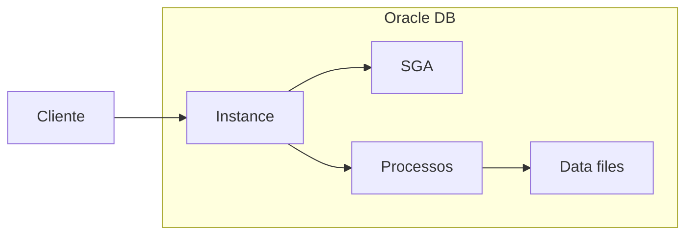

# Oracle

Oracle Database é um SGBD relacional enterprise, líder em ambientes corporativos. Oferece recursos avançados de alta disponibilidade, segurança e performance. Este capítulo traz uma visão geral e exemplos de SQL compatíveis com Oracle.

---

## Visão geral

- **Licença:** comercial (com opção Oracle XE gratuita para desenvolvimento).
- **Porta padrão:** 1521.
- **Linguagem procedural:** PL/SQL (stored procedures, triggers, packages).
- **Concorrência:** MVCC; suporte robusto a RAC (Real Application Clusters) e Data Guard.

---

## Diferenças de sintaxe em relação ao SQL “padrão”

| Conceito        | MySQL/PostgreSQL     | Oracle                    |
|-----------------|----------------------|---------------------------|
| Auto-increment   | AUTO_INCREMENT/SERIAL| SEQUENCE + trigger ou IDENTITY (12c+) |
| Limitar linhas  | LIMIT n              | FETCH FIRST n ROWS ONLY ou ROWNUM |
| Boolean         | TINYINT/BOOLEAN      | NUMBER(1) ou VARCHAR2(1)  |
| String concat   | CONCAT() ou \|\|     | \|\| ou CONCAT()          |
| Data/hora       | NOW(), CURRENT_DATE  | SYSDATE, CURRENT_DATE     |

---

## Esquema de exemplo (Oracle)

```sql
-- Sequência para ID
CREATE SEQUENCE seq_usuario START WITH 1 INCREMENT BY 1 NOCACHE;

CREATE TABLE usuario (
  id         NUMBER PRIMARY KEY,
  email      VARCHAR2(255) NOT NULL,
  nome       VARCHAR2(200),
  ativo      NUMBER(1) DEFAULT 1,
  criado_em  TIMESTAMP DEFAULT CURRENT_TIMESTAMP,
  CONSTRAINT uk_email UNIQUE (email)
);

CREATE OR REPLACE TRIGGER trg_usuario_id
BEFORE INSERT ON usuario
FOR EACH ROW
BEGIN
  IF :NEW.id IS NULL THEN
    SELECT seq_usuario.NEXTVAL INTO :NEW.id FROM DUAL;
  END IF;
END;
/

-- Alternativa com IDENTITY (Oracle 12c+)
CREATE TABLE pedido (
  id          NUMBER GENERATED ALWAYS AS IDENTITY PRIMARY KEY,
  usuario_id  NUMBER NOT NULL,
  total       NUMBER(12,2) DEFAULT 0,
  data_pedido DATE DEFAULT SYSDATE,
  CONSTRAINT fk_pedido_usuario FOREIGN KEY (usuario_id) REFERENCES usuario(id)
);
```

---

## Consultas com paginação e datas

```sql
-- Paginação (Oracle 12c+): primeiros 10 registros
SELECT id, email, nome, criado_em
FROM usuario
ORDER BY criado_em DESC
FETCH FIRST 10 ROWS ONLY;

-- Com OFFSET (página 2, 10 por página)
SELECT id, email, nome
FROM usuario
ORDER BY criado_em DESC
OFFSET 10 ROWS FETCH NEXT 10 ROWS ONLY;

-- Uso de ROWNUM (versões antigas)
SELECT * FROM (
  SELECT a.*, ROWNUM rn FROM (
    SELECT id, email, nome FROM usuario ORDER BY criado_em DESC
  ) a WHERE ROWNUM <= 20
) WHERE rn > 10;

-- Datas
SELECT id, nome, TO_CHAR(criado_em, 'YYYY-MM-DD HH24:MI') AS criado
FROM usuario
WHERE criado_em >= TRUNC(SYSDATE) - 7;
```

---

## PL/SQL: bloco anônimo e procedure

```sql
-- Bloco anônimo
DECLARE
  v_count NUMBER;
BEGIN
  SELECT COUNT(*) INTO v_count FROM usuario WHERE ativo = 1;
  DBMS_OUTPUT.PUT_LINE('Usuários ativos: ' || v_count);
END;
/

-- Stored procedure
CREATE OR REPLACE PROCEDURE sp_atualizar_total_pedido(p_pedido_id IN NUMBER) AS
  v_total NUMBER(12,2);
BEGIN
  SELECT NVL(SUM(quantidade * preco_unit), 0) INTO v_total
  FROM item_pedido WHERE pedido_id = p_pedido_id;
  UPDATE pedido SET total = v_total WHERE id = p_pedido_id;
  COMMIT;
EXCEPTION
  WHEN OTHERS THEN
    ROLLBACK;
    RAISE;
END sp_atualizar_total_pedido;
/
```

---

## Diagrama: componentes principais



---

## Recursos úteis

- **Oracle XE:** edição gratuita com limites de tamanho e uso, ideal para estudo.
- **Oracle Text:** full-text search (índices CONTEXT, CTXCAT).
- **JSON:** tipos JSON e funções (Oracle 12c+); consultas com `JSON_VALUE`, `JSON_QUERY`.
- **Flashback:** recuperação a ponto no tempo e query de dados históricos.

---

## Boas práticas

- Usar **bind variables** em aplicações para evitar SQL injection e melhorar cache de planos.
- Planejar **particionamento** de tabelas grandes (por data, range, list).
- Aproveitar **V$** e **DBA_** views para monitoramento e tuning.
- Manter estatísticas atualizadas (`DBMS_STATS`) para o otimizador.

---

*Próximo: [Supabase](./06-supabase.md).*
