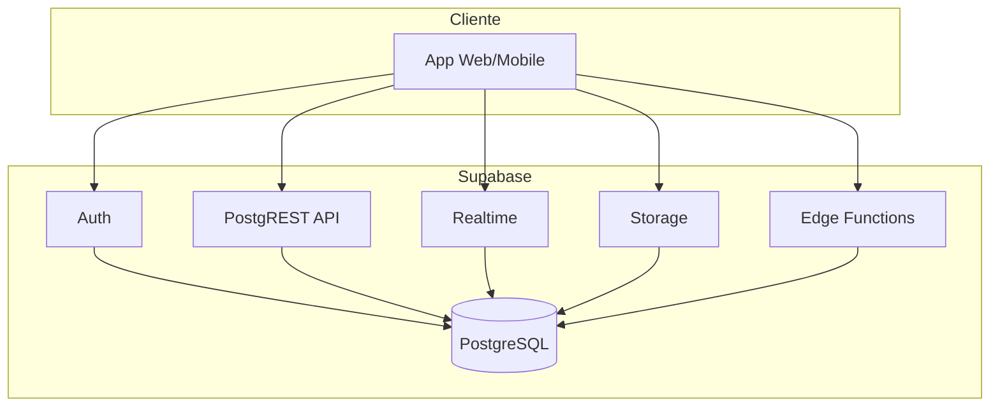

# Supabase

Supabase é uma plataforma **Backend-as-a-Service (BaaS)** que oferece um **PostgreSQL** gerenciado, **autenticação**, **armazenamento de arquivos**, **Realtime** (subscriptions) e **Edge Functions**, com SDKs para JavaScript/TypeScript e outras linguagens. É uma alternativa open source ao Firebase, mantendo o controle dos dados no PostgreSQL.

---

## Visão geral dos serviços

| Serviço        | Descrição principal                                      |
|----------------|----------------------------------------------------------|
| **Database**   | PostgreSQL 15+ gerenciado, com UI no dashboard          |
| **Auth**       | Login (email/senha, OAuth, magic link), JWT, sessões     |
| **Storage**    | Buckets S3-like para arquivos (imagens, documentos)      |
| **Realtime**   | Subscriptions em mudanças de tabelas (INSERT/UPDATE/DELETE) |
| **Edge Functions** | Funções serverless (Deno) na borda                   |
| **API Auto**   | REST e GraphQL gerados a partir do esquema (PostgREST)   |

---

## Criando um projeto

1. Acesse [supabase.com](https://supabase.com), crie uma conta e um novo projeto.
2. Escolha região, senha do banco e aguarde o provisionamento.
3. No dashboard: **Project Settings > API** você encontra:
   - **Project URL** (ex.: `https://xxxx.supabase.co`)
   - **anon key** (chave pública para o cliente)
   - **service_role key** (chave com privilégios totais; use apenas no backend e nunca no frontend).

---

## Banco de dados (PostgreSQL)

O banco é PostgreSQL padrão. Você pode usar o **SQL Editor** no dashboard ou conectar com qualquer cliente (psql, DBeaver, etc.) usando a connection string em **Settings > Database**.

### Exemplo de esquema com RLS

```sql
-- Tabela de perfis (complementar ao auth.users)
CREATE TABLE public.profis (
  id         UUID PRIMARY KEY REFERENCES auth.users(id) ON DELETE CASCADE,
  nome       TEXT,
  avatar_url TEXT,
  atualizado_em TIMESTAMPTZ DEFAULT NOW()
);

-- Habilitar RLS (Row Level Security)
ALTER TABLE public.profis ENABLE ROW LEVEL SECURITY;

-- Política: usuário só vê e atualiza o próprio perfil
CREATE POLICY "Usuários podem ver próprio perfil"
  ON public.profis FOR SELECT
  USING (auth.uid() = id);

CREATE POLICY "Usuários podem atualizar próprio perfil"
  ON public.profis FOR UPDATE
  USING (auth.uid() = id);

CREATE POLICY "Usuários podem inserir próprio perfil"
  ON public.profis FOR INSERT
  WITH CHECK (auth.uid() = id);

-- Tabela de posts (exemplo)
CREATE TABLE public.posts (
  id         UUID PRIMARY KEY DEFAULT gen_random_uuid(),
  autor_id   UUID NOT NULL REFERENCES auth.users(id) ON DELETE CASCADE,
  titulo     TEXT NOT NULL,
  corpo      TEXT,
  criado_em  TIMESTAMPTZ DEFAULT NOW()
);

ALTER TABLE public.posts ENABLE ROW LEVEL SECURITY;

CREATE POLICY "Posts visíveis para todos"
  ON public.posts FOR SELECT
  USING (true);

CREATE POLICY "Apenas autor pode inserir/atualizar/remover"
  ON public.posts FOR ALL
  USING (auth.uid() = autor_id)
  WITH CHECK (auth.uid() = autor_id);
```

---

## Autenticação (Auth)

O Supabase Auth gerencia usuários em `auth.users`, sessões e JWTs. No cliente, use o SDK para login, logout e recuperação de sessão.

### Exemplo (JavaScript/TypeScript)

```javascript
import { createClient } from '@supabase/supabase-js';

const supabaseUrl = 'https://seu-projeto.supabase.co';
const supabaseAnonKey = 'sua-anon-key';
const supabase = createClient(supabaseUrl, supabaseAnonKey);

// Cadastro com email/senha
const { data, error } = await supabase.auth.signUp({
  email: 'usuario@example.com',
  password: 'senhaSegura123',
  options: { data: { nome: 'João' } }
});

// Login
const { data: session, error: loginError } = await supabase.auth.signInWithPassword({
  email: 'usuario@example.com',
  password: 'senhaSegura123'
});

// Usuário atual
const { data: { user } } = await supabase.auth.getUser();

// Logout
await supabase.auth.signOut();
```

Magic link (sem senha):

```javascript
await supabase.auth.signInWithOtp({ email: 'usuario@example.com' });
```

OAuth (Google, GitHub, etc.): configure em **Authentication > Providers** e use `signInWithOAuth({ provider: 'google' })`.

---

## Acesso aos dados (API REST automática)

Cada tabela em `public` (com políticas RLS adequadas) ganha endpoints REST gerados pelo PostgREST.

### Exemplo: CRUD de posts

```javascript
// Inserir (o JWT do usuário logado é enviado; RLS valida autor_id)
const { data, error } = await supabase
  .from('posts')
  .insert({ autor_id: user.id, titulo: 'Meu post', corpo: 'Conteúdo...' })
  .select()
  .single();

// Listar
const { data: posts } = await supabase
  .from('posts')
  .select('id, titulo, criado_em, profis(nome)')
  .order('criado_em', { ascending: false })
  .limit(10);

// Atualizar
await supabase.from('posts').update({ titulo: 'Título novo' }).eq('id', postId);

// Remover
await supabase.from('posts').delete().eq('id', postId);
```

Filtros: `.eq('campo', valor)`, `.gt()`, `.like()`, `.in()`, etc. A documentação do PostgREST cobre a API completa.

---

## Realtime (subscriptions)

É possível inscrever-se em mudanças de tabelas (INSERT, UPDATE, DELETE) em tempo real.

```javascript
const channel = supabase
  .channel('posts-changes')
  .on(
    'postgres_changes',
    { event: '*', schema: 'public', table: 'posts' },
    (payload) => {
      console.log('Mudança em posts:', payload);
    }
  )
  .subscribe();

// Para limpar
supabase.removeChannel(channel);
```

No dashboard: **Database > Replication** — habilite a publicação para as tabelas desejadas (por padrão há uma publicação `supabase_realtime`).

---

## Storage

Crie buckets em **Storage** no dashboard. Exemplo: bucket `avatars` para fotos de perfil.

```javascript
// Upload (com RLS na tabela storage.objects)
const { data, error } = await supabase.storage
  .from('avatars')
  .upload(`${userId}/foto.png`, file, { upsert: true });

// URL pública (se o bucket for público)
const { data: { publicUrl } } = supabase.storage.from('avatars').getPublicUrl(data.path);

// Download / signed URL
const { data: signed } = await supabase.storage.from('avatars').createSignedUrl(data.path, 60);
```

Políticas de Storage são definidas em **Storage > Policies** (por bucket e operação).

---

## Edge Functions (Deno)

Edge Functions rodam na borda (Deno). Use para webhooks, processamento após eventos ou APIs que não devem expor a `service_role` no cliente.

1. Instale o CLI: `npm i -g supabase`.
2. Faça login e link ao projeto: `supabase link --project-ref seu-ref`.
3. Crie uma função: `supabase functions new minha-funcao`.
4. Edite em `supabase/functions/minha-funcao/index.ts`:

```typescript
import { serve } from 'https://deno.land/std@0.168.0/http/server.ts';

serve(async (req) => {
  const { name } = await req.json();
  return new Response(JSON.stringify({ message: `Olá, ${name}` }), {
    headers: { 'Content-Type': 'application/json' }
  });
});
```

5. Deploy: `supabase functions deploy minha-funcao --no-verify-jwt` (ou com JWT para chamadas autenticadas).

Chamada do cliente: `supabase.functions.invoke('minha-funcao', { body: { name: 'Mundo' } })`.

---

## Diagrama: arquitetura Supabase



---

## Boas práticas

- **Nunca** exponha a `service_role` no frontend; use apenas em backend ou Edge Functions.
- Sempre **habilite RLS** em tabelas sensíveis e defina políticas explícitas.
- Use **triggers** no PostgreSQL para manter `profis` sincronizado com `auth.users` (ex.: após `auth.users` INSERT, inserir em `profis`).
- Para produção, configure **custom domain**, **rate limiting** e monitore uso e custos no dashboard.

---

## Referências

- [Documentação oficial](https://supabase.com/docs)
- [Guia de Auth](https://supabase.com/docs/guides/auth)
- [Realtime](https://supabase.com/docs/guides/realtime)
- [Edge Functions](https://supabase.com/docs/guides/functions)

---

*Próximo: [Bancos não relacionais: conceitos](./07-nao-relacionais-conceitos.md).*
