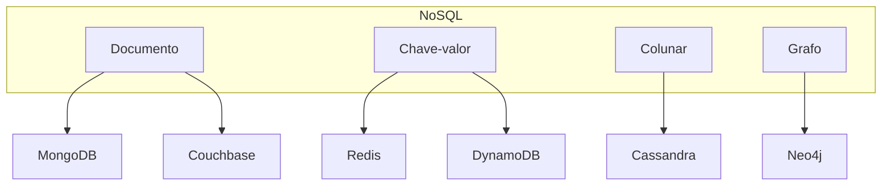

# Bancos não relacionais: conceitos e tipos

Bancos **não relacionais** (NoSQL) abrangem vários modelos de dados e trade-offs em relação ao modelo relacional. Este capítulo descreve os principais tipos e quando usá-los.

---

## Por que NoSQL?

Motivações comuns:

- **Escala horizontal:** distribuir dados em vários nós (sharding) sem depender de JOINs pesados.
- **Esquema flexível:** documentos ou atributos variáveis por registro.
- **Alta vazão:** otimização para leitura/escrita por chave ou padrões de acesso simples.
- **Latência muito baixa:** cache e estruturas em memória (chave-valor).

Isso frequentemente implica **consistência eventual** ou APIs mais limitadas em troca de disponibilidade e desempenho.

---

## Tipos principais

### 1. Documento

Dados armazenados em **documentos** (ex.: JSON/BSON). Cada documento pode ter estrutura própria; relacionamentos são por referência ou embedding.

| Sistema    | Formato | Uso típico                    |
|-----------|---------|--------------------------------|
| MongoDB   | BSON    | Catálogos, conteúdo, perfis   |
| Couchbase | JSON    | Cache + documento             |
| Firebase Firestore | JSON | Apps móveis, tempo real   |

**Vantagens:** flexibilidade de esquema, agregações ricas, índices em campos aninhados.  
**Desvantagens:** JOINs não nativos; modelagem por embedding pode duplicar dados.

---

### 2. Chave-valor

Cada **chave** mapeia para um **valor** (string, binário, estrutura serializada). Operações são por chave; sem consultas por conteúdo interno.

| Sistema   | Uso típico           |
|-----------|----------------------|
| Redis     | Cache, sessão, filas, pub/sub |
| DynamoDB  | Chave-valor + índices secundários; apps serverless |
| Memcached | Cache simples        |

**Vantagens:** latência muito baixa, alta vazão, simplicidade.  
**Desvantagens:** consultas ad hoc limitadas; modelagem por chave composta ou índices (quando existem).

---

### 3. Colunar (família de colunas)

Dados organizados por **colunas** em vez de linhas; ideal para analytics e agregações em grandes volumes.

| Sistema   | Uso típico              |
|-----------|-------------------------|
| Cassandra | Escrita massiva, leitura por partição |
| HBase     | Big Data, Hadoop        |

**Vantagens:** compressão e leitura seletiva de colunas eficientes.  
**Desvantagens:** modelo menos intuitivo; atualizações pontuais não são o forte.

---

### 4. Grafo

**Nós** (entidades) e **arestas** (relacionamentos) com propriedades. Consultas por padrões de relacionamento (vizinhos, caminhos).

| Sistema | Uso típico                    |
|---------|--------------------------------|
| Neo4j   | Redes sociais, recomendações, detecção de fraude |

**Vantagens:** modelagem natural para relações complexas; consultas de caminho eficientes.  
**Desvantagens:** ecossistema menor; operação e escala exigem conhecimento específico.

---

## Diagrama: classificação

---

## CAP e consistência

O **teorema CAP** (em redes com partição): é impossível garantir ao mesmo tempo **Consistência**, **Disponibilidade** e **Tolerância a partição**. Na prática:

- **Relacional (clássico):** tende a CP (consistência + tolerância a partição).
- **Muitos NoSQL:** tendem a AP (disponibilidade + tolerância a partição), com **consistência eventual**.

Alguns sistemas permitem **ajustar** o nível (ex.: quorum de leitura/escrita no Cassandra, consistência forte opcional no DynamoDB).

---

## Quando usar cada tipo (resumo)

| Necessidade              | Sugestão              |
|--------------------------|------------------------|
| Transações complexas, relatórios ad hoc | Relacional (PostgreSQL, MySQL) |
| Catálogo, conteúdo, perfis variáveis    | Documento (MongoDB)    |
| Cache, sessão, fila, rate limit        | Chave-valor (Redis)    |
| Alta escala, serverless, chave + índices | DynamoDB              |
| Analytics, séries, agregações massivas | Colunar (Cassandra)    |
| Relações em grafo (amigos, recomendações) | Grafo (Neo4j)        |

Os próximos capítulos trazem exemplos concretos com **MongoDB**, **DynamoDB** e **Redis**.

---

*Próximo: [MongoDB](./08-mongodb.md).*
