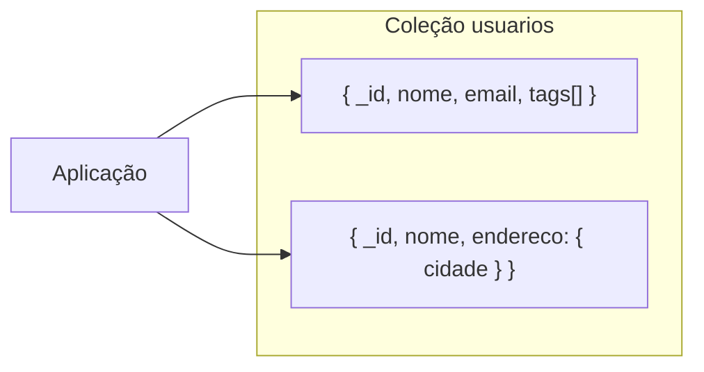

# MongoDB

MongoDB é um banco **orientado a documentos** (BSON). Oferece esquema flexível, índices em campos aninhados, agregações poderosas e drivers para várias linguagens. Muito usado em aplicações web e microsserviços.

---

## Visão geral

- **Modelo:** documentos em **coleções** (análogo a tabelas); não exige esquema fixo.
- **Formato:** BSON (Binary JSON) — tipos como ObjectId, Date, BinData.
- **Porta padrão:** 27017.
- **Drivers:** oficiais para Node.js, Python, Java, C#, etc.

---

## Conceitos principais

- **Database:** agrupa coleções.
- **Collection:** conjunto de documentos (não exige que todos tenham os mesmos campos).
- **Document:** registro em BSON; pode conter arrays e documentos aninhados.
- **_id:** identificador único por documento; se omitido, MongoDB gera um `ObjectId`.

---

## Inserção e consulta (shell / drivers)

### Inserir

```javascript
// Inserir um documento
db.usuarios.insertOne({
  nome: "Maria",
  email: "maria@example.com",
  ativo: true,
  tags: ["dev", "backend"],
  criado_em: new Date()
});

// Inserir vários
db.produtos.insertMany([
  { nome: "Notebook", preco: 3500, categoria: "informática" },
  { nome: "Mouse", preco: 80, categoria: "informática" }
]);
```

### Consultar

```javascript
// Todos
db.usuarios.find();

// Com filtro
db.usuarios.find({ ativo: true });
db.usuarios.find({ preco: { $gte: 100, $lte: 500 } });
db.usuarios.find({ tags: "dev" });
db.usuarios.find({ "endereco.cidade": "São Paulo" });

// Projeção (campos desejados)
db.usuarios.find({ ativo: true }, { nome: 1, email: 1, _id: 0 });

// Ordenar e limitar
db.usuarios.find().sort({ criado_em: -1 }).limit(10);

// Um único documento
db.usuarios.findOne({ email: "maria@example.com" });
```

### Atualizar e remover

```javascript
// Atualizar um
db.usuarios.updateOne(
  { email: "maria@example.com" },
  { $set: { nome: "Maria Silva", atualizado_em: new Date() } }
);

// Incrementar
db.pedidos.updateOne(
  { _id: pedidoId },
  { $inc: { total_itens: 1 } }
);

// Adicionar a array
db.usuarios.updateOne(
  { email: "maria@example.com" },
  { $addToSet: { tags: "python" } }
);

// Remover
db.usuarios.deleteOne({ email: "maria@example.com" });
```

---

## Índices

```javascript
// Índice simples
db.usuarios.createIndex({ email: 1 }, { unique: true });

// Índice composto (ordenação + filtro)
db.pedidos.createIndex({ cliente_id: 1, criado_em: -1 });

// Índice em campo aninhado
db.usuarios.createIndex({ "endereco.cidade": 1 });

// Índice de texto (full-text)
db.artigos.createIndex({ titulo: "text", corpo: "text" });
db.artigos.find({ $text: { $search: "mongodb tutorial" } });
```

---

## Agregação (aggregation pipeline)

Pipeline com estágios encadeados: `$match`, `$group`, `$sort`, `$lookup` (join), `$project`, etc.

```javascript
// Contar pedidos por status
db.pedidos.aggregate([
  { $match: { criado_em: { $gte: new Date("2024-01-01") } } },
  { $group: { _id: "$status", total: { $sum: 1 } } },
  { $sort: { total: -1 } }
]);

// Pedidos com nome do cliente (lookup)
db.pedidos.aggregate([
  { $lookup: {
      from: "clientes",
      localField: "cliente_id",
      foreignField: "_id",
      as: "cliente"
  }},
  { $unwind: "$cliente" },
  { $project: { _id: 1, total: 1, "cliente.nome": 1 } }
]);
```

---

## Diagrama: modelo de documentos



---

## Boas práticas

- Criar **índices** para filtros e ordenações frequentes; evitar índices demais (custam escrita).
- Decidir entre **embedding** (documento único) e **referência** (outra coleção): embedding para dados acessados juntos e que não crescem sem limite.
- Usar **projeção** para trazer só os campos necessários.
- Para transações multi-documento, usar **sessões** (transações) quando necessário (replicaset).

---

## Referência ao estudo DynamoDB

Para modelo **chave-valor** e **índices secundários** na AWS, veja o estudo dedicado: [DynamoDB](../dynamodb/README.md). O próximo capítulo resume DynamoDB e **Redis** (cache e fila).

---

*Próximo: [DynamoDB e Redis](./09-dynamodb-redis.md).*
