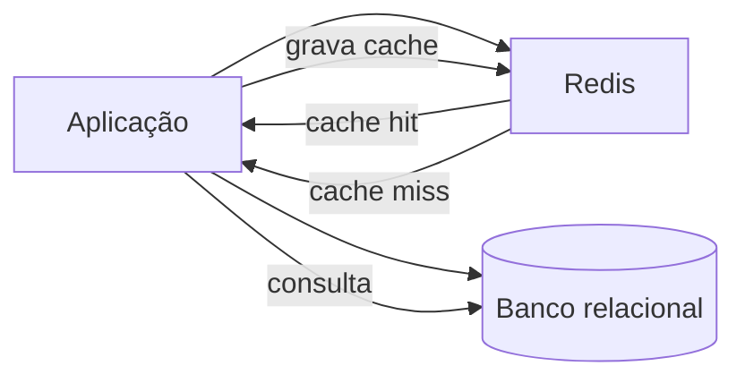

# DynamoDB e Redis

Este capítulo resume o **DynamoDB** (com referência ao estudo detalhado no repositório) e cobre o **Redis** como cache e fila, alinhado aos itens “Utilizando o Redis como fila” e “Utilizando Cache (Redis) em aplicações”.

---

## DynamoDB (resumo)

**Amazon DynamoDB** é um banco **NoSQL** gerenciado na AWS: modelo **chave-valor/documento**, tabelas com **partition key** (obrigatória) e opcional **sort key**. Oferece **GSI** e **LSI** para consultas por outros atributos, capacidade **on-demand** ou **provisionada**, e integração nativa com Lambda e API Gateway.

### Conceitos em uma frase

- **Item:** registro com atributos (tipos: String, Number, Binary, List, Map, etc.).
- **Chave primária:** partition key (PK) ou PK + sort key (SK); define onde o item é armazenado e como pode ser consultado.
- **Query:** por PK (e opcionalmente por range na SK); **Scan:** varredura (evitar em tabelas grandes).
- **GSI:** índice global com PK (e SK) próprios; **LSI:** índice com mesma PK e SK alternativa.

### Exemplo mínimo (AWS SDK v3 – Node.js)

```javascript
const { DynamoDBClient } = require('@aws-sdk/client-dynamodb');
const { PutItemCommand, GetItemCommand, QueryCommand } = require('@aws-sdk/lib-dynamodb');
const client = new DynamoDBClient({ region: 'us-east-1' });
const tableName = 'MinhaTabela';

// Inserir
await client.send(new PutItemCommand({
  TableName: tableName,
  Item: {
    pk: { S: 'USER#123' },
    sk: { S: 'PROFILE' },
    nome: { S: 'Maria' },
    email: { S: 'maria@example.com' }
  }
}));

// Obter por chave
const { Item } = await client.send(new GetItemCommand({
  TableName: tableName,
  Key: { pk: { S: 'USER#123' }, sk: { S: 'PROFILE' } }
}));

// Query por PK (e range em SK se houver)
const { Items } = await client.send(new QueryCommand({
  TableName: tableName,
  KeyConditionExpression: 'pk = :pk',
  ExpressionAttributeValues: { ':pk': { S: 'USER#123' } }
}));
```

### Estudo completo

Para modelo de dados, design de chaves, operações, índices e boas práticas, consulte o estudo dedicado: **[DynamoDB](../dynamodb/README.md)**.

---

## Redis: visão geral

**Redis** é um armazenamento **em memória** de estruturas de dados: strings, hashes, listas, sets, sorted sets, streams, etc. Usado como **cache**, **sessão**, **fila**, **pub/sub** e **rate limiting**.

- **Porta padrão:** 6379.
- **Persistência opcional:** RDB (snapshots) e AOF (append-only file).
- **Cliente CLI:** `redis-cli`.

---

## Redis como cache

Objetivo: reduzir acesso ao banco ou a APIs externas, armazenando valores por chave com **TTL** (time-to-live).

### Comandos básicos

```bash
# String (valor simples)
SET usuario:1001 "{\"nome\":\"Maria\",\"email\":\"maria@example.com\"}"
GET usuario:1001
EXPIRE usuario:1001 3600
# ou em um comando:
SET usuario:1002 "dados..." EX 3600

# Verificar existência e TTL
EXISTS usuario:1001
TTL usuario:1001
```

### Exemplo em Node.js (ioredis)

```javascript
const Redis = require('ioredis');
const redis = new Redis(process.env.REDIS_URL || 'redis://localhost:6379');

async function getUsuario(id) {
  const key = `usuario:${id}`;
  const cached = await redis.get(key);
  if (cached) return JSON.parse(cached);

  const usuario = await db.usuarios.findById(id); // exemplo
  await redis.set(key, JSON.stringify(usuario), 'EX', 3600); // 1h
  return usuario;
}
```

### Exemplo em Python (redis-py)

```python
import redis
import json

r = redis.Redis(host='localhost', port=6379, decode_responses=True)

def get_usuario(id):
    key = f'usuario:{id}'
    cached = r.get(key)
    if cached:
        return json.loads(cached)
    usuario = db.get_usuario(id)  # exemplo
    r.setex(key, 3600, json.dumps(usuario))
    return usuario
```

---

## Redis como fila

Visão geral na sessão [Mensageria — Redis: filas e pub/sub](../mensageria/06-redis-filas-pubsub.md).

Listas (**LPUSH/RPOP** ou **RPUSH/LPOP**) ou **Streams** (Redis 5+) permitem implementar filas. Abaixo: fila simples com lista.

### Produtor (Node.js)

```javascript
await redis.lpush('fila:tarefas', JSON.stringify({ tipo: 'email', para: 'user@example.com', assunto: 'Olá' }));
```

### Consumidor (Node.js) – BLPOP para esperar bloqueado

```javascript
while (true) {
  const result = await redis.blpop('fila:tarefas', 30); // espera até 30s
  if (result) {
    const [queue, payload] = result;
    const tarefa = JSON.parse(payload);
    await processar(tarefa);
  }
}
```

### Streams (fila mais rica)

- **XADD** adiciona mensagem ao stream; **XREADGROUP** permite consumidores em grupo com acknowledgment.
- Útil para filas com múltiplos consumidores e reprocessamento. Documentação: [Redis Streams](https://redis.io/docs/data-types/streams/).

---

## Redis em aplicações Clojure

Em Clojure é comum usar **carmine** ou **taoensso/carousel** (agente de cache). Exemplo conceitual com **carmine**:

```clojure
(require '[taoensso.carmine :as car])

(def redis-conn {:pool {} :spec {:host "localhost" :port 6379}})

(defmacro wcar [& body] `(car/wcar redis-conn ~@body))

;; Cache
(wcar (car/set "usuario:1001" (str usuario-json)))
(wcar (car/expire "usuario:1001" 3600))
(wcar (car/get "usuario:1001"))

;; Fila
(wcar (car/lpush "fila:tarefas" payload-json))
(wcar (car/brpop 30 "fila:tarefas"))
```

*(Ajuste dependências e namespace conforme seu projeto.)*

---

## Diagrama: Redis no fluxo da aplicação



---

## Boas práticas (Redis)

- Definir **TTL** em chaves de cache para evitar crescimento indefinido.
- Preferir **Redis Cluster** ou **Sentinel** para alta disponibilidade em produção.
- Para filas críticas, considerar **Streams** com grupos de consumidores e acks.
- Não armazenar dados únicos apenas no Redis; usar como cache ou fila, com fonte de verdade em banco ou fila durável (ex.: SQS).

---

*Próximo: [ORMs](./10-orms.md).*
