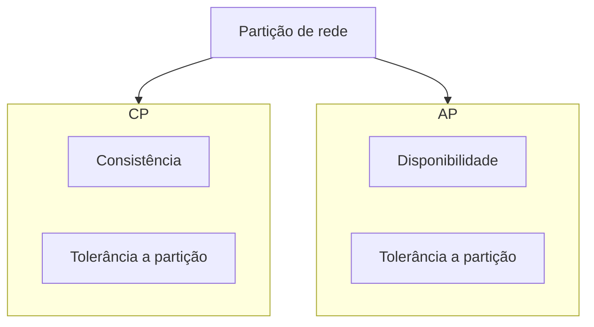

# Transações e consistência

Este capítulo resume conceitos de **transações** em bancos relacionais (ACID), **CAP** e **consistência eventual** em sistemas distribuídos e NoSQL, e como isso influencia a escolha e o uso de bancos de dados.

---

## ACID (bancos relacionais)

Transações em SGBDs relacionais costumam garantir as propriedades **ACID**:

| Propriedade   | Descrição resumida |
|---------------|--------------------|
| **Atomicidade** | A transação é tratada como uma unidade: ou todas as operações são aplicadas, ou nenhuma (rollback). |
| **Consistência** | Restrições do esquema e regras de negócio são mantidas antes e depois da transação. |
| **Isolamento**   | Efeitos de transações concorrentes são isolados (níveis: READ UNCOMMITTED, READ COMMITTED, REPEATABLE READ, SERIALIZABLE). |
| **Durabilidade** | Após COMMIT, o resultado persiste mesmo em falha (redo/undo logs, WAL). |

### Níveis de isolamento (resumo)

- **READ UNCOMMITTED:** pode ler dados não commitados (dirty read).
- **READ COMMITTED:** só lê dados já commitados; evita dirty read, pode ter non-repeatable read.
- **REPEATABLE READ:** mesma leitura repetida na transação; pode haver phantom reads em alguns bancos.
- **SERIALIZABLE:** serialização real; maior segurança e menor concorrência.

MySQL (InnoDB) e PostgreSQL usam **MVCC** para implementar isolamento sem bloquear leituras.

### Exemplo: transação em SQL

```sql
BEGIN;
  UPDATE contas SET saldo = saldo - 100 WHERE id = 1;
  UPDATE contas SET saldo = saldo + 100 WHERE id = 2;
  -- Se algo falhar: ROLLBACK;
COMMIT;
```

---

## CAP e consistência em sistemas distribuídos

O **teorema CAP** (Brewer) afirma que, na presença de **partição de rede**, um sistema distribuído não pode garantir ao mesmo tempo:

- **C**onsistência (todas as réplicas veem o mesmo dado)
- **A**vailability (toda requisição recebe resposta)
- **P**artition tolerance (sistema continua mesmo com partição)

Na prática, partição existe; a escolha é entre **CP** (priorizar consistência) ou **AP** (priorizar disponibilidade), com **consistência eventual** no caso AP.

### Consistência eventual

Em modelos **AP**, as réplicas podem divergir por um tempo; com o fim das escritas e da partição, o sistema tende a convergir para o mesmo estado. Isso é aceitável em cache, contadores, feeds, etc., mas não em débito/crédito sem compensação.

---

## Relacional vs NoSQL (transações)

| Aspecto            | Relacional (típico)     | NoSQL (muitos)              |
|---------------------|-------------------------|-----------------------------|
| Escopo da transação | Múltiplas tabelas/linhas| Item ou documento           |
| Consistência        | Forte (ACID)            | Eventual ou tunável         |
| Abordagem           | COMMIT/ROLLBACK global  | Transações limitadas (ex.: DynamoDB) ou multi-document (MongoDB 4+) |

MongoDB, a partir da versão 4, suporta **transações multi-documento** em replicasets e sharded clusters. DynamoDB oferece **transações** com múltiplos itens (TransactWriteItems/TransactGetItems) com consistência atômica dentro da mesma tabela (ou entre tabelas).

---

## Padrões comuns

- **Saga:** sequência de transações locais com compensação em caso de falha (comum em microsserviços).
- **Eventual consistency + idempotência:** filas e workers que processam eventos várias vezes sem efeito colateral duplicado.
- **CQRS:** separar leitura (pode ser eventual) de escrita (consistente no write store).

---

## Diagrama: trade-off CAP (conceitual)



---

## Boas práticas

- Em bancos relacionais: manter transações **curtas**, evitar lógica de negócio pesada dentro delas e escolher o **nível de isolamento** adequado.
- Em NoSQL: desenhar o modelo e as chaves para **evitar transações amplas**; usar transações nativas (MongoDB, DynamoDB) quando o modelo permitir.
- Em sistemas híbridos (relacional + cache/fila): tratar **cache e filas** como eventualmente consistentes e ter **fonte de verdade** clara (ex.: banco relacional).

---

*Fim do estudo. Voltar ao [índice](./README.md).*
