# Casos de Uso

## Desafios de arquitetura

Nesta seção são apresentados problemas de arquitetura típicos de ecossistemas robustos e escaláveis. Para cada situação há **várias soluções possíveis** (não uma única correta). O objetivo é praticar:

- Entendimento de diferentes ferramentas (Kubernetes, Redis, Kafka, S3, microserviços)
- Abordagem sustentável, flexível e escalável
- Trade-offs e comunicação de prós e contras

*Contexto assumido: cloud, Kubernetes, armazenamento objeto (S3), filas/streams (Kafka), cache (Redis), microserviços e escala horizontal.*

---

## Situação 1: Ingestão e processamento de eventos em alto volume

**Problema:** Aplicações móveis e web disparam milhões de eventos por minuto (cliques, transações, sinais de vida). É preciso ingerir, validar, enriquecer e persistir sem perder dados e com latência aceitável para o negócio.

### Solução A: API → Kafka → Consumers → S3 + DB

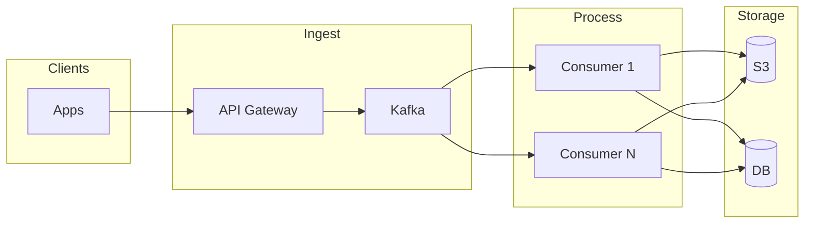

- **Prós:** Kafka absorve picos, desacopla ingestão do processamento, replay possível, consumidores escalam horizontalmente.
- **Contras:** Mais componentes e operação (Kafka, consumer groups); latência end-to-end maior; exige idempotência e ordenação bem definida nos consumers.

### Solução B: API → Filas por prioridade (Redis / SQS) → Workers → S3 + DB

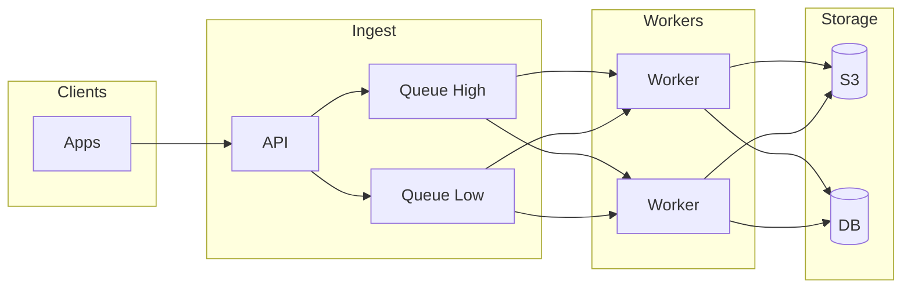

- **Prós:** Modelo mais simples (push em fila, workers consomem); priorização por fila; Redis/SQS bem conhecidos.
- **Contras:** Replay e retenção limitados; em escala muito alta, filas podem virar gargalo; menos adequado para “stream” contínuo e múltiplos consumidores.

### Solução C: API síncrona + write-through cache e batch assíncrono

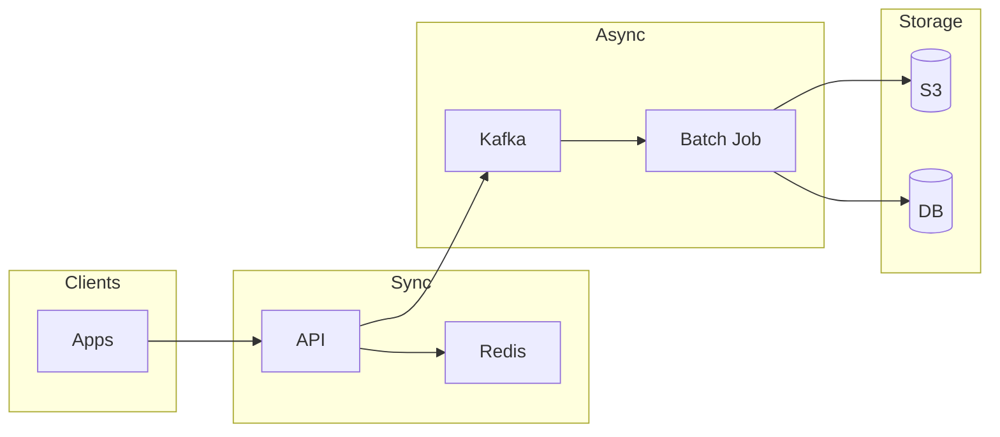

- **Prós:** Resposta rápida ao cliente (write em Redis); processamento pesado em batch; reduz carga direta no DB.
- **Contras:** Risco de perda se Redis cair antes do batch; consistência eventual; lógica duplicada (sync vs batch).

---

## Situação 2: Saldo e histórico de transações com consistência forte

**Problema:** Vários microserviços precisam ler e atualizar saldo e histórico de transações. É obrigatório: consistência forte, auditoria e suporte a alto volume de leitura.

### Solução A: DB transacional único (fonte da verdade) + cache de leitura (Redis)

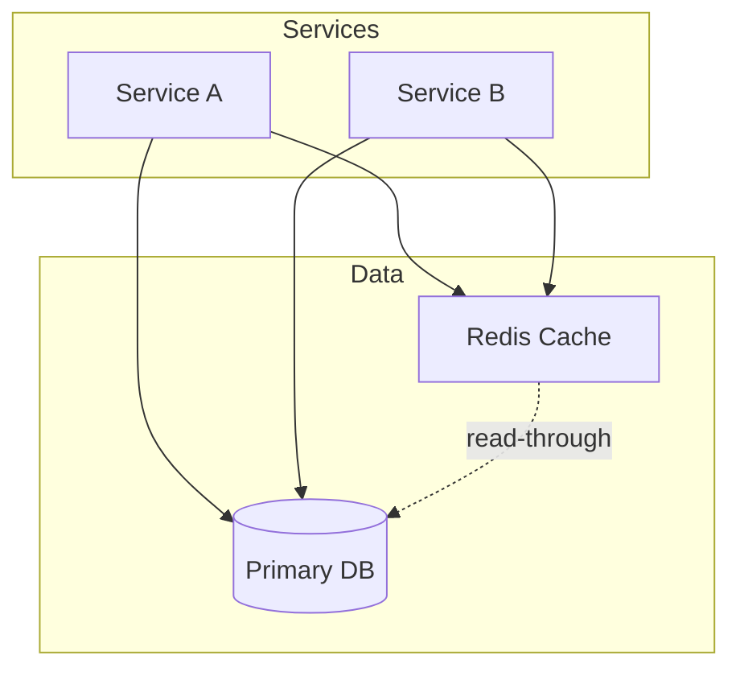

- **Prós:** Modelo simples; transações ACID; Redis reduz carga de leitura no DB.
- **Contras:** DB pode virar gargalo de escrita; cache invalidation e consistência cache-DB são críticos; limite de escala vertical do primary.

### Solução B: Event Sourcing + CQRS (write em stream, leitura em projeções)

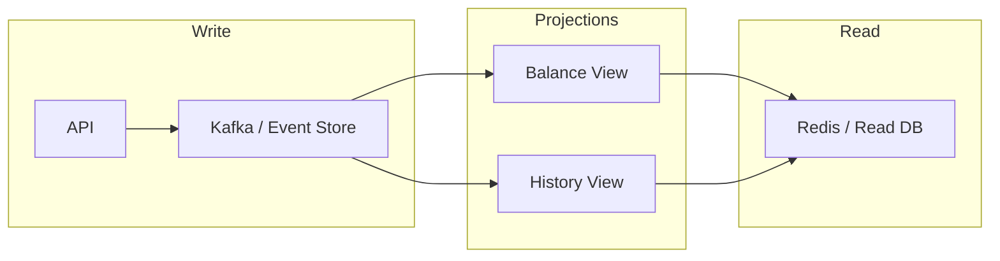

- **Prós:** Auditoria natural (log de eventos); escalabilidade de leitura independente; replay e novas projeções sem alterar o core.
- **Contras:** Complexidade operacional e de desenvolvimento; consistência eventual na leitura; necessidade de idempotência e tratamento de atrasos nas projeções.

### Solução C: Sharding por conta/entidade + ledger por shard

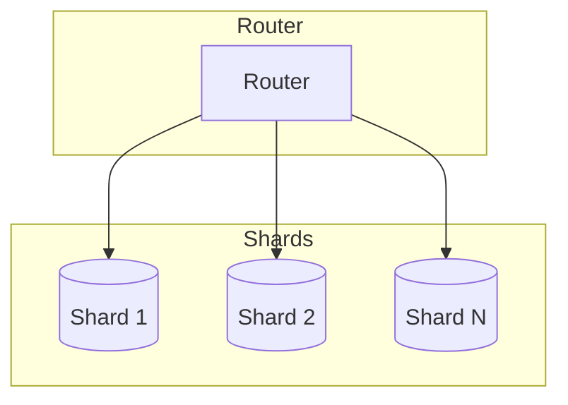

- **Prós:** Escala horizontal da escrita; transações locais por shard; isolamento de carga por entidade.
- **Contras:** Transações cross-shard complexas; rebalanceamento e crescimento de shards não triviais; design de chave de sharding crítico.

---

## Situação 3: Notificações em tempo quase real para milhões de usuários

**Problema:** Enviar push, e-mail e SMS de forma personalizada, com rate limit por usuário e por canal, fallback entre provedores e alta disponibilidade.

### Solução A: Kafka por canal (push, email, SMS) → consumers → provedores

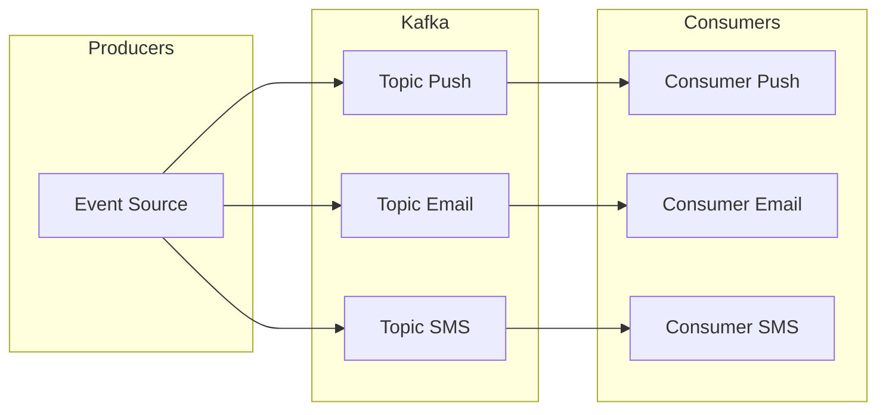

- **Prós:** Um canal não bloqueia o outro; backpressure e retenção do Kafka; múltiplos consumers por canal.
- **Contras:** Rate limit e estado por usuário exigem store (ex.: Redis); coordenação entre canais (ex.: “não enviar email se push ok”) mais complexa.

### Solução B: Fila única + worker que roteia e aplica rate limit (Redis)

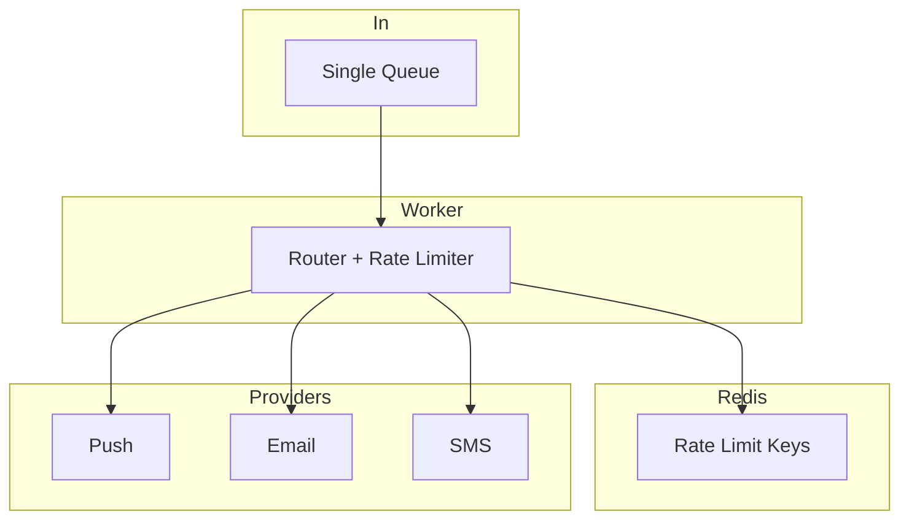

- **Prós:** Lógica de roteamento e fallback centralizada; Redis para rate limit e deduplicação; menos tópicos para operar.
- **Contras:** Worker pode virar gargalo; uma falha afeta todos os canais; escalar exige particionamento cuidadoso da fila.

### Solução C: Serviço por canal + API de notificação + filas internas

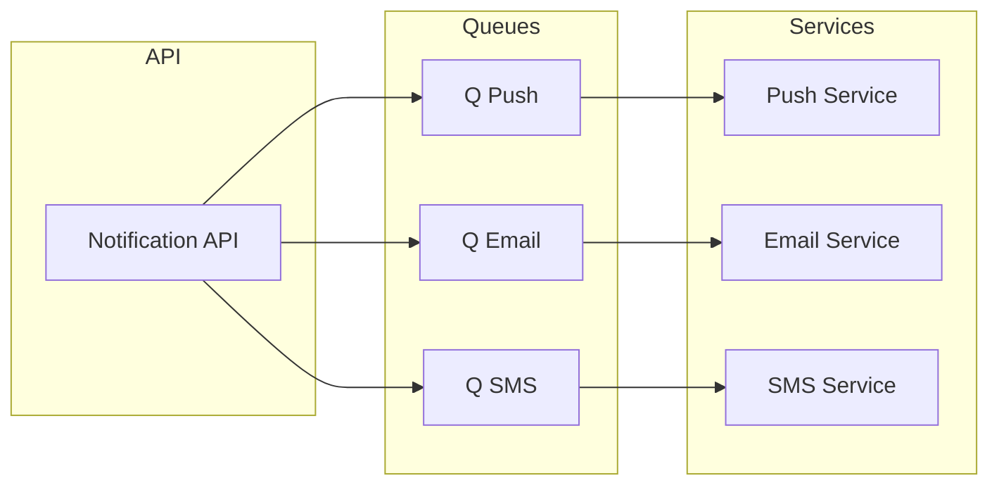

- **Prós:** Responsabilidade clara por canal; times podem evoluir cada serviço; isolamento de falhas.
- **Contras:** Mais serviços e filas; política de fallback e rate limit global precisa de componente compartilhado (ex.: API + Redis).

---

## Situação 4: Deploy de serviços críticos sem downtime e com compatibilidade

**Problema:** Serviços que tratam transações e contratos precisam ser atualizados sem derrubar tráfego, com rollback rápido e compatibilidade entre versões antigas e novas (clientes e outros serviços).

### Solução A: Blue/Green no Kubernetes (dois deployments, switch de tráfego)

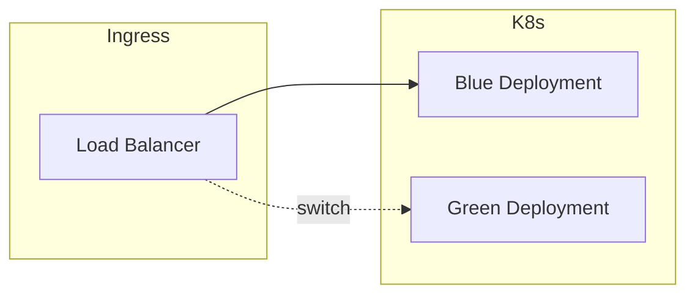

- **Prós:** Rollback imediato (voltar ao deployment anterior); teste completo do Green antes de cortar tráfego.
- **Contras:** Dobro de recursos durante o switch; migração de estado e conexões longas exigem cuidado; switch é “big bang”.

### Solução B: Canary (percentual de tráfego para nova versão)

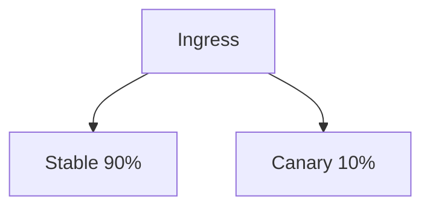

- **Prós:** Rollout gradual; detecção de erros com impacto limitado; possível automatizar (métricas, rollback).
- **Contras:** Compatibilidade de contrato e dados entre versões obrigatória; configuração de roteamento e métricas mais elaborada.

### Solução C: Feature flags + rolling update (uma versão, flags ligam comportamento)

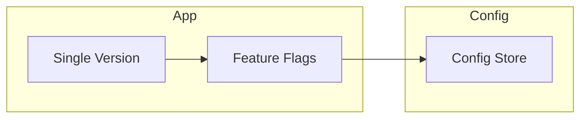

- **Prós:** Uma base de código; ativação/desativação sem novo deploy; A/B e rollout por usuário ou região.
- **Contras:** Código pode acumular ramos condicionais; gestão de flags e limpeza necessárias; configuração distribuída e latência de propagação.

---

## Resumo de trade-offs recorrentes

| Tema | Trade-off |
|------|-----------|
| **Throughput vs latência** | Kafka/streams dão throughput e retenção, mas aumentam latência; filas + workers podem reduzir latência com menos retenção. |
| **Consistência vs escala** | DB único + cache é mais simples e forte consistência; event sourcing e sharding escalam melhor com consistência eventual ou por entidade. |
| **Acoplamento vs operação** | Menos componentes (fila única, um serviço) simplificam; mais componentes (Kafka por canal, serviço por canal) isolam e escalam de forma independente. |
| **Deploy** | Blue/Green = rollback rápido e recurso duplicado; Canary = rollout gradual; Feature flags = flexibilidade sem novo deploy, com dívida de flags. |

*Use estes cenários para praticar desenho no quadro e discussão de trade-offs em entrevistas.*
