# Casos de Uso

## Desafios de arquitetura

Nesta seção são apresentados problemas de arquitetura típicos de ecossistemas robustos e escaláveis. Para cada situação há **várias soluções possíveis** (não uma única correta). O objetivo é praticar:

- Entendimento de diferentes ferramentas (Kubernetes, Redis, Kafka, S3, microserviços)
- Abordagem sustentável, flexível e escalável
- Trade-offs e comunicação de prós e contras

*Contexto assumido: cloud, Kubernetes, armazenamento objeto (S3), filas/streams (Kafka), cache (Redis), microserviços e escala horizontal.*

---

## Situação 1: Ingestão e processamento de eventos em alto volume

**Problema:** Aplicações móveis e web disparam milhões de eventos por minuto (cliques, transações, sinais de vida). É preciso ingerir, validar, enriquecer e persistir sem perder dados e com latência aceitável para o negócio. O sistema deve suportar picos de tráfego sem degradação e permitir reprocessamento ou replay quando necessário (ex.: correção de bug ou nova regra de enriquecimento).

**Exemplos de aplicação:** registrar cada tentativa de pagamento de boleto ou documento; sinal de vida do app (heartbeat); evento “transação iniciada” ou “tela de extrato visualizada”; auditoria de ações para compliance e análise de comportamento.

**Escopo**
- **Dentro do escopo:** ingestão em tempo quase real, validação de payload, enriquecimento (geolocalização, contexto), persistência em storage (DB e/ou objeto), retenção configurável, idempotência e ordenação por partição/chave.
- **Fora do escopo:** processamento analítico pesado (batch noturno), real-time analytics em stream (agregações contínuas), entrega de eventos a sistemas externos via webhook.

### Solução A: API → Kafka → Consumers → S3 + DB

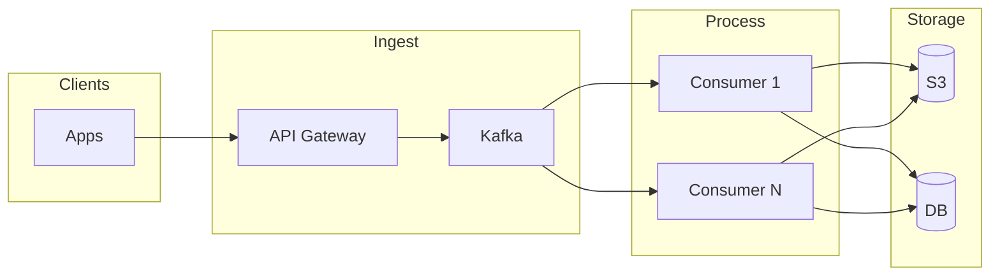

**O que acontece:** O app envia o evento para a API, que valida o payload e publica em um tópico Kafka. O Kafka armazena as mensagens com retenção configurada (ex.: 7 dias). Vários consumers, em grupo, leem as partições em paralelo: cada mensagem é validada, enriquecida (ex.: geolocalização, contexto do usuário) e então gravada em S3 (cópia bruta para data lake) e no DB (dados processados para consulta). Se um consumer cair, o grupo rebalanceia e as mensagens não confirmadas são reprocessadas; em caso de bug, é possível fazer replay do tópico.

- **Prós:** Kafka absorve picos, desacopla ingestão do processamento, replay possível, consumidores escalam horizontalmente.
- **Contras:** Mais componentes e operação (Kafka, consumer groups); latência end-to-end maior; exige idempotência e ordenação bem definida nos consumers.

### Solução B: API → Filas por prioridade (Redis / SQS) → Workers → S3 + DB

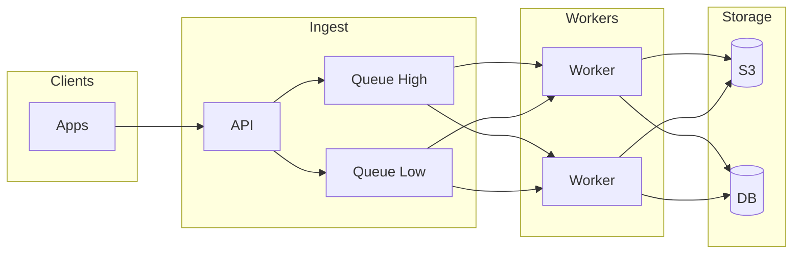

**O que acontece:** A API recebe o evento, classifica como alta ou baixa prioridade (ex.: transação financeira → fila alta; heartbeat → fila baixa) e envia a mensagem para a fila correspondente (Redis Streams ou SQS). Workers (pods no Kubernetes, escalonáveis) fazem poll na fila, pegam uma mensagem, processam (validar, enriquecer) e gravam em S3 e DB; após sucesso, removem a mensagem da fila. Se o worker falhar antes de remover, a mensagem volta a ficar disponível após o timeout de visibilidade. Não há retenção longa como no Kafka: após o consumo, a mensagem some.

- **Prós:** Modelo mais simples (push em fila, workers consomem); priorização por fila; Redis/SQS bem conhecidos.
- **Contras:** Replay e retenção limitados; em escala muito alta, filas podem virar gargalo; menos adequado para “stream” contínuo e múltiplos consumidores.

### Solução C: API síncrona + write-through cache e batch assíncrono

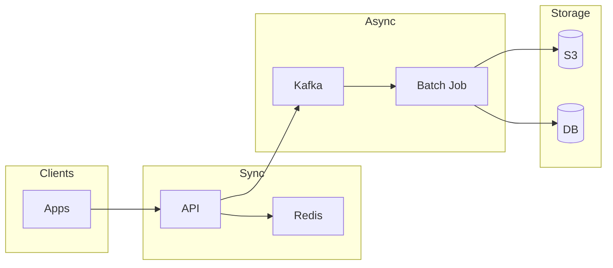

**O que acontece:** A API responde ao cliente assim que grava o evento no Redis (write-through), devolvendo “evento aceito” com baixa latência. Em paralelo, a API (ou um processo interno) publica o mesmo evento no Kafka. Um job em batch (scheduled ou contínuo) consome do Kafka em lotes: aplica validação e enriquecimento em batch e persiste em S3 e DB. A leitura para dashboards ou auditoria usa S3/DB; o Redis pode ser usado para consultas recentes ou contagem em tempo quase real. Se o Redis cair após o write mas antes da publicação no Kafka, há risco de perda; por isso costuma-se usar o Kafka como fonte de verdade assíncrona quando a durabilidade é crítica.

- **Prós:** Resposta rápida ao cliente (write em Redis); processamento pesado em batch; reduz carga direta no DB.
- **Contras:** Risco de perda se Redis cair antes do batch; consistência eventual; lógica duplicada (sync vs batch).

---

## Situação 2: Saldo e histórico de transações com consistência forte

**Problema:** Vários microserviços precisam ler e atualizar saldo e histórico de transações. É obrigatório: consistência forte (leitura refletindo a última escrita aceita), auditoria rastreável e suporte a alto volume de leitura sem comprometer a integridade dos débitos e créditos. Concorrência e idempotência (ex.: retentativas de pagamento) devem ser tratadas de forma segura.

**Exemplos de aplicação:** realizar transferência entre contas; pagar um boleto ou documento; consultar extrato bancário; debitar/creditar em compra com cartão; consultar saldo na tela inicial do app; conciliação e auditoria regulatória.

**Escopo**
- **Dentro do escopo:** modelo de dados de saldo e movimentações, garantias de consistência (ACID ou equivalente), cache de leitura, auditoria e rastreabilidade, idempotência de operações de escrita.
- **Fora do escopo:** integração com gateways de pagamento externos, disputas e chargebacks, liquidação entre instituições, relatórios regulatórios agregados (podem consumir as mesmas fontes).

### Solução A: DB transacional único (fonte da verdade) + cache de leitura (Redis)

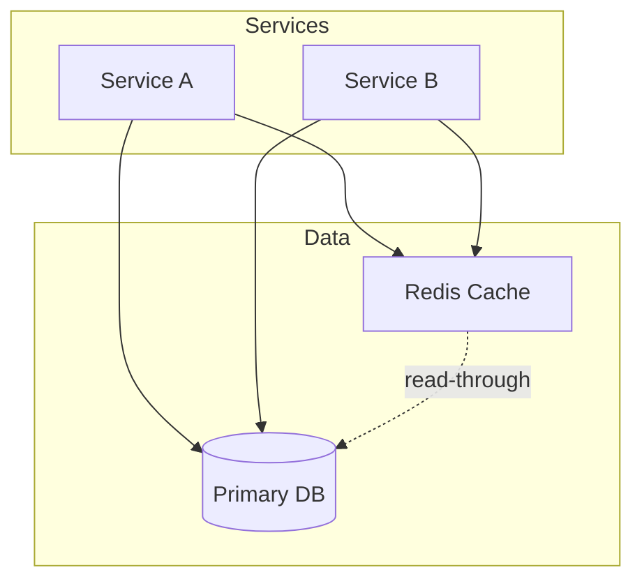

**O que acontece:** Toda escrita (debitar, creditar, registrar transação) vai direto ao DB dentro de uma transação ACID: o saldo e o histórico são atualizados atomicamente. Na leitura (ex.: “consultar extrato” ou “mostrar saldo”), o serviço primeiro consulta o Redis com a chave da conta; se existir (cache hit), devolve o valor. Se não existir (cache miss), lê do DB, grava no Redis com TTL e devolve. Após qualquer escrita no DB, o cache daquela conta é invalidado (ou atualizado), para a próxima leitura ver o valor correto. Assim, leituras repetidas (ex.: várias telas no app) não batem no DB; escritas sempre passam pelo DB como única fonte da verdade.

- **Prós:** Modelo simples; transações ACID; Redis reduz carga de leitura no DB.
- **Contras:** DB pode virar gargalo de escrita; cache invalidation e consistência cache-DB são críticos; limite de escala vertical do primary.

### Solução B: Event Sourcing + CQRS (write em stream, leitura em projeções)

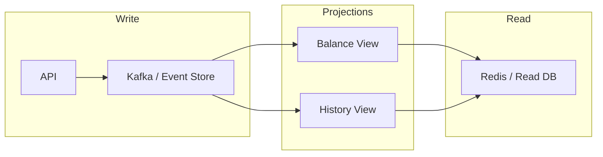

**O que acontece:** Uma operação que altera saldo (ex.: “pagar boleto”) não atualiza saldo diretamente: a API grava um **evento** (ex.: `DebitoRealizado`) no Kafka ou event store, com valor, conta, idempotency key e metadados. Consumidores (projeções) leem esse stream: a projeção “saldo” aplica cada evento e atualiza uma view (ex.: tabela ou Redis) por conta; a projeção “histórico” monta a lista de transações. Quem precisa de saldo ou extrato lê dessas views (Redis ou read DB), não do stream. O stream é a fonte da verdade e vira auditoria natural; novas projeções (ex.: “saldo por dia”) podem ser criadas reprocessando o stream. A leitura é eventualmente consistente: há um pequeno atraso entre o write e a atualização da view.

- **Prós:** Auditoria natural (log de eventos); escalabilidade de leitura independente; replay e novas projeções sem alterar o core.
- **Contras:** Complexidade operacional e de desenvolvimento; consistência eventual na leitura; necessidade de idempotência e tratamento de atrasos nas projeções.

### Solução C: Sharding por conta/entidade + ledger por shard

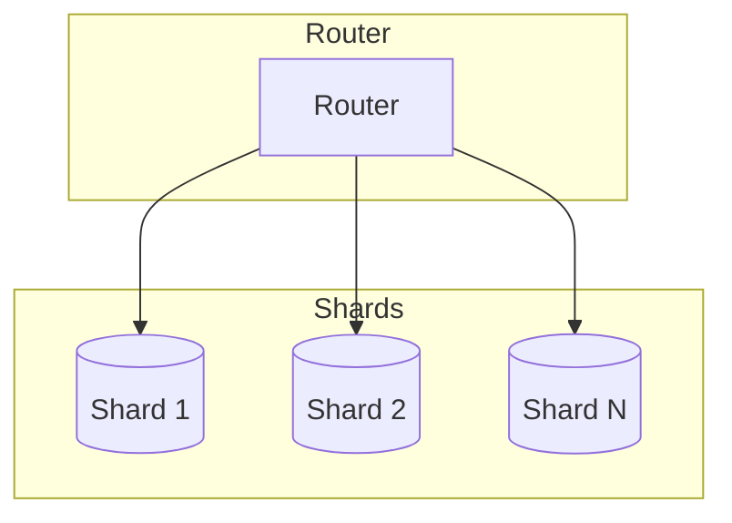

**O que acontece:** Existe um roteador (ou camada no serviço) que, a partir do identificador da conta (ou entidade), decide o shard: por exemplo, `shard_id = hash(conta_id) % N`. Toda leitura e escrita dessa conta (saldo, extrato, débito, crédito) vai para o mesmo shard, que mantém seu próprio ledger e tabelas. Assim, “consultar extrato da conta X” e “debitar na conta X” são resolvidos no mesmo banco (shard), com transações ACID locais. Contas diferentes ficam em shards diferentes, permitindo escalar horizontalmente a escrita. Uma transferência entre duas contas em shards diferentes exige uma transação distribuída ou um fluxo em duas fases (débito em um shard, crédito no outro com compensação em caso de falha), o que aumenta a complexidade.

- **Prós:** Escala horizontal da escrita; transações locais por shard; isolamento de carga por entidade.
- **Contras:** Transações cross-shard complexas; rebalanceamento e crescimento de shards não triviais; design de chave de sharding crítico.

---

## Situação 3: Notificações em tempo quase real para milhões de usuários

**Problema:** Enviar push, e-mail e SMS de forma personalizada, com rate limit por usuário e por canal, fallback entre provedores e alta disponibilidade. A latência entre o evento que dispara a notificação e a entrega deve ser baixa (segundos), e a falha de um canal (ex.: provedor de SMS indisponível) não pode travar os demais. Preferências do usuário (canal prioritário, horário silencioso) devem ser respeitadas.

**Exemplos de aplicação:** avisar que um boleto foi pago; alerta de transação em outra cidade; confirmação de transferência recebida; comunicado de manutenção programada; código de verificação (2FA) por SMS ou e-mail; lembrete de fatura.

**Escopo**
- **Dentro do escopo:** roteamento por canal (push, e-mail, SMS), rate limit por usuário e por canal, fallback entre provedores, preferências e templates, deduplicação, retry e dead-letter.
- **Fora do escopo:** criação de conteúdo da mensagem (isso vem do sistema que publica o evento), gestão de preferências na UI, métricas de entrega e abertura (podem ser feitas por outro consumidor dos mesmos eventos).

### Solução A: Kafka por canal (push, email, SMS) → consumers → provedores

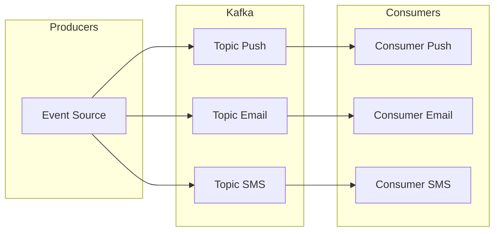

**O que acontece:** Um evento de negócio (ex.: “boleto pago”) é publicado uma vez e replicado ou produzido em três tópicos Kafka: um para push, um para e-mail e um para SMS (ou um único tópico com três consumer groups, um por canal). Cada grupo de consumers lê só o que lhe cabe: o consumer de push consulta preferências e rate limit (ex.: Redis), envia ao provedor de push e commita o offset; o de e-mail e o de SMS fazem o mesmo nos seus canais. Assim, uma falha no provedor de SMS não atrasa push nem e-mail; cada canal escala de forma independente. A política “não enviar e-mail se o push foi entregue” exige um store compartilhado (ex.: Redis) com o status por notificação ou usuário, e os consumers consultam antes de enviar.

- **Prós:** Um canal não bloqueia o outro; backpressure e retenção do Kafka; múltiplos consumers por canal.
- **Contras:** Rate limit e estado por usuário exigem store (ex.: Redis); coordenação entre canais (ex.: “não enviar email se push ok”) mais complexa.

### Solução B: Fila única + worker que roteia e aplica rate limit (Redis)

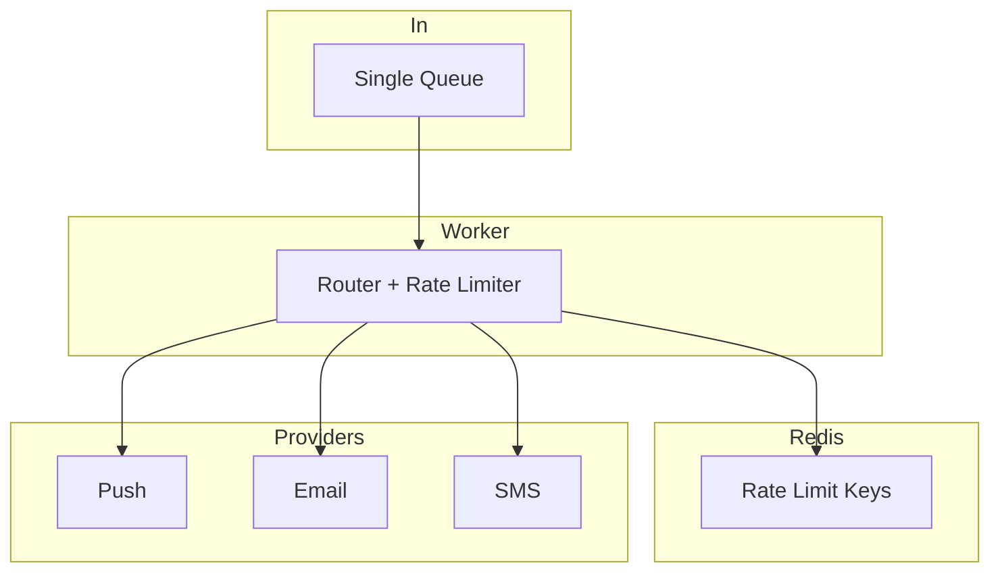

**O que acontece:** Todas as solicitações de notificação (push, e-mail, SMS) entram na mesma fila (ex.: uma fila SQS ou Redis). Um ou mais workers fazem poll na fila, pegam uma mensagem e executam a lógica centralizada: consultam Redis para rate limit por usuário e por canal (ex.: máximo de 5 SMS/hora), preferências do usuário e regras de fallback (ex.: se push falhar, tentar e-mail). Em seguida escolhem o canal e o provedor e disparam a chamada (HTTP, SDK). Se o provedor principal falhar, o worker tenta o fallback. A deduplicação (evitar enviar a mesma notificação duas vezes) também pode usar Redis. Escalar significa aumentar o número de workers; a fila única pode virar gargalo se o volume for muito alto, e aí entra particionamento por usuário ou por tipo de evento.

- **Prós:** Lógica de roteamento e fallback centralizada; Redis para rate limit e deduplicação; menos tópicos para operar.
- **Contras:** Worker pode virar gargalo; uma falha afeta todos os canais; escalar exige particionamento cuidadoso da fila.

### Solução C: Serviço por canal + API de notificação + filas internas

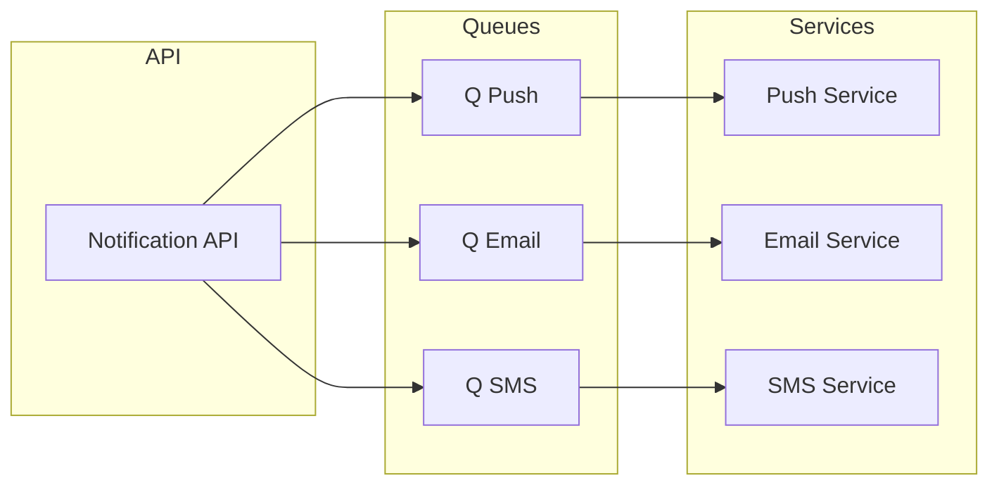

**O que acontece:** Uma API de notificação única recebe o pedido (“enviar confirmação de transferência para o usuário X”) e decide quais canais usar (push, e-mail, SMS) com base em regras ou preferências. Para cada canal escolhido, a API publica uma mensagem em uma fila dedicada: fila de push, fila de e-mail, fila de SMS. O Serviço de Push consome só da fila de push, aplica rate limit (pode usar Redis compartilhado) e chama o provedor de push; o Serviço de E-mail e o de SMS fazem o mesmo nas suas filas. Assim, a responsabilidade por canal fica isolada: um bug no serviço de SMS não derruba push nem e-mail. A política de “não enviar e-mail se push foi enviado” e o rate limit global ficam na API ou em um componente compartilhado (ex.: Redis com chaves por usuário e por notificação).

- **Prós:** Responsabilidade clara por canal; times podem evoluir cada serviço; isolamento de falhas.
- **Contras:** Mais serviços e filas; política de fallback e rate limit global precisa de componente compartilhado (ex.: API + Redis).

---

## Situação 4: Deploy de serviços críticos sem downtime e com compatibilidade

**Problema:** Serviços que tratam transações e contratos precisam ser atualizados sem derrubar tráfego, com rollback rápido e compatibilidade entre versões antigas e novas (clientes e outros serviços). Requisitos típicos: zero downtime, possibilidade de voltar atrás em minutos em caso de problema, e garantia de que clientes ou outros serviços que ainda usam contratos antigos continuem funcionando durante e após o deploy.

**Exemplos de aplicação:** publicar nova versão do serviço de pagamento de boletos; atualizar o serviço que consulta extrato e saldo; liberar nova versão da API de transações; corrigir bug crítico no fluxo de transferência sem interromper o uso.

**Escopo**
- **Dentro do escopo:** estratégia de deploy (blue/green, canary, rolling), troca de tráfego, rollback, compatibilidade de API e de dados entre versões, tratamento de conexões longas e estado em memória.
- **Fora do escopo:** pipeline de CI/CD completo, testes automatizados de regressão, versionamento semântico de API (podem ser pré-requisitos, mas não são desenhados neste caso).

### Solução A: Blue/Green no Kubernetes (dois deployments, switch de tráfego)

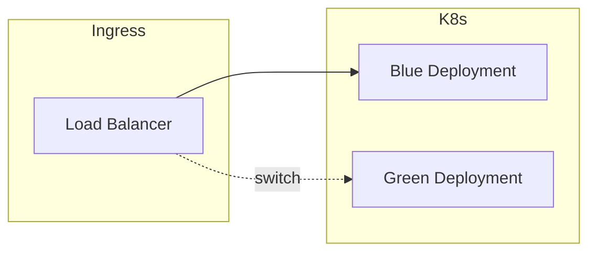

**O que acontece:** Em produção existem dois deployments idênticos em capacidade: Blue (versão atual) e Green (vazio ou espelho). No deploy, a nova versão é colocada no Green; o tráfego continua 100% no Blue. A equipe valida o Green (testes de fumaça, health check, dados de teste). Quando aprovado, o load balancer ou Ingress passa a enviar 100% do tráfego para o Green; o Blue fica ocioso. Em caso de problema, o switch é revertido (tráfego de volta ao Blue), o que dá rollback imediato. Durante o switch, conexões longas (WebSocket, streaming) podem ser encerradas; sessões e estado em memória precisam ser considerados (ex.: sticky session ou estado em Redis).

- **Prós:** Rollback imediato (voltar ao deployment anterior); teste completo do Green antes de cortar tráfego.
- **Contras:** Dobro de recursos durante o switch; migração de estado e conexões longas exigem cuidado; switch é “big bang”.

### Solução B: Canary (percentual de tráfego para nova versão)

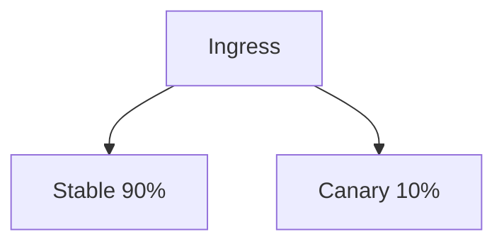

**O que acontece:** A nova versão do serviço é implantada junto da antiga no mesmo cluster: por exemplo, 90% dos pods estão na versão estável (v1) e 10% na canary (v2). O Ingress ou service mesh roteia uma parte do tráfego (ex.: 10% por hash do usuário ou aleatório) para os pods canary. Métricas (latência, erro, throughput) são coletadas por versão. Se a canary se comportar bem por um tempo definido, aumenta-se o percentual (ex.: 50%, depois 100%) até substituir totalmente a v1. Se aparecer aumento de erro ou latência, a canary é removida (scale to 0) e o tráfego volta todo para a v1. Contratos (API, eventos) e esquemas de dados precisam ser compatíveis entre v1 e v2, pois ambas recebem tráfego real ao mesmo tempo.

- **Prós:** Rollout gradual; detecção de erros com impacto limitado; possível automatizar (métricas, rollback).
- **Contras:** Compatibilidade de contrato e dados entre versões obrigatória; configuração de roteamento e métricas mais elaborada.

### Solução C: Feature flags + rolling update (uma versão, flags ligam comportamento)

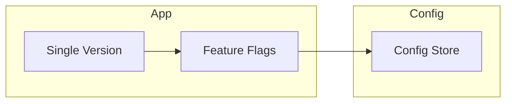

**O que acontece:** Há uma única versão do serviço em produção (rolling update no Kubernetes atualiza os pods gradualmente). O comportamento novo (ex.: nova lógica de consulta de extrato) fica atrás de uma feature flag, consultada em tempo de execução em um config store (ex.: Redis, serviço de configuração). Com a flag desligada, o código antigo roda; ligando a flag para 5% dos usuários (por ID, região ou aleatório), apenas essa parcela usa o novo fluxo. Não é necessário novo deploy para ativar ou desativar: muda-se a configuração da flag. Rollback é desligar a flag. A/B tests e rollout por região são naturais. O código acumula `if (featureX) { ... } else { ... }`; é importante limpar flags antigas e evitar muitas ramificações.

- **Prós:** Uma base de código; ativação/desativação sem novo deploy; A/B e rollout por usuário ou região.
- **Contras:** Código pode acumular ramos condicionais; gestão de flags e limpeza necessárias; configuração distribuída e latência de propagação.

---

## Situação 5: Cache distribuído e invalidação em múltiplos serviços

**Problema:** Vários microserviços precisam ler dados que mudam com frequência moderada (catálogo, preços, perfil de usuário). É necessário reduzir carga na fonte de verdade (DB ou outro serviço) e manter a latência de leitura baixa, garantindo que o cache reflita alterações em tempo aceitável e sem inconsistências prolongadas entre serviços.

**Exemplos de aplicação:** cache de catálogo de produtos para listagem e busca; cache de preços e promoções na camada de exibição; cache de perfil e preferências do usuário; redução de carga no DB de transações para consultas de extrato ou saldo.

**Escopo**
- **Dentro do escopo:** estratégia de cache (aside, through, write-through), invalidação (TTL, evento, explícita), consistência entre cache e fonte, compartilhamento de cache entre instâncias (Redis).
- **Fora do escopo:** escolha da fonte de verdade (já existe), política de expiração por tipo de dado (pode ser parametrizada no escopo).

### Solução A: Cache-aside com TTL fixo

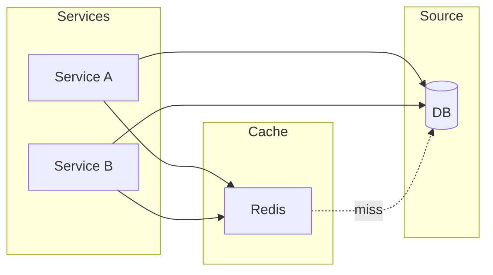

**O que acontece:** Cada serviço, ao precisar de um dado, primeiro consulta o Redis (chave por entidade, ex.: `product:123`). Se existir (hit), devolve. Se não (miss), consulta o DB, grava no Redis com TTL (ex.: 5 min) e devolve. Escritas vão direto ao DB; o cache não é atualizado na escrita, apenas expira após o TTL. Simples de implementar; a inconsistência é limitada ao TTL. Para dados que mudam pouco, TTL maior reduz carga no DB; para dados que mudam muito, TTL menor reduz inconsistência às custas de mais hits ao DB.

- **Prós:** Implementação simples; sem dependência de eventos; cada serviço controla seu uso do cache.
- **Contras:** Janela de inconsistência até o TTL; escritas não invalidam o cache; pode haver stampede no DB quando muitas chaves expiram ao mesmo tempo.

### Solução B: Invalidação dirigida por eventos (Kafka)

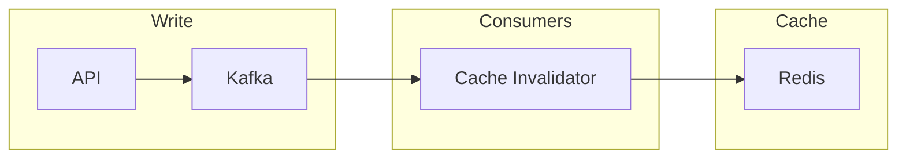

**O que acontece:** Quando um dado é alterado (ex.: preço atualizado), o serviço que faz a escrita publica um evento no Kafka (ex.: `PrecoAtualizado`, `ProdutoAlterado`) com o identificador da entidade. Um consumer dedicado (ou um por tipo de entidade) lê o evento e invalida a chave correspondente no Redis (delete ou atualiza). As leituras continuam cache-aside: miss busca no DB e preenche o cache. Assim, a invalidação é imediata após o processamento do evento; a janela de inconsistência fica na ordem da latência do pipeline (Kafka + consumer).

- **Prós:** Cache atualizado logo após a mudança; desacoplamento entre quem escreve e quem invalida; replay possível para re-invalidar em massa.
- **Contras:** Dependência do Kafka e do consumer; latência de propagação; necessidade de idempotência na invalidação.

### Solução C: Write-through + cache compartilhado com publicação de atualização

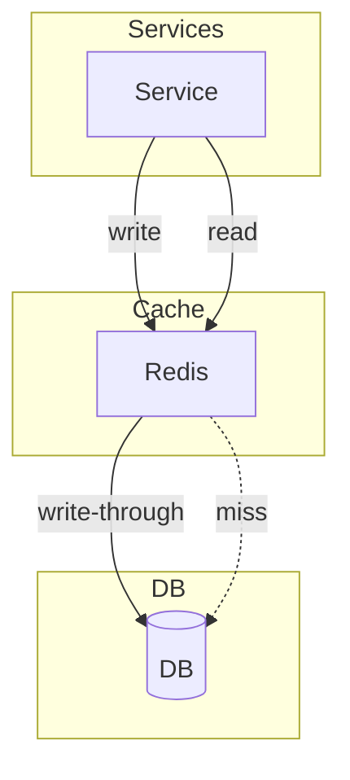

**O que acontece:** Todas as escritas passam pelo Redis: o serviço grava no Redis e o Redis (ou um componente em frente) persiste no DB em write-through. Leituras leem do Redis; miss vai ao DB e preenche o cache. Opcionalmente, após write-through bem-sucedido, um evento é publicado (Kafka ou interno) para que outras réplicas de cache ou outros serviços atualizem suas visões. Assim, a escrita é a única que atualiza o cache; outros nós podem ser atualizados por evento. Útil quando há um “owner” claro do dado e múltiplos leitores.

- **Prós:** Consistência forte na escrita (cache e DB atualizados juntos); leituras sempre no cache quando há write recente.
- **Contras:** Escrita mais lenta (dois destinos); Redis vira ponto crítico; padrão write-through exige disciplina em todos os escritores.

---

## Situação 6: E-commerce – listagem, precificação, promoções, venda e estoque

**Problema:** Construir um fluxo de e-commerce com listagem de produtos, precificação, promoções, frete, venda e cancelamento, garantindo que o usuário veja apenas produtos com preço definido, que preços e promoções sejam atualizados em todas as etapas (carrinho, checkout, pagamento) e que o estoque seja reservado no carrinho e efetivado (ou devolvido) no pagamento ou cancelamento. No pagamento, preços e promoções devem ser validados novamente de forma síncrona; no cancelamento, itens devem voltar ao estoque.

**Exemplos de aplicação:** vitrine de produtos com preço e promoção em tempo quase real; carrinho com reserva de estoque (locação); checkout com atualização de frete, preço e promoção; pagamento com validação final de preço/promoção; cancelamento com devolução de estoque.

**Escopo**
- **Dentro do escopo:** microserviços de disponibilidade/listagem, precificação, promoções, frete, venda/cancelamento e estoque; regra “produto visível só com preço”; atualização de preço/promoção/frete em cada etapa; reserva (locação) de estoque no carrinho; confirmação de dedução no pagamento; devolução no cancelamento; validação síncrona no pagamento.
- **Fora do escopo:** gateway de pagamento externo (integração genérica), catálogo de produtos (origem dos dados), UI do app (apenas consumo das APIs/eventos).

### Solução A: Comunicação por Kafka (streaming) + validação REST no pagamento

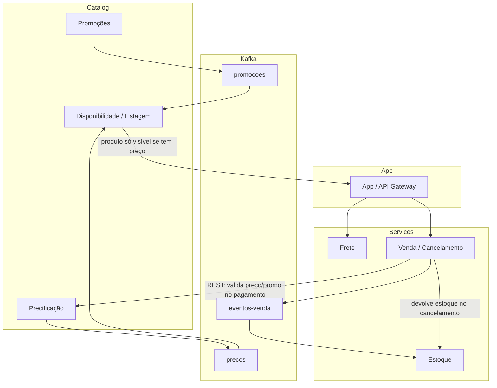

**O que acontece:** Os microserviços de **precificação** e **promoções** publicam atualizações em streams Kafka (ex.: tópicos `precos` e `promocoes`). O serviço de **disponibilidade/listagem** consome esses streams e mantém uma visão “produto + preço + promoção”: um produto só entra (ou permanece) na listagem quando existe ao menos um preço para ele. O app consulta a listagem e, em cada etapa da venda (carrinho, checkout), consome a mesma visão atualizada (ou reconsulta preço/promoção e frete via serviços que também consomem Kafka). O **frete** é outro microserviço, consultado quando o carrinho ou endereço muda. O **venda/cancelamento** orquestra: ao colocar no carrinho, reserva estoque (locação) no microserviço de **estoque**; ao confirmar pagamento, chama via **REST** o serviço de precificação (e promoções) para validar preço e promoção finais e, se ok, confirma a dedução do estoque; ao cancelar, devolve as unidades ao estoque. Em todas as etapas intermediárias, preço, promoção e frete são atualizados (via dados já enriquecidos pelos streams ou por consulta síncrona aos serviços que alimentam os streams). Esta solução prioriza consistência eventual na vitrine e carrinho, com validação forte e síncrona apenas no momento do pagamento.

- **Prós:** Vitrine e carrinho sempre com preço/promoção atualizados via streaming; desacoplamento entre precificação, promoções e listagem; validação crítica no pagamento evita divergência; estoque reservado e confirmado/devolvido de forma clara.
- **Contras:** Latência de propagação nos streams; complexidade operacional (Kafka, consumers, idempotência); necessidade de definir bem tópicos e contratos dos eventos.

### Solução B: APIs REST síncronas em todas as etapas

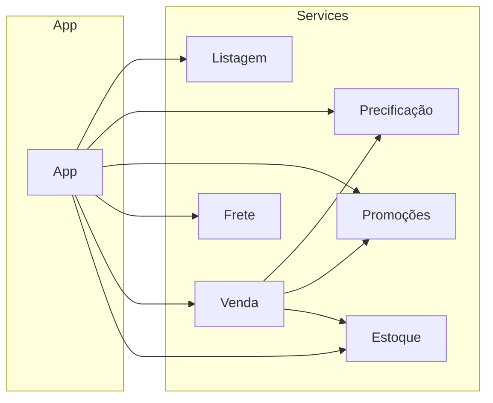

**O que acontece:** A **listagem** é uma API que agrega dados de catálogo; ao exibir produtos, o app ou o BFF chama **precificação** e **promoções** por produto (ou em lote) e filtra no próprio app os que têm preço. Em cada etapa (carrinho, checkout), o app chama de novo precificação, promoções e **frete**. No pagamento, **venda** chama precificação e promoções (REST) para validar e depois **estoque** para confirmar dedução; no cancelamento, venda chama estoque para devolver. A reserva no carrinho é uma chamada REST ao estoque (locação); a confirmação no pagamento é outra chamada (confirma dedução). Tudo síncrono: sem Kafka, mais simples de raciocinar e debugar, mas com maior acoplamento e carga nas APIs a cada interação.

- **Prós:** Modelo simples; sem dependência de mensageria; validação e regras sempre na hora; fácil de testar e operar.
- **Contras:** Muitas chamadas síncronas; latência e disponibilidade em cadeia; listagem e carrinho podem ficar pesados se precisarem de preço/promoção para muitos itens.

### Solução C: Híbrido – eventos para visão de vitrine, REST para orquestração de venda

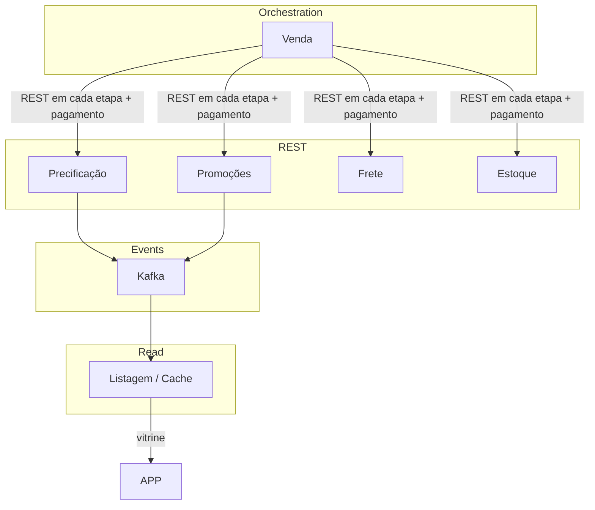

**O que acontece:** A **vitrine** (listagem) é alimentada por eventos Kafka (preço e promoção); o produto só aparece quando há preço. O carrinho e o checkout, porém, são orquestrados pelo serviço de **venda** via chamadas REST: a cada mudança de carrinho ou etapa, venda chama precificação, promoções e frete para obter valores atuais e reserva/confirmação no estoque. No pagamento, validação REST de preço e promoção e confirmação de estoque; no cancelamento, devolução via REST ao estoque. Combina vitrine sempre atualizada por evento com fluxo de venda explícito e síncrono.

- **Prós:** Vitrine leve e atualizada por stream; fluxo de venda previsível e auditável via REST; validação no pagamento e estoque claros.
- **Contras:** Dois padrões (eventos + REST); serviço de venda central e com muitas dependências síncronas.

---

## Resumo de trade-offs recorrentes

| Tema | Trade-off |
|------|-----------|
| **Throughput vs latência** | Kafka/streams dão throughput e retenção, mas aumentam latência; filas + workers podem reduzir latência com menos retenção. |
| **Consistência vs escala** | DB único + cache é mais simples e forte consistência; event sourcing e sharding escalam melhor com consistência eventual ou por entidade. |
| **Acoplamento vs operação** | Menos componentes (fila única, um serviço) simplificam; mais componentes (Kafka por canal, serviço por canal) isolam e escalam de forma independente. |
| **Deploy** | Blue/Green = rollback rápido e recurso duplicado; Canary = rollout gradual; Feature flags = flexibilidade sem novo deploy, com dívida de flags. |
| **Cache** | TTL = simples e janela de inconsistência limitada; invalidação por evento = mais atualizado, com dependência de mensageria; write-through = consistência forte, cache como ponto crítico. |
| **E-commerce (preço/estoque)** | Kafka em todo o fluxo = vitrine e etapas sempre atualizadas, validação REST só no pagamento; REST em tudo = mais simples, mais acoplado; híbrido = vitrine por evento, venda por REST. |

*Use estes cenários para praticar desenho no quadro e discussão de trade-offs em entrevistas.*
