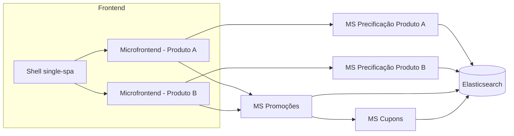

# 🎥 Case: Engine de Precificação e Promoções -- Arquitetura Distribuída

## 🎯 Contexto e Problema

Em um projeto da área de turismo, surgiu a necessidade de prover
rapidamente uma engine robusta de precificação e promoções.

O desafio principal era que as regras eram altamente dinâmicas:

-   Cada produto possuía estrutura própria de precificação
-   Campos variavam significativamente entre produtos
-   Regras promocionais podiam combinar múltiplos produtos

Além disso, tanto o backend quanto o frontend precisavam ser
independentes por unidade de negócio, permitindo que squads evoluíssem
de forma paralela.

------------------------------------------------------------------------

## 🏗️ Visão Geral da Arquitetura

O diagrama ilustra a separação por domínio, com microfrontends
independentes consumindo microserviços específicos, todos persistindo
dados de forma flexível no Elasticsearch.

------------------------------------------------------------------------

## 🏗️ Decisão Arquitetural

Descartamos banco relacional tradicional devido à alta variabilidade
estrutural das regras, o que geraria complexidade excessiva de modelagem
e migrações frequentes.

Optamos por uma arquitetura baseada em microserviços distribuídos por
domínio:

-   Cada produto possui sua própria engine de precificação, implementada
    como microserviço independente
-   Serviços versionados e deployáveis de forma isolada
-   Comunicação síncrona via APIs REST
-   Contratos bem definidos para evitar acoplamento

Para persistência, escolhemos o Elasticsearch.

### Motivos técnicos da decisão:

-   Estrutura baseada em documentos flexíveis
-   Índices separados por tipo de regra
-   Alta capacidade de consulta dinâmica
-   Evolução estrutural sem necessidade de migração rígida

Cada tipo de regra era armazenado como documento em um índice
específico, funcionando como collections independentes.

------------------------------------------------------------------------

## ⚙️ Componentes Técnicos do Backend

Criamos duas bibliotecas Java compartilhadas:

### Biblioteca de Cadastro

-   Padronização de payload
-   Validação estrutural
-   Abstração da camada de persistência
-   Serialização/deserialização homogênea

### Biblioteca Core de Cálculo

-   Interface comum para engines
-   Estratégias de cálculo desacopladas
-   Testabilidade isolada
-   Separação clara entre domínio e infraestrutura

Além disso:

-   Um microserviço único para promoções gerais
-   Um microserviço exclusivo para cupons

Esses serviços eram mais transversais e combinavam múltiplos produtos,
por isso não seguiram o modelo de segregação por produto.

A arquitetura manteve separação clara entre:

-   Camada de domínio
-   Camada de aplicação
-   Infraestrutura

Permitindo testabilidade e futura substituição tecnológica com baixo
impacto.

------------------------------------------------------------------------

## 🧩 Frontend e Microfrontends

No frontend, o desafio era equivalente:\
cada regra podia ter um formulário completamente diferente.

Adotamos arquitetura de microfrontends com single-spa.

Escolhida pela menor complexidade operacional em comparação ao Webpack
Module Federation.

Implementamos:

-   Monorepo React para compartilhamento de componentes
-   Formulários dinâmicos gerados a partir de definições JSON
-   Independência por unidade de negócio

------------------------------------------------------------------------

## 🚀 Minha Contribuição

Atuei diretamente:

-   Na definição da arquitetura distribuída
-   Na decisão técnica pelo Elasticsearch
-   Na implementação da arquitetura de microfrontends
-   Na padronização das bibliotecas backend

Após a definição arquitetural, fui promovido a Tech Lead, liderando
tanto o frontend quanto as engines de promoções e cupons, garantindo
consistência técnica e evolução sustentável da solução.
