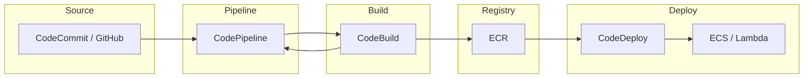

# Conceitos e serviços AWS para CI/CD

## Integração e implantação contínuas na AWS

**CI (Continuous Integration)** significa integrar código frequentemente (commits, PRs) com build e testes automatizados. **CD (Continuous Deployment ou Delivery)** significa que o resultado aprovado do pipeline é implantado automaticamente (ou está sempre pronto para implantação) em ambientes como staging e produção. Na **AWS**, isso é feito com uma combinação de serviços gerenciados: repositório, pipeline, build, registry de imagens e deploy.

## Serviços principais

| Serviço | Função |
|---------|--------|
| **CodeCommit** | Repositório Git gerenciado na AWS; alternativa ao GitHub/GitLab quando se quer tudo na AWS. |
| **CodePipeline** | Orquestra o pipeline: estágios (source, build, deploy) e ações; dispara em push ou manual. |
| **CodeBuild** | Executa build em ambiente gerenciado (container ou imagem padrão); compila, testa e gera artefatos (ex.: imagem Docker enviada ao ECR). |
| **CodeDeploy** | Faz o deploy do artefato no destino: EC2 (incluindo Auto Scaling), ECS, Lambda, ou on-premise. Rolling, blue/green ou canary. |
| **ECR** | Registry de imagens Docker compatível com Docker Hub; ECS e Lambda (container) puxam imagens do ECR. |
| **CodeArtifact** | Repositório de dependências (npm, Maven, PyPI); o CodeBuild pode baixar pacotes de lá. |

## Fluxo típico

1. **Source** – CodePipeline tem um estágio “Source” conectado a CodeCommit, GitHub (via conexão), GitHub Enterprise ou S3. A cada commit (ou merge) na branch configurada, o pipeline é disparado.
2. **Build** – Estágio “Build” chama o CodeBuild: o projeto CodeBuild define imagem, comandos (install, test, build) e saída (artefatos para S3 ou push de imagem para ECR). O CodeBuild roda em um container efêmero; não há servidor para manter.
3. **Deploy** – Estágio “Deploy” pode usar CodeDeploy (para EC2/ECS/Lambda) ou outra ação (ex.: atualizar stack CloudFormation, invocar Lambda de deploy). O artefato (código empacotado ou URI da imagem no ECR) é passado do estágio anterior.

## Integração com GitHub

Para usar **GitHub** (ou Bitbucket) como fonte:

- No CodePipeline, crie uma **conexão** (Source connection) com o provedor; autorize a AWS no GitHub (OAuth ou App).
- Escolha repositório e branch; o pipeline será disparado em push (e opcionalmente em PR, se configurado no GitHub com webhook).
- Detecção de mudanças pode ser por polling ou por webhook (recomendado) para menor latência.

## Permissões (IAM)

- O **CodePipeline** precisa de uma role IAM que permita chamar CodeBuild, CodeDeploy, S3, ECR e acessar artefatos (bucket de artefatos do pipeline).
- O **CodeBuild** precisa de uma role para ler do S3 (artefatos do pipeline), escrever no S3 e fazer push no ECR; e para acessar CodeArtifact ou redes (VPC) se necessário.
- O **CodeDeploy** precisa de permissão para ler artefatos e atualizar o destino (ECS, Lambda, EC2).

Boas práticas: usar roles dedicadas por serviço; não usar credenciais de longa duração no código; secrets em Secrets Manager ou Parameter Store e acessados pela role do CodeBuild.

## Resumo

| Componente | Papel |
|------------|--------|
| **CodePipeline** | Orquestra estágios (source → build → deploy); disparo por evento ou manual. |
| **CodeBuild** | Executa build e testes; produz artefatos (S3, ECR). |
| **CodeDeploy** | Leva o artefato ao ambiente (EC2, ECS, Lambda). |
| **ECR** | Armazena imagens Docker usadas por ECS/Lambda. |
| **GitHub** | Fonte do código via conexão e webhook. |

No próximo capítulo: configuração do estágio de build, testes e geração de artefatos (incluindo imagem Docker no ECR).

---

*Próximo: [Pipeline: build, teste e artefatos](./02-pipeline-build-artefatos.md).*
