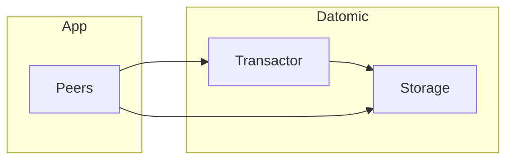

# Modelo de dados e conceitos do Datomic

## O que é o Datomic?

**Datomic** é um banco de dados que trata dados como **fatos imutáveis** e **temporais**: não há “update” que sobrescreve; cada mudança é uma nova “transação” que adiciona fatos no tempo. O banco mantém todo o histórico; consultas podem ver o estado em qualquer ponto no tempo (point-in-time). É muito usado em ecossistemas **Clojure** e JVM, com API nativa em Clojure e suporte a Datalog para consultas declarativas.



## Entidades e atributos

- **Entidade** – Identificada por um **entity id** (eid); não há “tabela” rígida; a entidade é um conjunto de **fatias** (datoms) que compartilham o mesmo eid.
- **Atributo** – Define um “campo”: nome, tipo, cardinalidade (one ou many), e se é componente (parte da entidade pai). Atributos são definidos no **schema** via transação.
- **Valor** – Cada fatia associa entidade + atributo + valor + tempo (transação). O “estado atual” de uma entidade é a união dos fatos mais recentes por atributo (considerando a transação mais recente).

Não há DELETE que apaga o passado; “retração” (retract) é um fato que indica que um valor deixa de valer a partir daquela transação; o histórico permanece para auditoria e point-in-time.

## Datom e tempo

Um **datom** é uma tupla: **[eid, attribute, value, transaction, added]** (em algumas representações “added” é implícito). A **transação** é um número monotônico; cada transação tem um instante de tempo (txInstant). Assim:

- Inserir um fato = adicionar um datom com a transação atual.
- “Atualizar” = retrair o fato antigo (datom com added=false na nova transação) e adicionar o novo fato.
- Consultar “agora” = considerar apenas fatos cuja transação é a mais recente para aquele eid+attribute; consultar “no tempo T” = filtrar por transação ≤ T.

Isso permite **auditoria** natural (quem mudou o quê e quando) e **time travel** (replay, reprocessamento, análise histórica).

## Schema

O schema do Datomic é **dados**: você transaciona atributos como entidades. Exemplo conceitual de definição de atributo:

```clojure
{:db/ident       :person/name
 :db/valueType   :db.type/string
 :db/cardinality :db.cardinality/one
 :db/doc         "Full name of the person"}
```

- **db/ident** – Nome do atributo (keyword).
- **db/valueType** – Tipo (string, long, ref, instant, uuid, etc.).
- **db/cardinality** – :db.cardinality/one ou :db.cardinality/many (multivalorado).
- **db/doc** – Documentação.
- Outros: **:db/unique**, **:db/index** para índices e unicidade.

Referências entre entidades usam **:db.type/ref**; o valor é o eid da outra entidade. **:db/isComponent true** faz a entidade filha ser “parte” da pai (cascade retract).

## Resumo

| Conceito | Descrição |
|----------|-----------|
| **Imutabilidade** | Dados não são sobrescritos; cada mudança é uma nova transação. |
| **Temporal** | Histórico completo; consultas em qualquer ponto no tempo. |
| **Entidade** | Conjunto de fatos (eid, attr, value, tx). |
| **Schema como dados** | Atributos definidos via transação; flexível e evolutivo. |

No próximo capítulo: transações (como escrever), retração, e consultas em Datalog.

---

*Próximo: [Transações e consultas](./02-transacoes-consultas.md).*
