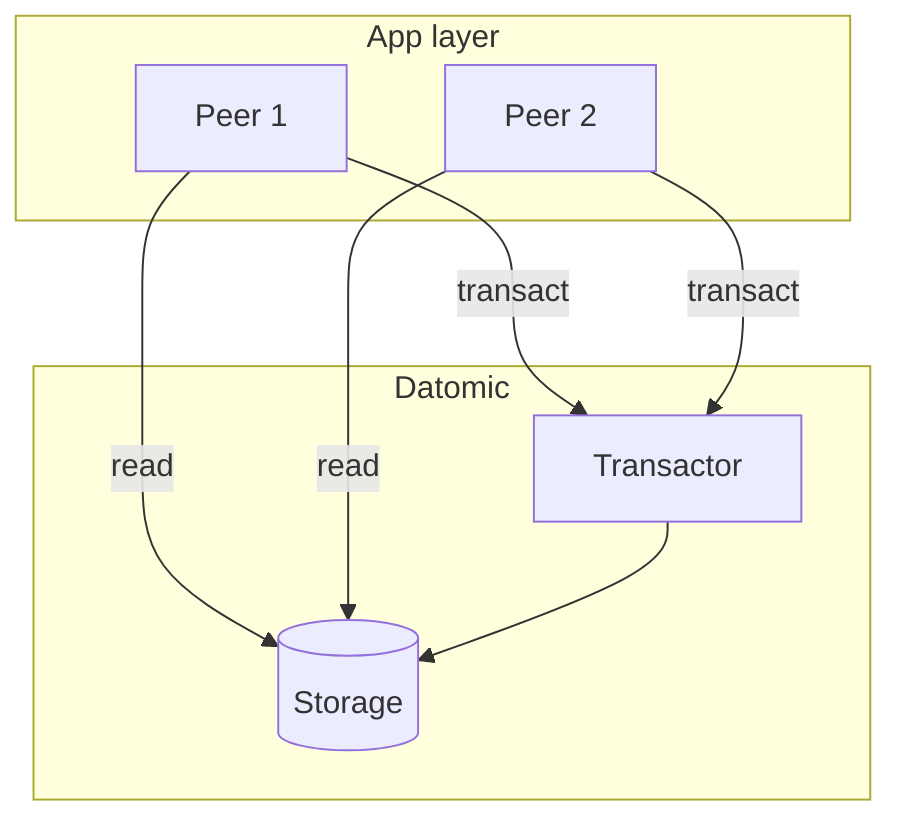

# Arquitetura e operação do Datomic

## Componentes

- **Storage** – Onde os datoms são persistidos (ex.: DynamoDB, Cassandra, SQL, ou storage próprio no Datomic Cloud/On-Prem). O Storage é a fonte da verdade; só o **Transactor** escreve nele.
- **Transactor** – Processo único que executa transações: valida, atribui tx id, persiste no Storage e propaga o novo estado aos Peers. Garante consistência e serialização das writes.
- **Peers / Client** – Aplicações que se conectam ao Datomic: leem do Storage (cache local ou remoto) e enviam transações ao Transactor. **Peer** mantém cache do banco localmente; **Client** (modelo mais leve) não mantém cache e consulta via serviço. Em Datomic Cloud, o modelo é orientado a Client e serviços gerenciados.

## Escalabilidade

- **Leitura** – Escala horizontal: muitos Peers (ou Clients) podem ler em paralelo; cada um pode ter cache local. O Storage (ex.: DynamoDB) também escala para leitura.
- **Escrita** – O Transactor é um único processo; todas as transações passam por ele. Throughput de write é limitado pelo Transactor (tipicamente da ordem de milhares de transações por segundo, dependendo de tamanho e complexidade). Para write em escala muito alta, padrões como batching de transações e particionamento lógico (múltiplos “databases” ou sistemas) são considerados.
- **Datomic Cloud** – Serviço gerenciado na AWS; Storage usa DynamoDB; Transactor e Peers são gerenciados; alta disponibilidade e backup.

## Backup e restore

- **Backup** – Exportar o Storage (snapshot) para S3 ou outro destino; o Datomic oferece ferramentas de backup compatíveis com o Storage em uso.
- **Restore** – Restaurar a partir do backup; ponto no tempo depende do último backup e de logs (se aplicável).
- **Point-in-time** – Como o banco é imutável, recuperação lógica (consultar estado passado) não exige restore; apenas para recuperar de perda do Storage.

## Boas práticas

- **Schema** – Definir índices (:db/index true) em atributos usados em :where; unique quando fizer sentido.
- **Transações** – Manter transações pequenas e atômicas; evitar transações que dependem de leitura “atual” e escrita em sequência para decisão crítica (otimistic locking com :db/cas ou checagem no aplicativo).
- **Consultas** – Evitar consultas que varrem todo o banco; usar índices e restrições; pull para formas previsíveis de dados.
- **Conectividade** – Transactor é single point para writes; garantir alta disponibilidade (HA) do Transactor em produção (Datomic Cloud ou configuração On-Prem com failover).

Com isso, você tem uma visão do **armazenamento de dados no Datomic**: modelo imutável e temporal, transações e Datalog, e arquitetura Transactor/Storage/Peers para uso em aplicações Clojure e JVM.

---

*Voltar ao [índice](./README.md).*
