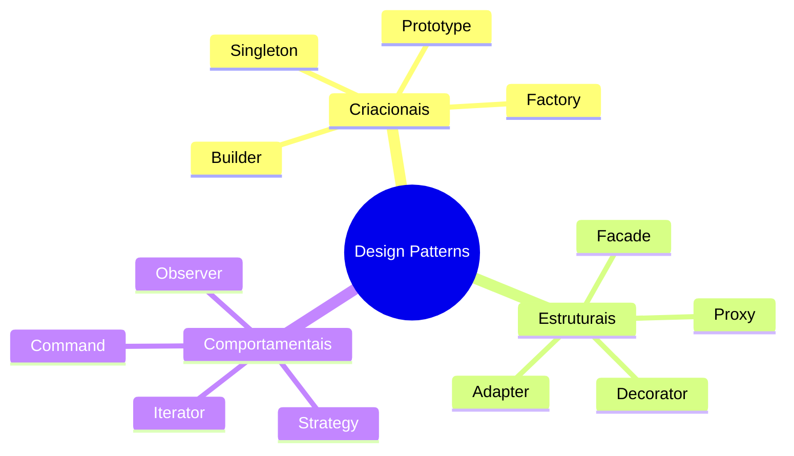

# Visão geral – Design Patterns

## O que são design patterns?

Padrões de projeto são soluções reutilizáveis para problemas recorrentes no desenho de software. Não são código pronto para copiar e colar, e sim **modelos** que você adapta ao seu contexto (linguagem, framework, domínio).

## Classificação (GoF)

Os padrões do livro *Design Patterns: Elements of Reusable Object-Oriented Software* costumam ser agrupados em três categorias:

| Categoria      | Objetivo principal                          |
|----------------|---------------------------------------------|
| **Criacionais** | Como criar e montar objetos                 |
| **Estruturais** | Como organizar classes e objetos            |
| **Comportamentais** | Como distribuir responsabilidades e fluxo |

## Onde os exemplos aparecem

Nos próximos arquivos, cada padrão terá:

- Descrição e quando usar
- Diagrama (Mermaid ou referência a imagem em `imagens/`)
- Exemplos em: **Java**, **C#**, **TypeScript/Node**, **React** (quando fizer sentido) e **Clojure**

---

## Referências rápidas

- [Refactoring.Guru – What’s a design pattern?](https://refactoring.guru/design-patterns/what-is-pattern)
- [Wikipedia – Software design pattern](https://en.wikipedia.org/wiki/Software_design_pattern)
