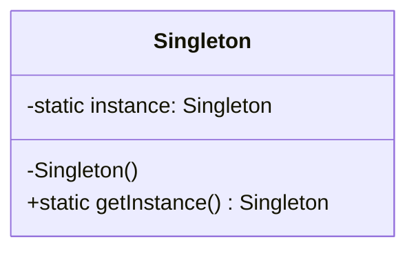
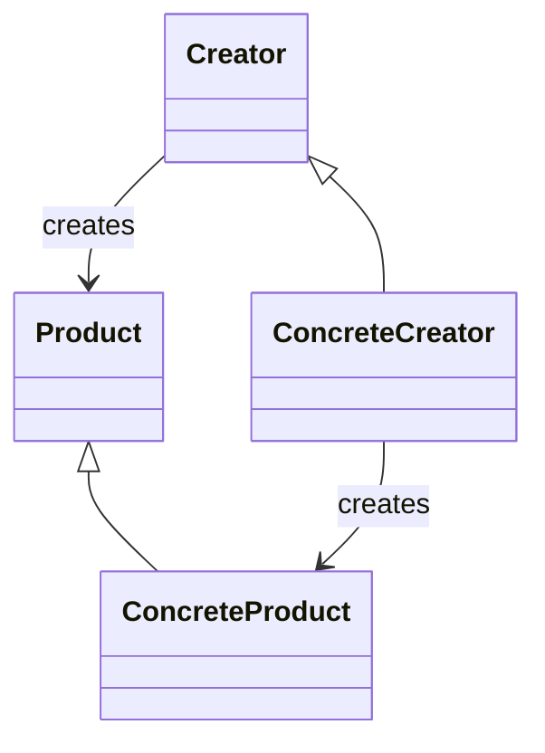
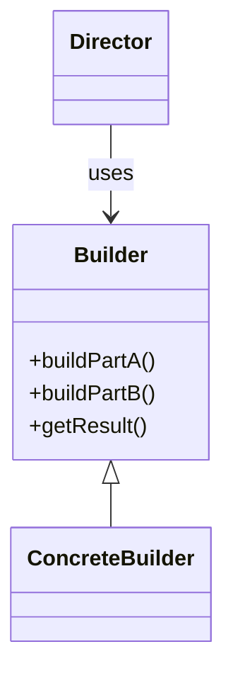

# Padrões criacionais

Padrões que tratam da **criação de objetos**: como instanciar, quem instancia e como evitar acoplamento à implementação concreta.

---

## Singleton

Garante uma única instância de uma classe e um ponto global de acesso.

### Diagrama



### Exemplo em Java

```java
public class Singleton {
    private static volatile Singleton instance;

    private Singleton() {}

    public static Singleton getInstance() {
        if (instance == null) {
            synchronized (Singleton.class) {
                if (instance == null) instance = new Singleton();
            }
        }
        return instance;
    }
}
```

### Exemplo em C#

```csharp
public sealed class Singleton
{
    private static readonly Lazy<Singleton> _instance = new Lazy<Singleton>(() => new Singleton());
    private Singleton() { }
    public static Singleton Instance => _instance.Value;
}
```

### Exemplo em TypeScript/Node

```typescript
let instance: Singleton | null = null;

export class Singleton {
  private constructor() {}
  static getInstance(): Singleton {
    if (!instance) instance = new Singleton();
    return instance;
  }
}
```

### Em Clojure

Em Clojure não há “classe única”; o estado único é modelado com **atoms** ou **delay**. O “singleton” é o próprio namespace ou um def com estado.

```clojure
;; Estado único no namespace
(defonce app-config (atom {:initialized false}))

;; Ou um “singleton” como delay
(def single-instance
  (delay {:id 1 :name "única instância"}))
```

---

## Factory Method

Uma classe delega a criação de objetos para subclasses (método que retorna o produto).

### Diagrama



### Exemplo em Java

```java
interface Product { void use(); }
class ConcreteProductA implements Product { public void use() { System.out.println("A"); } }
class ConcreteProductB implements Product { public void use() { System.out.println("B"); } }

abstract class Creator {
    abstract Product createProduct();
    void doSomething() { createProduct().use(); }
}
class CreatorA extends Creator { Product createProduct() { return new ConcreteProductA(); } }
```

### Exemplo em C#

```csharp
public interface IProduct { void Use(); }
public class ProductA : IProduct { public void Use() => Console.WriteLine("A"); }

public abstract class Creator {
    protected abstract IProduct CreateProduct();
    public void DoSomething() => CreateProduct().Use();
}
public class CreatorA : Creator {
    protected override IProduct CreateProduct() => new ProductA();
}
```

### Exemplo em TypeScript

```typescript
interface Product { use(): void; }
class ProductA implements Product { use() { console.log("A"); } }

abstract class Creator {
  abstract createProduct(): Product;
  doSomething() { this.createProduct().use(); }
}
class CreatorA extends Creator {
  createProduct(): Product { return new ProductA(); }
}
```

### Em Clojure (multimethods / protocolos)

```clojure
(defmulti create-product :type)
(defmethod create-product :a [_] {:use (fn [] (println "A"))})
(defmethod create-product :b [_] {:use (fn [] (println "B"))})

(defn do-something [opts]
  ((:use (create-product opts))))
```

---

## Builder

Separa a construção de um objeto complexo da sua representação, permitindo o mesmo processo de construção gerar representações diferentes.

### Diagrama



### Exemplo em Java

```java
public class Product {
    private String partA, partB;
    public void setPartA(String a) { partA = a; }
    public void setPartB(String b) { partB = b; }
}

public class Builder {
    private Product product = new Product();
    public Builder partA(String a) { product.setPartA(a); return this; }
    public Builder partB(String b) { product.setPartB(b); return this; }
    public Product build() { return product; }
}
```

### Exemplo em TypeScript

```typescript
class Product {
  partA = ""; partB = "";
}

class Builder {
  private product = new Product();
  partA(a: string) { this.product.partA = a; return this; }
  partB(b: string) { this.product.partB = b; return this; }
  build() { return this.product; }
}
```

### Em Clojure (mapas e assoc)

```clojure
(defn make-product [& {:keys [part-a part-b] :or {part-a "" part-b ""}}]
  {:part-a part-a :part-b part-b})

;; Uso
(make-product :part-a "A" :part-b "B")

;; Ou “builder” com reduções
(defn builder [] (atom {}))
(defn with-part-a [b v] (swap! b assoc :part-a v) b)
(defn with-part-b [b v] (swap! b assoc :part-b v) b)
(defn build [b] @b)
```

---

## Referências

- [Refactoring.Guru – Creational Patterns](https://refactoring.guru/design-patterns/creational-patterns)
- [SourceMaking – Creational patterns](https://sourcemaking.com/design_patterns/creational_patterns)
