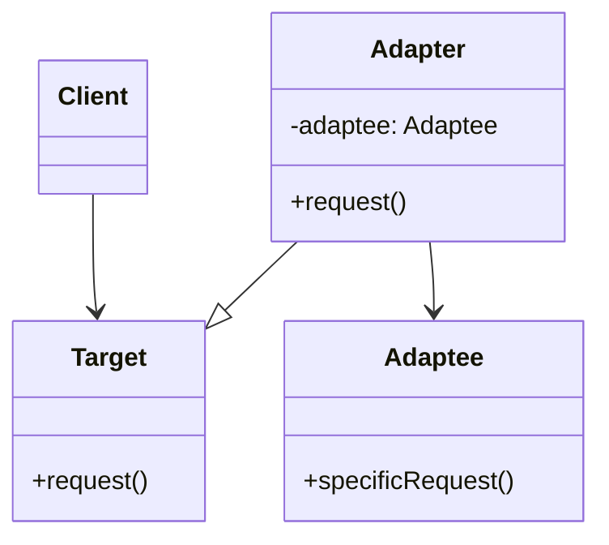
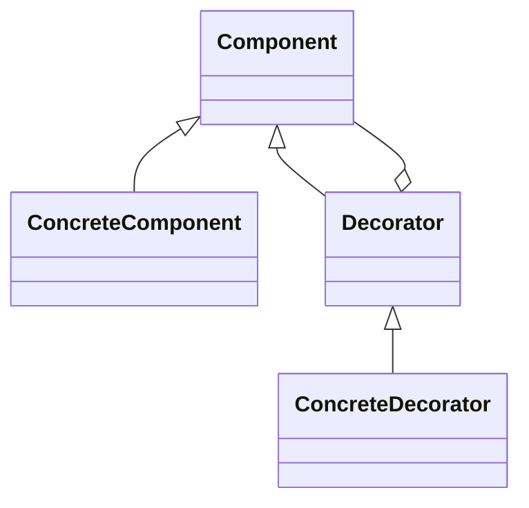
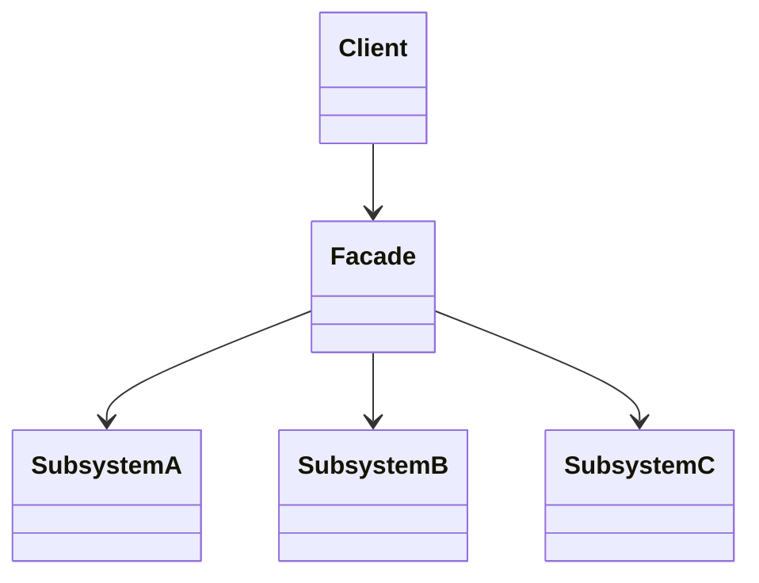
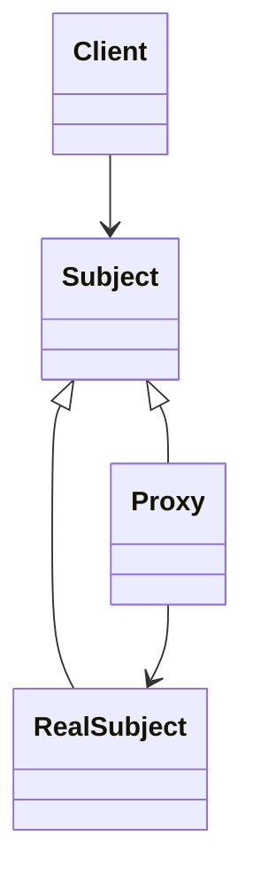

# Padrões estruturais

Padrões que tratam da **composição de classes e objetos**: como montar estruturas maiores mantendo flexibilidade e reutilização.

---

## Adapter

Adapta a interface de uma classe existente para outra interface esperada pelo cliente.

### Diagrama



### Exemplo em Java

```java
interface Target { void request(); }
class Adaptee { void specificRequest() { System.out.println("Adaptee"); } }

class Adapter implements Target {
    private Adaptee adaptee = new Adaptee();
    public void request() { adaptee.specificRequest(); }
}
```

### Exemplo em TypeScript

```typescript
interface Target { request(): void; }
class Adaptee { specificRequest() { console.log("Adaptee"); } }

class Adapter implements Target {
  private adaptee = new Adaptee();
  request() { this.adaptee.specificRequest(); }
}
```

### Em Clojure (funções que delegam)

```clojure
(defn specific-request [] (println "Adaptee"))

(defn request []
  (specific-request))
```

---

## Decorator

Adiciona responsabilidades a um objeto dinamicamente, envolvendo-o em “invólucros”.

### Diagrama



### Exemplo em C#

```csharp
public abstract class Component { public abstract string Operation(); }
public class ConcreteComponent : Component { public override string Operation() => "Core"; }

public abstract class Decorator : Component {
    protected Component _wrapped;
    public Decorator(Component c) { _wrapped = c; }
}
public class ConcreteDecorator : Decorator {
    public ConcreteDecorator(Component c) : base(c) { }
    public override string Operation() => $"Decorated({_wrapped.Operation()})";
}
```

### Exemplo em TypeScript

```typescript
interface Component { operation(): string; }
const ConcreteComponent: Component = { operation: () => "Core" };

function decorate(comp: Component): Component {
  return {
    operation: () => `Decorated(${comp.operation()})`
  };
}
```

### Em React (HOCs / wrappers)

```tsx
function withLogging<P>(Wrapped: React.ComponentType<P>) {
  return function WithLogging(props: P) {
    console.log("Rendering", Wrapped.displayName);
    return <Wrapped {...props} />;
  };
}
```

### Em Clojure (composição de funções)

```clojure
(defn core [] "Core")
(defn wrap-decorator [f]
  (fn [] (str "Decorated(" (f) ")")))
((wrap-decorator core))
```

---

## Facade

Oferece uma interface simplificada para um conjunto de interfaces de um subsistema.

### Diagrama



### Exemplo em Java

```java
class SubsystemA { void doA() {} }
class SubsystemB { void doB() {} }
class Facade {
    private SubsystemA a = new SubsystemA();
    private SubsystemB b = new SubsystemB();
    void doSimple() { a.doA(); b.doB(); }
}
```

### Em Clojure

```clojure
(defn do-a [])
(defn do-b [])
(defn do-simple []
  (do-a)
  (do-b))
```

---

## Proxy

Fornece um substituto ou placeholder que controla o acesso ao objeto real.

### Diagrama



### Exemplo em TypeScript

```typescript
interface Subject { request(): void; }
class RealSubject implements Subject { request() { console.log("Real"); } }

class Proxy implements Subject {
  private real: RealSubject | null = null;
  request() {
    if (!this.real) this.real = new RealSubject();
    this.real.request();
  }
}
```

---

## Referências

- [Refactoring.Guru – Structural Patterns](https://refactoring.guru/design-patterns/structural-patterns)
- [SourceMaking – Structural patterns](https://sourcemaking.com/design_patterns/structural_patterns)
