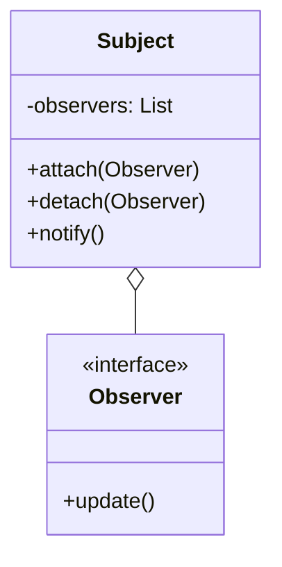
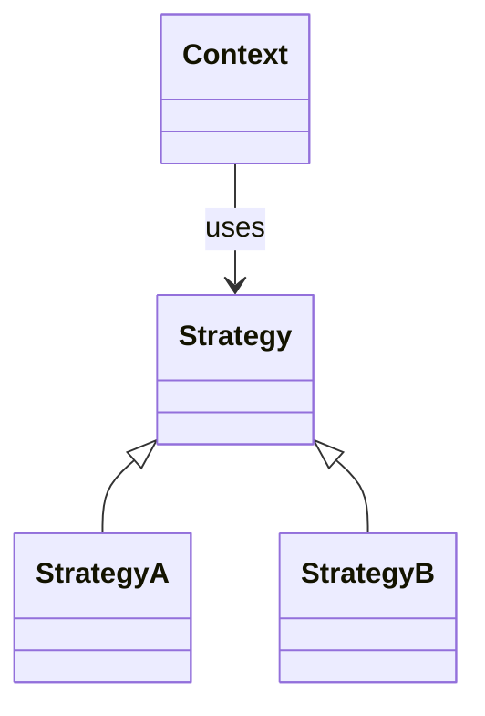
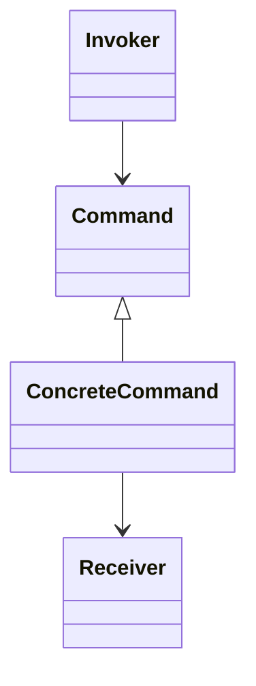
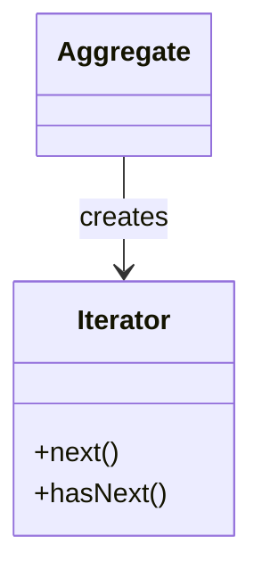

# Padrões comportamentais

Padrões que tratam de **responsabilidades**, **fluxo de dados** e **comunicação entre objetos**.

---

## Observer

Define uma dependência um-para-muitos: quando um objeto muda de estado, todos os dependentes são notificados.

### Diagrama



### Exemplo em Java

```java
interface Observer { void update(String msg); }
interface Subject {
    void attach(Observer o);
    void notifyObservers(String msg);
}
// Implementações mantêm lista de observers e chamam update em cada um
```

### Exemplo em TypeScript

```typescript
type Observer = (msg: string) => void;
const subject = {
  observers: [] as Observer[],
  attach(o: Observer) { this.observers.push(o); },
  notify(msg: string) { this.observers.forEach(o => o(msg)); }
};
```

### Em React

Em React, o “observer” é o próprio componente que usa estado (useState) ou contexto (useContext). A “notificação” é o re-render quando o estado/contexto muda.

```tsx
const [value, setValue] = useState(0);
// Qualquer componente que use `value` é “observador”
```

### Em Clojure (atoms + watch)

```clojure
(def state (atom nil))
(add-watch state :obs (fn [_ _ _ new] (println "Updated:" new)))
(swap! state assoc :x 1)
```

---

## Strategy

Define uma família de algoritmos, encapsula cada um e os torna intercambiáveis.

### Diagrama



### Exemplo em C#

```csharp
public interface IStrategy { int Execute(int a, int b); }
public class AddStrategy : IStrategy { public int Execute(int a, int b) => a + b; }
public class MultiplyStrategy : IStrategy { public int Execute(int a, int b) => a * b; }

public class Context {
    private IStrategy _strategy;
    public Context(IStrategy s) { _strategy = s; }
    public int Do(int a, int b) => _strategy.Execute(a, b);
}
```

### Exemplo em TypeScript

```typescript
type Strategy = (a: number, b: number) => number;
const add: Strategy = (a, b) => a + b;
const multiply: Strategy = (a, b) => a * b;

function context(strategy: Strategy, a: number, b: number) {
  return strategy(a, b);
}
```

### Em Clojure (funções como estratégias)

```clojure
(defn add [a b] (+ a b))
(defn multiply [a b] (* a b))
(defn context [f a b] (f a b))
(context add 2 3)    ;; 5
(context multiply 2 3) ;; 6
```

---

## Command

Encapsula uma requisição como objeto, permitindo parametrizar clientes com diferentes requisições, enfileirar ou suportar desfazer.

### Diagrama



### Exemplo em Java

```java
interface Command { void execute(); }
class Receiver { void action() { System.out.println("Action"); } }
class ConcreteCommand implements Command {
    private Receiver receiver = new Receiver();
    public void execute() { receiver.action(); }
}
class Invoker { void setCommand(Command c) { c.execute(); } }
```

### Em Clojure (funções como comandos)

```clojure
(defn action [] (println "Action"))
(defn execute [f] (f))
(execute action)
```

---

## Iterator

Permite percorrer elementos de uma coleção sem expor sua representação interna.

### Diagrama



### Em linguagens modernas

Java (Iterator), C# (IEnumerator), TypeScript/JavaScript (for...of, Symbol.iterator), Clojure (seq) já oferecem iteração padrão. O padrão está “embutido” na biblioteca.

### Em Clojure (seqs)

```clojure
(doseq [x [1 2 3]] (println x))
(map inc [1 2 3])
(seq [1 2 3])
```

---

## Referências

- [Refactoring.Guru – Behavioral Patterns](https://refactoring.guru/design-patterns/behavioral-patterns)
- [SourceMaking – Behavioral patterns](https://sourcemaking.com/design_patterns/behavioral_patterns)
- [React – Compound Components / Control Props](https://reactpatterns.com/) (padrões relacionados a estado e comportamento em React)
