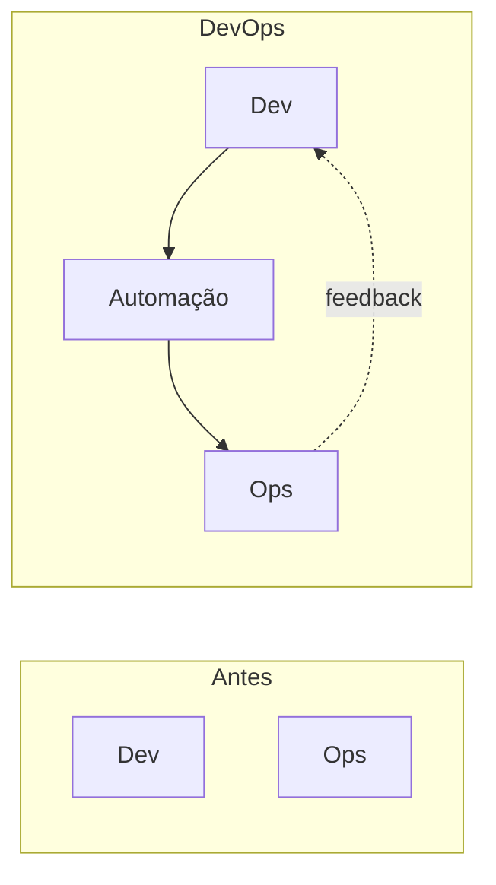
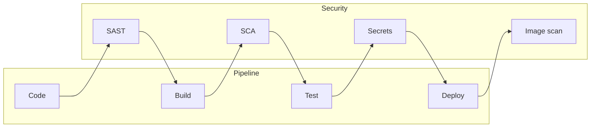

# Conceitos: DevOps, DevSecOps e afins

## O que é DevOps?

**DevOps** é uma cultura e um conjunto de práticas que aproximam **desenvolvimento** (Dev) e **operações** (Ops), com foco em entrega contínua, qualidade e feedback rápido. Não é só ferramenta: envolve colaboração entre times, automação de build e deploy, e infraestrutura tratada como código.

| Aspecto | Descrição |
|---------|-----------|
| **Cultura** | Times compartilham responsabilidade por entrega e operação; quebra de silos entre dev e infra. |
| **Automação** | CI/CD (build, teste, deploy), provisionamento de infra, configuração como código. |
| **Feedback** | Monitoramento, logs, métricas e alertas para corrigir e evoluir rápido. |
| **Iteração** | Entregas em ciclos curtos; redução de risco e tempo de mudança. |

## Pilares comuns

- **CI (Continuous Integration)** – Código integrado frequentemente; build e testes automatizados a cada commit ou PR.
- **CD (Continuous Delivery / Deployment)** – Artefatos prontos para produção (Delivery) ou deploy automático em produção (Deployment).
- **Infraestrutura como código (IaC)** – Servidores, redes e configurações definidos em arquivos versionados (Terraform, CloudFormation, Ansible, etc.).
- **Containers e orquestração** – Docker, Kubernetes: ambiente consistente da dev à produção e escalabilidade.

## DevSecOps

**DevSecOps** integra **segurança** (Sec) no fluxo de DevOps: segurança “no início” e em cada etapa, não só no final.

| Prática | O que é |
|---------|--------|
| **SAST** | Análise estática do código em busca de vulnerabilidades (ex.: SonarQube, Semgrep). |
| **SCA** | Análise de dependências (licenças, CVEs); ex.: Dependabot, Snyk, npm audit. |
| **Secrets** | Não commitar senhas/tokens; uso de vaults e variáveis seguras no pipeline. |
| **Scan de imagem** | Verificar imagens Docker (Trivy, Clair) antes de subir para produção. |
| **Políticas** | Conformidade e políticas de segurança aplicadas no pipeline (ex.: bloqueio se crítica). |

Objetivo: encontrar e tratar riscos cedo, com menos custo e sem travar o ritmo de entrega.

## SRE (Site Reliability Engineering)

**SRE** é uma disciplina que aplica engenharia de software à operação de sistemas: confiabilidade, escalabilidade e eficiência. Conceitos centrais:

- **SLI (Service Level Indicator)** – Métrica que reflete a saúde do serviço (ex.: disponibilidade, latência p99).
- **SLO (Service Level Objective)** – Meta para o SLI (ex.: 99,9% de disponibilidade).
- **SLA (Service Level Agreement)** – Compromisso formal com o cliente; geralmente derivado do SLO.
- **Error budget** – Margem de falha aceitável; quando o orçamento está “gasto”, prioriza-se estabilidade em vez de novas features.
- **Toil** – Trabalho manual e repetitivo; objetivo é reduzi-lo com automação.

DevOps e SRE se complementam: DevOps foca em fluxo e entrega; SRE foca em confiabilidade e operação contínua.

## GitOps

**GitOps** usa o repositório Git como **fonte da verdade** para o estado desejado da infraestrutura e das aplicações. Um operador (ex.: Argo CD) compara o estado do cluster (ou cloud) com o que está no Git e aplica as diferenças.

- **Vantagens:** auditoria, rollback (reverter commit), revisão por PR, ambiente reproduzível.
- **Ferramentas:** Argo CD, Flux, Jenkins X (modo GitOps).

## Resumo

| Termo | Foco |
|-------|------|
| **DevOps** | Cultura e práticas que unem dev e ops; CI/CD, automação, feedback. |
| **DevSecOps** | Segurança integrada em todo o pipeline (SAST, SCA, secrets, scan de imagem). |
| **SRE** | Confiabilidade, SLI/SLO, error budget, redução de toil. |
| **GitOps** | Estado da infra e apps definido no Git; operador reconcilia com o ambiente. |

Nos próximos artigos entram as ferramentas: Docker, Kubernetes, GitHub Actions, Argo CD e Jenkins.

---

*Próximo: [Docker](./02-docker.md).*
