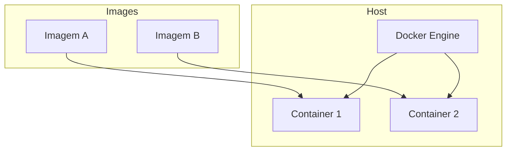

# Docker

## O que é Docker?

**Docker** é uma plataforma de **containerização**: empacota aplicação e dependências em uma unidade (imagem) que roda de forma isolada e consistente em qualquer ambiente que tenha o Docker (dev, CI, produção). Usa recursos do kernel Linux (namespaces, cgroups) para isolar processos sem precisar de uma máquina virtual completa.



| Conceito | Descrição |
|----------|-----------|
| **Imagem** | Modelo read-only: sistema de arquivos (layers) + metadados (CMD, ENTRYPOINT, ENV). |
| **Container** | Instância em execução de uma imagem; camada de escrita efêmera (a menos que use volumes). |
| **Dockerfile** | Receita para construir uma imagem (FROM, COPY, RUN, EXPOSE, etc.). |
| **Registry** | Repositório de imagens (Docker Hub, ECR, GCR, ACR). |

## Dockerfile em resumo

```dockerfile
FROM node:20-alpine
WORKDIR /app
COPY package*.json ./
RUN npm ci --only=production
COPY . .
EXPOSE 3000
CMD ["node", "server.js"]
```

- **FROM** – Imagem base.
- **WORKDIR** – Diretório de trabalho no container.
- **COPY** – Copia arquivos do host para a imagem (use .dockerignore para excluir o que não precisa).
- **RUN** – Comando durante o build (instalar pacotes, compilar).
- **EXPOSE** – Documenta a porta; não publica sozinho (isso é feito no `docker run -p`).
- **CMD** – Comando padrão ao iniciar o container.

Boas práticas: imagens enxutas (multi-stage build quando fizer sentido), usuário não-root, poucos layers, cache de layers (ordem de COPY e RUN).

## Comandos essenciais

| Ação | Comando |
|------|---------|
| Build | `docker build -t meu-app:1.0 .` |
| Run | `docker run -d -p 3000:3000 --name app meu-app:1.0` |
| Logs | `docker logs -f app` |
| Parar/remover | `docker stop app && docker rm app` |
| Listar imagens/containers | `docker images` / `docker ps -a` |
| Push | `docker tag meu-app:1.0 registry/meu-app:1.0` e `docker push registry/meu-app:1.0` |

## Volumes e rede

- **Volume** – Persistir dados fora do container; `docker volume create` ou `-v nome:/caminho`.
- **Bind mount** – Montar um diretório do host: `-v /host/path:/container/path`.
- **Rede** – Containers na mesma rede Docker podem se comunicar pelo nome do serviço/container; `docker network create` e `--network`.

## Docker Compose

Orquestra múltiplos containers em um ambiente local (dev ou teste): um arquivo `docker-compose.yml` define serviços, portas, volumes e dependências.

```yaml
services:
  app:
    build: .
    ports:
      - "3000:3000"
    environment:
      - DB_HOST=db
    depends_on:
      - db
  db:
    image: postgres:16-alpine
    volumes:
      - dbdata:/var/lib/postgresql/data
    environment:
      - POSTGRES_PASSWORD=secret
volumes:
  dbdata:
```

- **docker compose up -d** – Sobe os serviços em background.
- **docker compose down** – Para e remove containers (volumes nomeados persistem).

Docker é a base para rodar as mesmas imagens em Kubernetes ou em outros orquestradores.

---

*Próximo: [Kubernetes](./03-kubernetes.md).*
