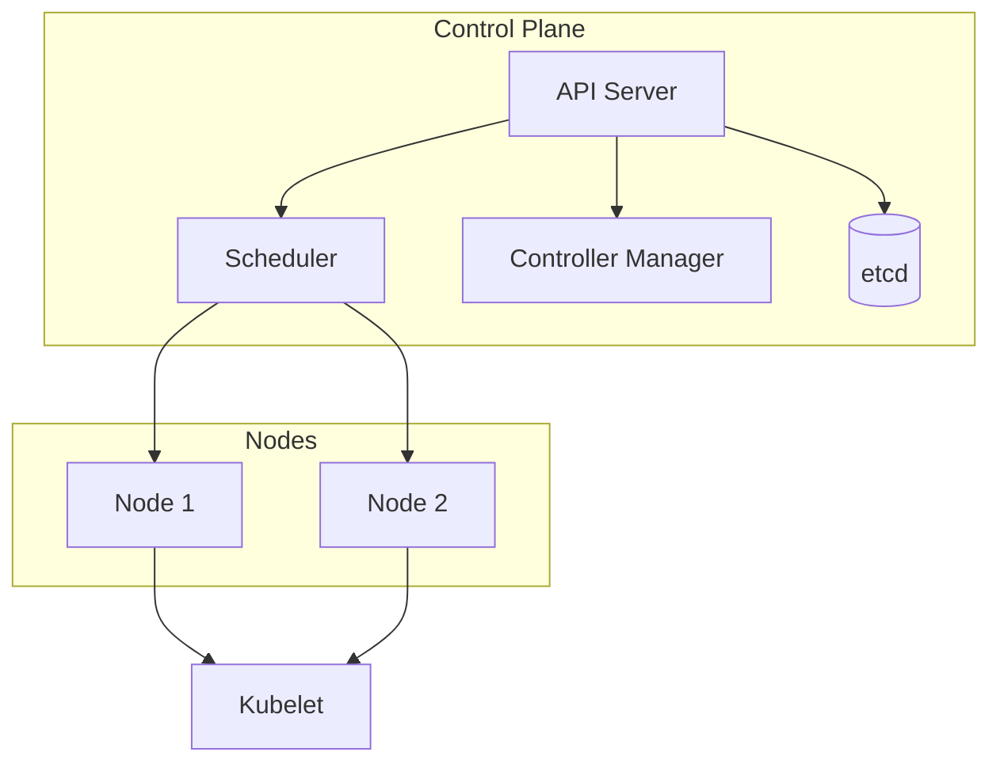

# Kubernetes

## O que é Kubernetes?

**Kubernetes** (K8s) é um orquestrador de **containers** em escala: gerencia deploy, escalonamento, rede e armazenamento de aplicações em cluster. Você declara o estado desejado (quantos pods, qual imagem, recursos, saúde); o Kubernetes reconcilia o estado real com o desejado.

| Conceito | Descrição |
|----------|-----------|
| **Pod** | Menor unidade deployável; um ou mais containers que compartilham rede e volumes. |
| **Deployment** | Controla réplicas de pods; rolling update, rollback, escalonamento (replicas). |
| **Service** | Estável rede e DNS para pods (ClusterIP, NodePort, LoadBalancer). |
| **ConfigMap / Secret** | Configuração e dados sensíveis injetados nos pods. |
| **Namespace** | Isolamento lógico de recursos dentro do cluster. |

## Recursos básicos

- **Deployment** – Define imagem, réplicas, estratégia de update e template do pod (containers, env, recursos, probes).
- **Service** – Expõe pods por nome/DNS e IP estável; tipos: ClusterIP (interno), NodePort, LoadBalancer (e Ingress para HTTP).
- **Ingress** – Roteamento HTTP/HTTPS para serviços; um ponto de entrada com host/path e TLS.
- **ConfigMap / Secret** – Configuração e secrets; usados como env ou arquivos montados no pod.

## Fluxo típico

1. Você aplica um manifesto (YAML) ou usa Helm/Kustomize.
2. O **API Server** recebe e persiste o estado desejado no **etcd**.
3. **Controllers** (Deployment, ReplicaSet) criam/atualizam **Pods**.
4. O **Scheduler** coloca pods em **Nodes** com recursos disponíveis.
5. O **Kubelet** em cada node executa os containers e reporta saúde (liveness/readiness).
6. **Services** e **Ingress** expõem a aplicação dentro e fora do cluster.

## Comandos essenciais (kubectl)

| Ação | Comando |
|------|---------|
| Aplicar | `kubectl apply -f deploy.yaml` |
| Listar | `kubectl get pods,svc,deploy -n <namespace>` |
| Logs | `kubectl logs -f <pod>` |
| Descrever | `kubectl describe pod <pod>` |
| Exec | `kubectl exec -it <pod> -- /bin/sh` |
| Escalar | `kubectl scale deploy/<nome> --replicas=5` |

## Saúde e deploy

- **Liveness probe** – Se falhar, o Kubernetes reinicia o container.
- **Readiness probe** – Se falhar, o pod sai do Service (não recebe tráfego) até voltar a passar.
- **Rolling update** – Deployment atualiza pods gradualmente; `maxSurge` e `maxUnavailable` controlam o ritmo.
- **Rollback** – `kubectl rollout undo deployment/<nome>`.

Kubernetes é a base para rodar cargas em produção com alta disponibilidade e escalabilidade; ferramentas como Argo CD fazem o deploy a partir do Git (GitOps).

---

*Próximo: [GitHub Actions](./04-github-actions.md).*
