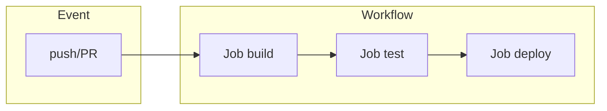

# GitHub Actions

## O que é GitHub Actions?

**GitHub Actions** é a plataforma de **CI/CD** integrada ao GitHub: workflows definidos em YAML no repositório, disparados por eventos (push, PR, release, agendamento, webhook). Cada workflow é composto de **jobs**, que rodam em **runners** (hosted pela GitHub ou self-hosted).



| Conceito | Descrição |
|----------|-----------|
| **Workflow** | Arquivo `.github/workflows/*.yml`; define quando e o que executar. |
| **Event** | Gatilho: push, pull_request, schedule, workflow_dispatch, etc. |
| **Job** | Conjunto de steps que rodam no mesmo runner; jobs podem depender uns dos outros. |
| **Step** | Unidade de execução: run (script) ou use (action). |
| **Action** | Unidade reutilizável (própria do repo ou marketplace). |

## Estrutura mínima

```yaml
name: CI
on:
  push:
    branches: [main]
  pull_request:
    branches: [main]
jobs:
  build:
    runs-on: ubuntu-latest
    steps:
      - uses: actions/checkout@v4
      - name: Install and test
        run: |
          npm ci
          npm test
```

- **on** – Eventos que disparam o workflow.
- **jobs.build** – Um job chamado "build".
- **runs-on** – Runner (ubuntu-latest, windows-latest, ou self-hosted).
- **steps** – Checkout do código, depois instalação e testes.

## Recursos úteis

- **Matrix** – Rodar o mesmo job em várias combinações (ex.: Node 18, 20, 22).
- **Secrets** – Variáveis sensíveis em Settings → Secrets; uso: `secrets.MY_SECRET`.
- **Cache** – Action `actions/cache` para dependências (npm, pip) e acelerar builds.
- **Artefatos** – `actions/upload-artifact` e `download-artifact` para passar arquivos entre jobs.
- **Environments** – Ambientes com proteção (approval, secrets) para deploy.
- **workflow_dispatch** – Disparo manual na aba Actions.

## Exemplo: build e push de imagem Docker

```yaml
- uses: docker/login-action@v3
  with:
    registry: ghcr.io
    username: ${{ github.actor }}
    password: ${{ secrets.GITHUB_TOKEN }}
- run: docker build -t ghcr.io/${{ github.repository }}:${{ github.sha }} .
- run: docker push ghcr.io/${{ github.repository }}:${{ github.sha }}
```

O **GITHUB_TOKEN** é gerado automaticamente para o workflow; para outros registries (Docker Hub, ECR), use secrets.

## Limites e boas práticas

- **Minutos gratuitos** – Conta free tem cota mensal; uso em repositórios privados consome mais.
- **Concorrência** – `concurrency:` evita rodar workflows duplicados (ex.: cancelar runs antigos do mesmo branch).
- **Paths** – `on.push.paths` e `on.pull_request.paths` para rodar só quando certos arquivos mudam.
- **Reuso** – Composite actions ou workflows reutilizables para não duplicar YAML.

GitHub Actions cobre CI (build, test, lint) e CD (deploy, publicar artefatos); para GitOps em Kubernetes, costuma-se usar em conjunto com Argo CD (o workflow faz push no Git ou atualiza imagem; Argo CD aplica no cluster).

---

*Próximo: [ArgoCD](./05-argocd.md).*
