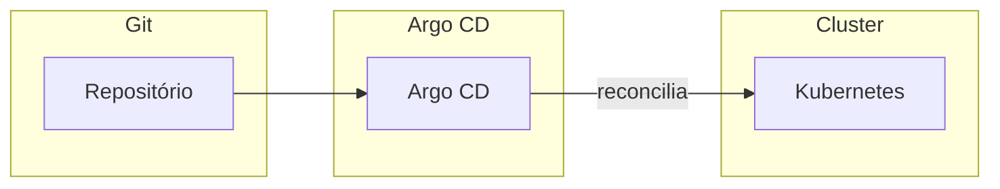

# Argo CD

## O que é Argo CD?

**Argo CD** é um **operador de GitOps** para Kubernetes: mantém o estado do cluster alinhado ao que está definido em um repositório Git (manifests YAML, Helm charts, Kustomize). Ele compara continuamente o estado desejado (Git) com o estado real (cluster) e aplica as diferenças; em caso de deriva (mudança manual no cluster), pode reverter para o que está no Git.

| Conceito | Descrição |
|----------|-----------|
| **Application** | Recurso do Argo CD que aponta para um repo (ou chart) e um destino (namespace, cluster). |
| **Sync** | Ação de aplicar o estado do Git no cluster; pode ser automática ou manual. |
| **Health / Sync status** | Argo CD mostra se os recursos estão sincronizados e saudáveis (Deployment OK, Pods rodando, etc.). |
| **Source** | Origem da verdade: Git (branch/path), Helm repo ou diretório com Kustomize. |

## Por que GitOps com Argo CD?

- **Auditoria** – Toda mudança passa por commit no Git; histórico e blame.
- **Rollback** – Reverter um commit ou fazer sync para um revision anterior.
- **Revisão** – PR para alterar manifests; aprovação antes de aplicar.
- **Consistência** – Vários ambientes (dev, staging, prod) a partir do mesmo repo (branches ou overlays).
- **Segurança** – Cluster não precisa de credenciais de escrita no Git; Argo CD puxa e aplica.

## Recursos principais

- **Applicação** – Define repo URL, branch/path, destino (cluster, namespace), projeto (para agrupamento e permissões).
- **Sync policy** – Automático (poll ou webhook) ou manual; opção de auto-prune (remover recursos que saíram do Git).
- **Sync options** – Prune (apagar recursos órfãos), CreateNamespace, ServerSideApply, etc.
- **Health checks** – Argo CD sabe o status de Deployment, StatefulSet, Ingress, etc.; custom health para CRDs quando necessário.
- **UI e CLI** – Dashboard para ver apps, sync e logs; `argocd` CLI para operação e integração em pipeline.

## Fluxo típico

1. Manifests (ou Helm/Kustomize) ficam em um repositório Git.
2. No Argo CD você cria uma **Application** apontando para esse repo e para o cluster/namespace.
3. Argo CD faz **clone** (ou acessa o repo), renderiza Helm/Kustomize se for o caso e compara com o cluster.
4. Se houver **diferença**, entra estado **OutOfSync**; ao fazer **Sync**, ele aplica (kubectl apply ou equivalente).
5. Após o sync, o status passa a **Synced**; a **Health** reflete o estado dos recursos (ex.: Deployment com réplicas prontas).

## Integração com CI

O pipeline (GitHub Actions, Jenkins, etc.) não precisa acessar o cluster: ele faz **push** dos manifests ou charts no Git (ou atualiza um arquivo de imagem, ex.: kustomize image tag). Argo CD, ao detectar a mudança (poll ou webhook), sincroniza o cluster. Assim, o CI “entrega” via Git; o CD é responsabilidade do Argo CD.

## Boas práticas

- **App of Apps** – Uma aplicação Argo CD que referencia um diretório com várias outras aplicações; facilita onboarding de novos serviços.
- **Projetos** – Agrupar aplicações e restringir destinos (cluster/namespace) e repos.
- **RBAC** – Limitar quem pode fazer sync ou ver secrets na UI.
- **Notifications** – Integrar com Slack/Teams para sync falho ou mudança de health.

Argo CD é uma das ferramentas mais usadas para GitOps em Kubernetes; complementa o CI (GitHub Actions, Jenkins) que constrói imagens e atualiza o Git.

---

*Próximo: [Jenkins](./06-jenkins.md).*
