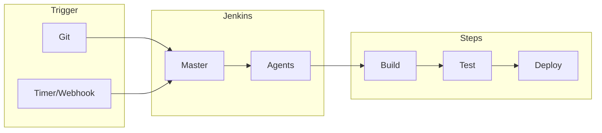

# Jenkins

## O que é Jenkins?

**Jenkins** é um servidor de **automação** open source muito usado para **CI/CD**: executa pipelines definidos em código (Jenkinsfile, Groovy) ou na UI. Suporta plugins para integração com Git, Docker, Kubernetes, notificações e dezenas de ferramentas. Pode ser self-hosted (on-premise ou em VM/container) e escala com agents (nodes) distribuídos.



| Conceito | Descrição |
|----------|-----------|
| **Job / Pipeline** | Unidade de trabalho: um job pode ser “freestyle” (configurado na UI) ou **Pipeline** (Jenkinsfile). |
| **Jenkinsfile** | Pipeline-as-code (Groovy DSL); versionado no repo junto do código. |
| **Stage** | Bloco lógico no pipeline (ex.: Build, Test, Deploy); aparece na UI por estágio. |
| **Agent / Node** | Onde o pipeline roda; master ou agent; agent pode ser dinâmico (Kubernetes, Docker). |
| **Plugin** | Extensão para Git, Docker, Slack, Kubernetes, etc. |

## Pipeline declarativo (Jenkinsfile)

```groovy
pipeline {
  agent any
  stages {
    stage('Checkout') {
      steps {
        checkout scm
      }
    }
    stage('Build') {
      steps {
        sh 'npm ci'
        sh 'npm run build'
      }
    }
    stage('Test') {
      steps {
        sh 'npm test'
      }
    }
    stage('Deploy') {
      when { branch 'main' }
      steps {
        sh './deploy.sh'
      }
    }
  }
  post {
    failure { slackSend channel: '#builds', message: "Build ${env.JOB_NAME} failed" }
  }
}
```

- **agent** – Onde rodar (any, label, docker, kubernetes).
- **stages** – Sequência de estágios; cada um pode ter steps (sh, bat, script, etc.).
- **when** – Condição para rodar o stage (branch, expression).
- **post** – Ações ao final (success, failure, always); notificação, limpeza.

## Recursos úteis

- **Parâmetros** – `parameters { string(name: 'VERSION') }` para build manual com inputs.
- **Credenciais** – Jenkins armazena secrets (usuário/senha, token, SSH); uso com `credentials()` ou `withCredentials`.
- **Agents dinâmicos** – Plugin Kubernetes: cada build pode rodar em um pod efêmero; escala sob demanda.
- **Multibranch** – Pipeline que descobre branches/PRs e cria jobs por branch.
- **Blue Ocean** – UI alternativa para visualizar pipelines e estágios.

## Jenkins vs GitHub Actions

| Aspecto | Jenkins | GitHub Actions |
|---------|---------|----------------|
| **Hosting** | Geralmente self-hosted | Hospedado pelo GitHub |
| **Config** | Jenkinsfile (Groovy) no repo ou job na UI | Workflows YAML no repo |
| **Integração** | Plugins; qualquer Git, qualquer destino | Nativo ao GitHub; fácil para outros via API |
| **Escala** | Você gerencia master e agents | Runners gerenciados (ou self-hosted) |
| **Uso típico** | Empresas que já usam Jenkins; ambientes restritos; múltiplos repos/orgs | Projetos no GitHub; CI/CD leve e integrado |

Jenkins continua relevante em ambientes corporativos, legados ou com necessidade de controle total; muitas equipes usam Jenkins para build e publicação de artefatos e Argo CD (ou outro) para deploy em Kubernetes (GitOps).

---

*Voltar ao [índice](./README.md).*
