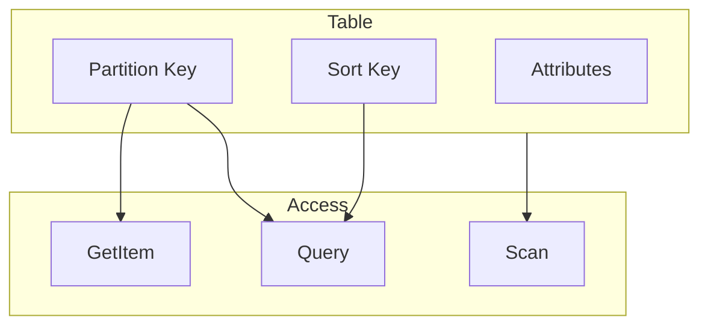

# Modelo de dados e chaves no DynamoDB

## O que é o DynamoDB?

**Amazon DynamoDB** é um banco **NoSQL** gerenciado na AWS: tabelas com itens (documentos) identificados por **chave primária**; suporta **partition key** obrigatória e opcional **sort key** para ordenação e acesso por range. É serverless no sentido de não gerenciar servidores; você define tabelas, throughput (ou on-demand) e paga por uso. Baixa latência, escalabilidade automática e integração com SDKs e serviços AWS.

## Tabelas e itens

- **Tabela** – Coleção de itens; cada item é um conjunto de **atributos** (nome–valor). Não há schema fixo além da chave primária; diferentes itens podem ter atributos diferentes.
- **Item** – Tamanho máximo 400 KB; atributos podem ser escalares (string, number, binary, boolean, null) ou tipos aninhados (map, list, string set, number set, binary set).
- **Chave primária** – Identifica o item de forma única. Dois tipos:
  - **Partition key only** – Uma única atributo (ex.: user_id); cada valor de partition key identifica no máximo um item.
  - **Partition key + Sort key** – Par (ex.: user_id + order_id); a combinação é única; vários itens podem compartilhar a mesma partition key (agrupamento lógico) e são ordenados pela sort key.

## Partition key e distribuição

O DynamoDB particiona os dados pela **partition key**: o valor da chave é hasheado para determinar a partição física. Itens com a mesma partition key ficam na mesma partição; partições diferentes podem estar em nós diferentes. Assim:

- **Throughput** – A capacidade (RCU/WCU) é distribuída entre partições; partições “quentes” (muita leitura/escrita na mesma partition key) podem limitar o throughput se não houver capacidade suficiente naquela partição. Escolha de partition key deve distribuir a carga.
- **Query** – Operação **Query** retorna itens com uma partition key (e opcionalmente condição na sort key); é eficiente porque acessa uma partição. **GetItem** precisa da chave primária completa (partition + sort se houver).
- **Scan** – Varre a tabela inteira; custoso em tabelas grandes; usar com filtros e paginação ou evitar em produção para grandes volumes.

## Modelagem: acesso por chave

O modelo de dados deve refletir os **padrões de acesso**: quais consultas você fará? Cada acesso eficiente (Query, GetItem) precisa da partition key (e sort key quando aplicável). Acessos por outros atributos exigem **índice secundário** (GSI ou LSI).

Exemplos:

- **User por id** – Partition key: user_id (sem sort key). GetItem(user_id).
- **Pedidos por usuário** – Partition key: user_id, Sort key: order_id. Query(user_id) lista pedidos do usuário; GetItem(user_id, order_id) pega um pedido.
- **Pedidos por data** – Query(user_id, condition: order_date between X and Y) se order_date for a sort key; ou GSI com (user_id, order_date).

## Resumo

| Conceito | Descrição |
|----------|-----------|
| **Partition key** | Obrigatória; determina a partição física; escolha que distribua carga. |
| **Sort key** | Opcional; ordena itens na mesma partição; permite Query por range. |
| **Item** | Até 400 KB; atributos flexíveis; sem schema fixo além da chave. |
| **Modelagem** | Orientada a padrões de acesso; chave primária deve suportar GetItem/Query. |

No próximo capítulo: operações (GetItem, PutItem, Query, Scan, Batch), índices secundários (GSI, LSI) e condições.

---

*Próximo: [Operações, índices e consultas](./02-operacoes-indices.md).*
