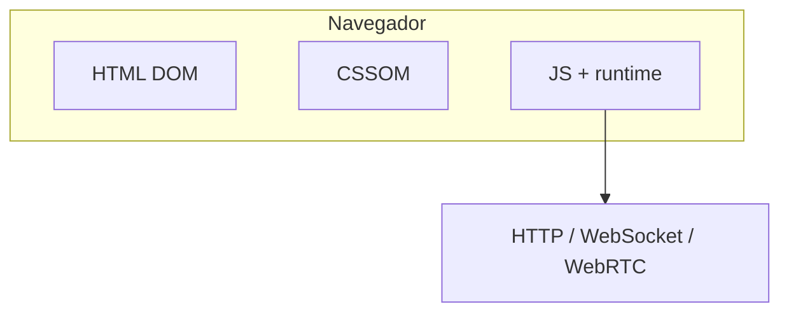
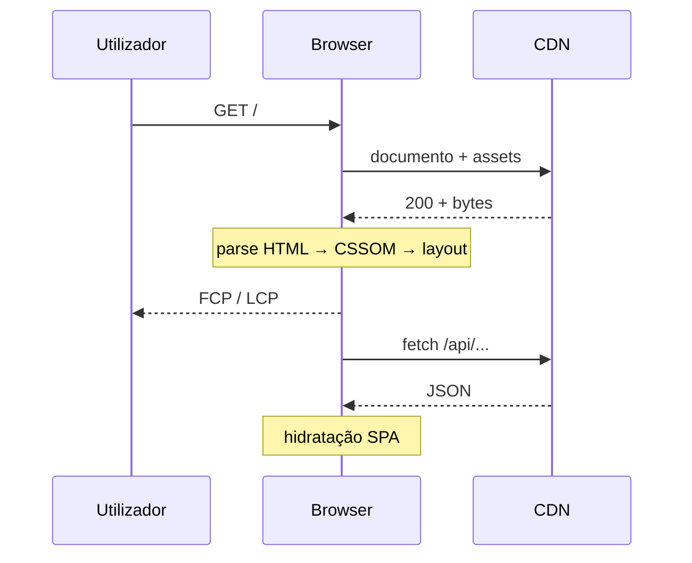
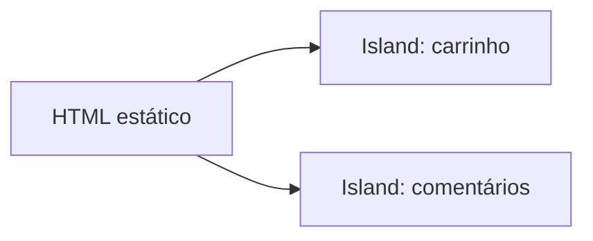

# Visão geral do frontend

## O que é “frontend”?

**Frontend** é a camada com que o utilizador interage: **HTML** (estrutura e significado), **CSS** (apresentação), **JavaScript** (comportamento e I/O de rede). **Frameworks** (React, Vue, Angular, Svelte) e **meta-frameworks** (Next.js, Nuxt, SvelteKit) organizam código em componentes e rotas; **Flutter** e **React Native** alargam o mesmo problema de **estado + layout** para mobile.



---

## Problema real: “A app funciona no meu Chrome”

**Sintomas:** bugs só em Safari ou Firefox; *polyfills* em falta; APIs experimentais.

**Causas comuns:** uso de APIs sem *feature detection*; diferenças de *flex/grid* antigas; *date parsing* (`Date.parse` com formatos ambíguos).

**Mitigação:** testar em **Baseline** + 1 motor WebKit; [eslint-plugin-compat](https://github.com/amilajack/eslint-plugin-compat) ou Browserslist alinhado ao negócio; testes E2E (Playwright) em mais de um browser.


---

## Caminho de renderização (e onde perde tempo)

1. **HTML** inicial (documento ou *shell* de SPA).
2. **CSS** — *blocking* se `<link>` no `<head>` sem `media` ou *preload* mal usado.
3. **JS** — *parse/compile* bloqueia a thread principal; bundles enormes atrasam **INP**.



**Problema real: LCP > 2,5 s em mobile**

- Hero `jpg` de 3 MB sem `srcset`.
- Fonte web sem `font-display: swap` → texto invisível.
- **Solução:** comprimir imagens (AVIF/WebP), dimensões explícitas, *preload* só do que está *above the fold*, subset de fontes.

---

## Core Web Vitals (resumo operacional)

| Métrica | O que mede | Cheiro a problema |
|---------|------------|---------------------|
| **LCP** | Maior conteúdo visível | Hero lento, servidor lento, cache fraco |
| **INP** | Latência da interação | JS longo na thread principal, *handlers* pesados |
| **CLS** | Estabilidade visual | Imagens sem espaço reservado, anúncios |

Referência: [web.dev — Vitals](https://web.dev/vitals/).

---

## Responsividade e acessibilidade (não negociável)

- **Mobile-first** — CSS base para viewport estreita; *breakpoints* para mais espaço.
- **WCAG 2.2** — contraste (1.4.3), foco visível (2.4.7), alvo mínimo toque (2.5.8).
- **Problema real:** botão de 24×24 px impossível de acertar no dedo → mínimo ~44×44 CSS px.

---

## Segurança no cliente (modelo de ameaça)

| Risco | Exemplo real | Defesa |
|-------|----------------|--------|
| **XSS** | Comentário com `<script>` refletido | Escapar saída, CSP `script-src`, sanitização estrita |
| **Token em localStorage** | Extensão maliciosa lê storage | Preferir **httpOnly** + SameSite cookies quando possível |
| **CSRF** | Formulário externo submete à tua API | SameSite cookies, CSRF token em mutações |
| **Clickjacking** | `iframe` invisível em cima do botão | `X-Frame-Options` / CSP `frame-ancestors` |

OWASP: [XSS Prevention](https://cheatsheetseries.owasp.org/cheatsheets/Cross_Site_Scripting_Prevention_Cheat_Sheet.html), [DOM Clobbering](https://github.com/OWASP/www-community/blob/master/pages/DOM_Clobbering.md).

---

## CORS e frontends em produção

**Problema real:** `fetch` devolve *failed* no browser mas `curl` funciona.

O browser aplica **CORS**; o servidor deve enviar `Access-Control-Allow-Origin` (e credenciais exigem `Allow-Credentials` + origem explícita). Ver também o estudo [HTTP](../apis-arquitetura/08-http.md) nos materiais de APIs.

---

## Como usar esta sessão

1. **HTML → CSS → JavaScript** — base sólida.
2. **Tailwind** — velocidade de UI sem fugir de boas práticas de CSS.
3. **Um** framework SPA (React **ou** Vue) antes de saltar para Next/Nuxt.
4. **Next.js** quando SEO, rotas híbridas e *streaming* forem requisitos.

---

## Checklist antes de “ir a produção”

- [ ] Lighthouse / PageSpeed em **mobile throttling**
- [ ] Navegação só com **teclado** (Tab, Enter, Escape em modais)
- [ ] Erros de API com mensagem útil e **sem** stack trace ao utilizador
- [ ] `lang` correto no `<html>` para leitores de ecrã e tradução
- [ ] Variáveis de ambiente no build (Vite `import.meta.env`) **sem** secrets no bundle

---

## Nível avançado: *Islands* e hidratação selectiva

**Problema:** SPA hidrata **tudo** — JS inicial enorme e INP fraco na primeira interação.

**Padrão *Islands* (Astro, partial hydration):** HTML estático por defeito; só “ilhas” de JS hidratam componentes interativos. Reduz bytes e trabalho na thread principal.

**Padrão *Resumability* (Qwik — conceito):** serializar continuações para retomar sem re-executar todo o *bundle*; útil para sites conteúdo + widgets dispersos.



---

## Nível avançado: *import maps* e controlo de versões no cliente

**Problema:** CDN de *esm.sh* muda versão sob os pés.

**Inteligente:** `importmap` fixa URLs versionadas ou use **bundler** com *lockfile* em produção; *import maps* em dev para protótipos rápidos.

```html
<script type="importmap">
{
  "imports": {
    "vue": "https://cdn.jsdelivr.net/npm/vue@3.4.21/dist/vue.esm-browser.prod.js"
  }
}
</script>
```

---

## Referências

- [MDN — Learn web development](https://developer.mozilla.org/en-US/docs/Learn)
- [web.dev — Learn performance](https://web.dev/learn/performance/)
- [WAI — Tutorials](https://www.w3.org/WAI/tutorials/)
- [Baseline for web developers](https://web.dev/baseline)
- [HTTP Archive — state of the web](https://httparchive.org/reports)
- [Patterns.dev — Rendering patterns](https://www.patterns.dev/posts/rendering-patterns)
- [Astro — Islands architecture](https://docs.astro.build/en/concepts/islands/)

---

*O frontend “acaba” quando o **utilizador** e o **negócio** medem sucesso — não quando o build passa.*
