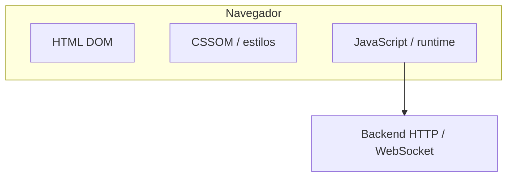
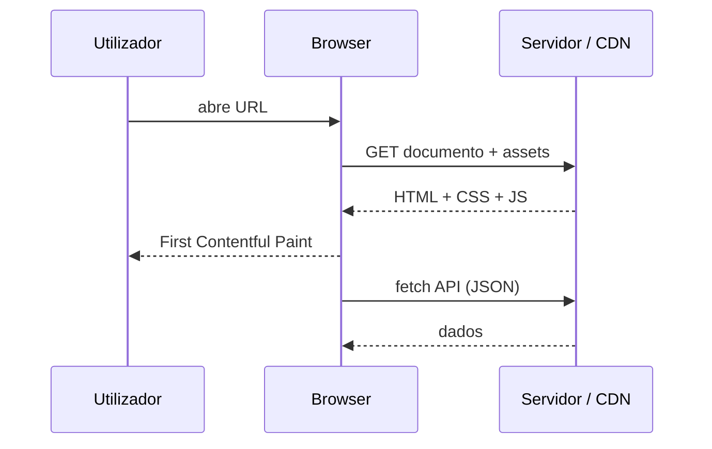

# Visão geral do frontend

## O que é “frontend”?

**Frontend** é a camada com que o utilizador interage: **HTML** (estrutura), **CSS** (apresentação), **JavaScript** (comportamento e comunicação com APIs). Frameworks (**React**, **Vue**, **Angular**, **Svelte**) e meta-frameworks (**Next.js**) geram ou organizam essas três peças em aplicações maiores; **Flutter** compila para UI nativa ou web (**Wasm**).

---

## Caminho de renderização

1. **HTML** chega ao cliente (documento inicial ou *shell*).
2. **CSS** aplica-se ao DOM (incluindo *critical CSS* e *lazy* sheets).
3. **JS** hidrata componentes, regista *listeners* e busca dados.

---

## Responsividade e acessibilidade

- **Mobile-first** — desenhar para viewport estreita e ir alargando com *media queries*.
- **WCAG** — contraste, foco visível, teclado, *labels* em formulários.
- **Performance** — Core Web Vitals (LCP, INP, CLS).

---

## Segurança mínima

- Sanitizar saída para evitar **XSS**; preferir **CSP**.
- Não guardar **tokens** em `localStorage` se o modelo de ameaça incluir XSS persistente — avaliar **httpOnly cookies** + SameSite.

---

## Como usar esta sessão

Leia **HTML → CSS → JavaScript** antes de saltar para frameworks; **Tailwind** encaixa após CSS; **React** ou **Vue** como primeiro SPA; **Next.js** quando precisar de **SSR/SSG** e rotas no servidor.

---

## Referências

- [MDN — Learning area](https://developer.mozilla.org/en-US/docs/Learn)

---

*Frameworks mudam; **DOM**, **eventos** e **rede** permanecem.*
