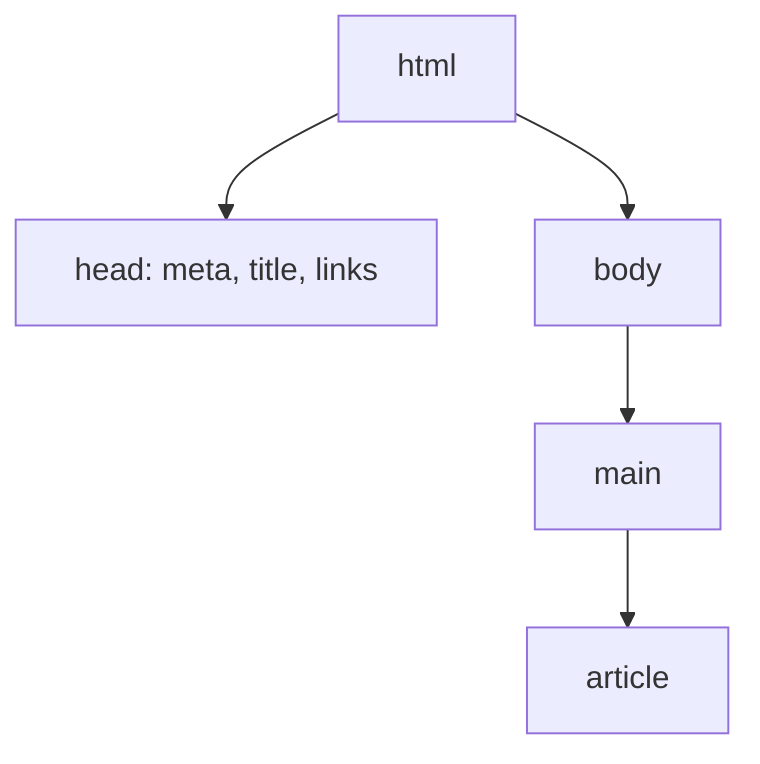

# HTML — estrutura semântica e formulários

## Introdução

**HTML** (*HyperText Markup Language*) estrutura o documento com **elementos** aninhados. HTML5 introduziu **tags semânticas** (`<header>`, `<nav>`, `<main>`, `<article>`, `<section>`, `<footer>`) que melhoram **SEO** e **leitores de ecrã**.



---

## Documento mínimo válido

```html
<!DOCTYPE html>
<html lang="pt">
  <head>
    <meta charset="utf-8" />
    <meta name="viewport" content="width=device-width, initial-scale=1" />
    <title>Exemplo</title>
  </head>
  <body>
    <header><h1>Olá</h1></header>
    <main>
      <p>Conteúdo principal.</p>
    </main>
  </body>
</html>
```

---

## Formulários e acessibilidade

```html
<form action="/api/login" method="post" novalidate>
  <label for="email">E-mail</label>
  <input id="email" name="email" type="email" autocomplete="email" required />

  <label for="password">Palavra-passe</label>
  <input id="password" name="password" type="password" minlength="8" required />

  <button type="submit">Entrar</button>
</form>
```

- **`for`/`id`** liga *label* ao controlo (clicável e anunciável).
- **`type="email"`** validação nativa leve.

---

## Multimédia

```html
<figure>
  
  <figcaption>Legenda opcional.</figcaption>
</figure>
```

---

## Referências

- [MDN — HTML](https://developer.mozilla.org/en-US/docs/Web/HTML)

---

*Semântica correta reduz **div-itis** e custo de manutenção.*
