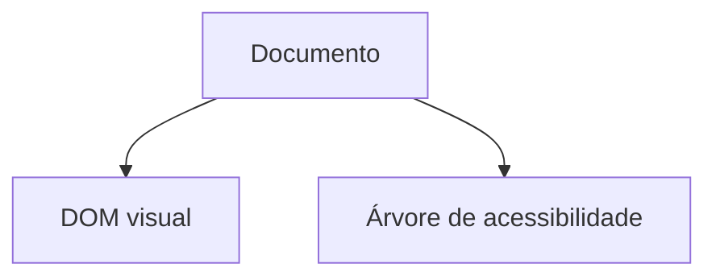

# HTML — estrutura semântica, formulários e conteúdo

## Introdução

**HTML** define a **árvore de acessibilidade** (parallel ao DOM) que leitores de ecrã usam, o **outline** de cabeçalhos para navegação, e metadados para **SEO** e *previews* em redes sociais. HTML “div em tudo” funciona visualmente mas **piora** manutenção, SEO e tecnologias assistivas.



---

## Problema real: hierarquia de títulos quebrada

**Sintoma:** utilizador de leitor de ecrã não consegue saltar entre secções; Lighthouse acusa “*heading elements are not in a sequentially-descending order*”.

**Causa:** `<h3>` antes de `<h1>` só por estilo; múltiplos `<h1>` sem critério.

**Solução:** um `<h1>` por vista (ou por *main landmark*); níveis descendentes (`h2` → `h3`). Para tamanho visual use **CSS**, não nível de heading errado.

```html
<main>
  <h1>Conta corrente</h1>
  <section aria-labelledby="mov-label">
    <h2 id="mov-label">Movimentos</h2>
    <h3>Últimos 30 dias</h3>
  </section>
</main>
```

---

## Documento mínimo + SEO básico

```html
<!DOCTYPE html>
<html lang="pt">
  <head>
    <meta charset="utf-8" />
    <meta name="viewport" content="width=device-width, initial-scale=1" />
    <title>Página significativa — Marca</title>
    <meta name="description" content="Uma frase única que resume o conteúdo." />
    <link rel="canonical" href="https://exemplo.com/pagina" />
    <meta property="og:title" content="Título para partilhas" />
    <meta property="og:description" content="Resumo para redes." />
    <meta property="og:image" content="https://exemplo.com/og.jpg" />
  </head>
  <body>
    <a class="skip-link" href="#main">Saltar para o conteúdo</a>
    <header>...</header>
    <main id="main">...</main>
    <footer>...</footer>
  </body>
</html>
```

**Problema real:** *snippet* Google mostra texto aleatório — falta `<meta name="description">` ou conteúdo principal pouco claro.

---

## Formulários: validação, acessibilidade e UX

### Erros anunciados (sem só cor vermelha)

```html
<form novalidate>
  <div>
    <label for="email">E-mail</label>
    <input id="email" name="email" type="email" autocomplete="email" required aria-describedby="email-hint" />
    <p id="email-hint">Usamos este e-mail apenas para faturação.</p>
    <p id="email-err" class="error" role="alert" hidden></p>
  </div>
  <button type="submit">Continuar</button>
</form>
```

```javascript
// Após validação falhada no submit
const err = document.getElementById("email-err");
err.textContent = "Introduza um e-mail válido.";
err.hidden = false;
document.getElementById("email").setAttribute("aria-invalid", "true");
```

**WCAG:** erro identificável por texto, não só cor ([1.4.1 Use of Color](https://www.w3.org/WAI/WCAG22/Understanding/use-of-color.html)).

### `autocomplete` e menos fricção

Valores como `email`, `current-password`, `cc-number` permitem **password managers** e preenchimento seguro — reduz abandono em *checkout*.

---

## Tabelas de dados (não layout)

**Problema real:** `<table>` usada para alinhar *banners* — leitor de ecrã lê “linha 1 coluna 1…” sem sentido.

Para dados tabulares use `<th scope="col">` / `scope="row"` ou `headers`/`id` em tabelas complexas.

```html
<table>
  <caption>Movimentos de abril</caption>
  <thead>
    <tr>
      <th scope="col">Data</th>
      <th scope="col">Descrição</th>
      <th scope="col">Valor</th>
    </tr>
  </thead>
  <tbody>
    <tr>
      <th scope="row"><time datetime="2026-04-01">1 abr</time></th>
      <td>Transferência</td>
      <td>−50,00 €</td>
    </tr>
  </tbody>
</table>
```

---

## Multimédia e performance

```html
<picture>
  <source type="image/avif" srcset="/hero.avif" />
  <source type="image/webp" srcset="/hero.webp" />
  
</picture>
```

- **`width`/`height`** reservam espaço → reduz **CLS**.
- **`loading="lazy"`** fora do *above the fold*.

### Vídeo acessível

```html
<video controls poster="/thumb.jpg">
  <source src="/demo.webm" type="video/webm" />
  <track kind="captions" src="/demo.pt.vtt" srclang="pt" label="Português" default />
</video>
```

---

## `dialog` nativo (modais sem *library*)

```html
<button type="button" id="open">Abrir termos</button>
<dialog aria-labelledby="t-title" id="dlg">
  <h2 id="t-title">Termos</h2>
  <p>Texto...</p>
  <form method="dialog">
    <button value="ok">Aceitar</button>
  </form>
</dialog>
<script>
  const dlg = document.getElementById("dlg");
  document.getElementById("open").onclick = () => dlg.showModal();
</script>
```

**Problema real:** foco “foge” para trás do modal — `showModal()` trata **backdrop** e *focus trap* em browsers modernos; testar Safari alvo.

---

## Padrão inteligente: `<details>` + `<summary>` para FAQ (sem JS)

**Problema:** acordeão em React só para texto estático — JS e hidratação desnecessários.

**Solução nativa:** expansão/colapso acessível com teclado.

```html
<details class="faq">
  <summary>Como cancelo a subscrição?</summary>
  <p>Vá a Conta → Faturação → Cancelar antes do período de faturação.</p>
</details>
```

Estilize `details[open]` em CSS; para animar altura use `@starting-style` (progressivo) ou *grid trick* `grid-template-rows: 0fr` → `1fr`.

---

## Padrão inteligente: `popover` + `popovertarget` (comportamento declarativo)

**Problema:** menu de contexto com dezenas de linhas de JS para posicionar e fechar com Escape.

**Solução (Chrome/Baseline em expansão):** botão que abre *popover* ligado por ID.

```html
<button type="button" popovertarget="menu" popovertargetaction="toggle">Abrir</button>
<div id="menu" popover role="menu">…</div>
```

Verificar [Baseline](https://web.dev/baseline) e *fallback* para browsers sem suporte.

---

## Nível avançado: `content-visibility` para listas longas

**Problema:** 5000 cards no DOM — *layout* inicial de segundos.

```css
.card {
  content-visibility: auto;
  contain-intrinsic-size: auto 120px;
}
```

O browser salta trabalho fora do ecrã; ajuste `contain-intrinsic-size` para evitar **CLS** ao scrollar.

---

## Referências

- [MDN — HTML](https://developer.mozilla.org/en-US/docs/Web/HTML)
- [HTML Living Standard](https://html.spec.whatwg.org/)
- [WAI — Forms tutorial](https://www.w3.org/WAI/tutorials/forms/)
- [web.dev — Sign-up form best practices](https://web.dev/sign-up-form-best-practices/)
- [Open Graph protocol](https://ogp.me/)
- [Popover API](https://developer.mozilla.org/en-US/docs/Web/API/Popover_API)
- [content-visibility](https://developer.mozilla.org/en-US/docs/Web/CSS/content-visibility)

---

*HTML semântico é **contrato** com utilizadores, motores de busca e leis de acessibilidade — não “opcional”.*
