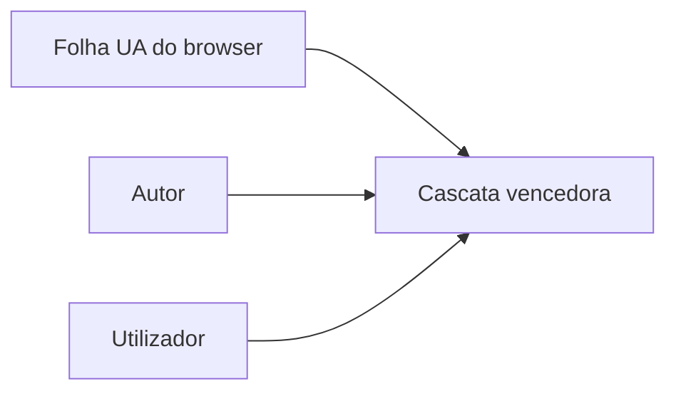

# CSS — layout, cascata e design responsivo

## Introdução

**CSS** define cores, tipografia, posicionamento e animações. O modelo **box** (margin, border, padding, content), a **cascata** (origem, especificidade, ordem) e **herança** explicam a maior parte dos “porque não aplicou?”.



---

## Flexbox (eixo principal e cruzado)

```css
.container {
  display: flex;
  flex-direction: row;
  justify-content: space-between;
  align-items: center;
  gap: 1rem;
}
```

---

## Grid (duas dimensões)

```css
.layout {
  display: grid;
  grid-template-columns: repeat(12, 1fr);
  gap: 1rem;
}
.sidebar {
  grid-column: span 3;
}
.content {
  grid-column: span 9;
}
```

---

## Media queries (responsivo)

```css
@media (max-width: 768px) {
  .sidebar {
    grid-column: span 12;
  }
}
```

---

## Variáveis customizadas

```css
:root {
  --color-brand: #14532d;
  --radius: 8px;
}
.card {
  border-radius: var(--radius);
  border: 1px solid var(--color-brand);
}
```

---

## Referências

- [MDN — CSS](https://developer.mozilla.org/en-US/docs/Web/CSS)
- [CSS-Tricks — Flexbox / Grid](https://css-tricks.com/)

---

*Especificidade alta (`#id .class`) é dívida técnica — prefira **componentes** e tokens.*
