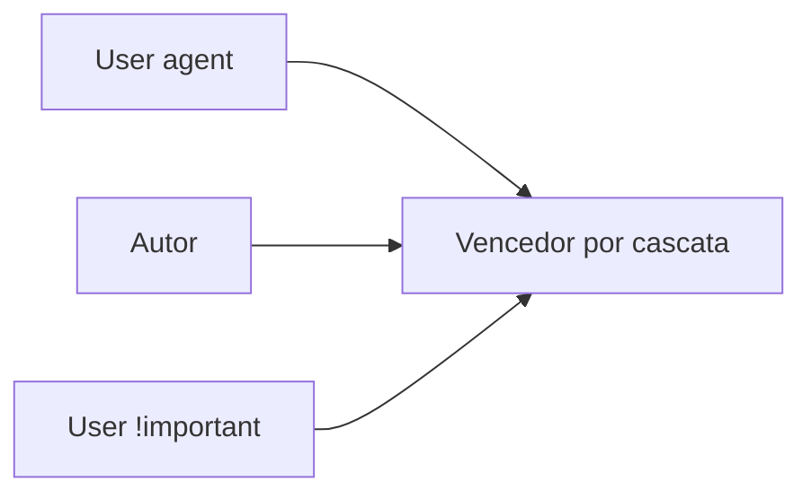

# CSS — layout, cascata, responsivo e manutenção

## Introdução

**CSS** controla apresentação: layout, cor, tipo, animação e *print*. A maior parte dos bugs em produção vem de **especificidade**, **overflow** inesperado, **z-index** sem contexto de *stacking*, e layouts que não foram testados em **viewport** real.



---

## Problema real: “O estilo não aplica e o DevTools mostra riscado”

**Causas:** regra mais específica noutro ficheiro; `!important` noutro sítio; *layer* (`@layer`) com ordem errada.

**Ferramenta:** painel *Computed* no DevTools mostra **origem** da vitória.

**Prevenção:** convenção de **BEM** / *CSS Modules* / *scoped* do SFC; evitar `#id` em componentes reutilizáveis; documentar *layers*:

```css
@layer reset, tokens, components, utilities;
@import "reset.css" layer(reset);
```

---

## Box model e `box-sizing`

**Problema real:** `width: 100%` + `padding` estoura o parent.

```css
*,
*::before,
*::after {
  box-sizing: border-box;
}
```

---

## Flexbox — casos reais

### Centrar e distribuir

```css
.toolbar {
  display: flex;
  align-items: center;
  justify-content: space-between;
  gap: 0.75rem;
  flex-wrap: wrap;
}
```

### `min-height` em colunas (“sticky footer”)

```css
.page {
  min-height: 100dvh;
  display: flex;
  flex-direction: column;
}
main {
  flex: 1;
}
```

**Problema real:** `100vh` em mobile inclui barra do browser — preferir **`100dvh`** (dynamic viewport) com *fallback*:

```css
.minh {
  min-height: 100vh;
  min-height: 100dvh;
}
```

---

## CSS Grid — dashboards e *cards*

```css
.dashboard {
  display: grid;
  grid-template-columns: repeat(auto-fill, minmax(280px, 1fr));
  gap: 1rem;
}
```

**Problema real:** *gap* não suportado em IE11 — hoje raro; confirmar [Baseline](https://web.dev/baseline) do projeto.

### Áreas nomeadas (legibilidade)

```css
.layout {
  display: grid;
  grid-template-columns: 240px 1fr;
  grid-template-rows: auto 1fr auto;
  grid-template-areas:
    "side head"
    "side main"
    "side foot";
}
aside {
  grid-area: side;
}
```

---

## Media queries e contentores

```css
@media (max-width: 48rem) {
  .layout {
    grid-template-columns: 1fr;
    grid-template-areas: "head" "main" "side" "foot";
  }
}
```

**Container queries** — estilo baseado no **pai**, não só no viewport:

```css
.card-wrap {
  container-type: inline-size;
}
@container (min-width: 22rem) {
  .card {
    display: flex;
    gap: 1rem;
  }
}
```

Referência: [MDN — CSS container queries](https://developer.mozilla.org/en-US/docs/Web/CSS/CSS_containment/Container_queries).

---

## Variáveis (tokens) e temas

```css
:root {
  color-scheme: light dark;
  --bg: #0f172a;
  --fg: #f8fafc;
  --accent: #38bdf8;
}
@media (prefers-color-scheme: light) {
  :root {
    --bg: #f8fafc;
    --fg: #0f172a;
  }
}
body {
  background: var(--bg);
  color: var(--fg);
}
```

**Problema real:** *flash* branco antes do tema escuro — definir `color-scheme` e CSS crítico inline mínimo no `<head>`.

---

## `position` e *stacking context*

**Problema real:** `z-index: 9999` no modal mas fica atrás do *header* — um ancestral criou *stacking context* (`transform`, `filter`, `opacity < 1`).

**Solução:** modal no **final do `body`** (portal em React/Vue) ou revisar ancestrais com `isolation: isolate` propositado.

---

## Animações acessíveis

```css
@media (prefers-reduced-motion: reduce) {
  *,
  *::before,
  *::after {
    animation-duration: 0.01ms !important;
    animation-iteration-count: 1 !important;
    transition-duration: 0.01ms !important;
  }
}
```

---

## Padrão inteligente: `:has()` para estilizar o pai em função do filho

**Problema:** “destacar o `label` quando o `input` dentro está `:focus-visible`” sem JavaScript.

```css
.field:has(input:focus-visible) {
  outline: 2px solid var(--accent);
  outline-offset: 2px;
}
```

Cuidado com **performance** em árvores enormes — `:has()` pode ser caro; limite o alcance (`.card:has(...)`).

---

## Nível avançado: `subgrid` para alinhar *cards* entre colunas

**Problema:** alturas de títulos diferentes desalinham botões “Comprar” entre colunas.

```css
.grid {
  display: grid;
  grid-template-columns: repeat(3, 1fr);
  gap: 1rem;
}
.card {
  display: grid;
  grid-template-rows: subgrid;
  grid-row: span 3;
}
```

Referência: [MDN — Subgrid](https://developer.mozilla.org/en-US/docs/Web/CSS/CSS_grid_layout/Subgrid).

---

## Nível avançado: propriedades lógicas (`margin-inline`, `padding-block`)

**Problema:** RTL (*right-to-left*) quebra layouts com `margin-left` fixo.

```css
.panel {
  margin-inline-start: 1rem; /* “start” inverte em RTL */
  padding-block: 0.75rem;
}
```

---

## Referências

- [MDN — CSS](https://developer.mozilla.org/en-US/docs/Web/CSS)
- [CSS-Tricks — Almanac](https://css-tricks.com/almanac/)
- [web.dev — Learn CSS](https://web.dev/learn/css/)
- [Every Layout](https://every-layout.dev/) — padrões de layout resilientes
- [Defensive CSS](https://defensivecss.dev/) — edge cases reais
- [MDN — :has()](https://developer.mozilla.org/en-US/docs/Web/CSS/Reference/Selectors/:has)
- [MDN — Subgrid](https://developer.mozilla.org/en-US/docs/Web/CSS/CSS_grid_layout/Subgrid)
- [Logical properties](https://developer.mozilla.org/en-US/docs/Web/CSS/CSS_logical_properties_and_values)

---

*CSS “limpo” é **previsível**: quem lê o ficheiro entende **porque** a regra existe.*
